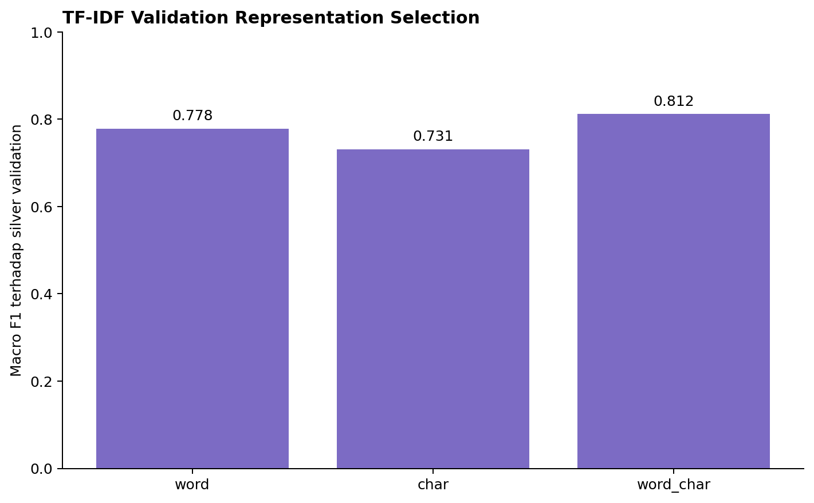
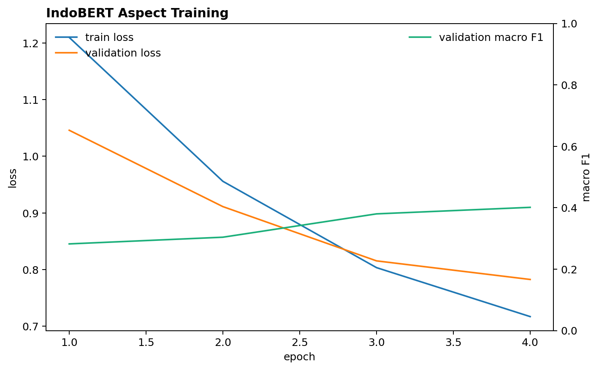
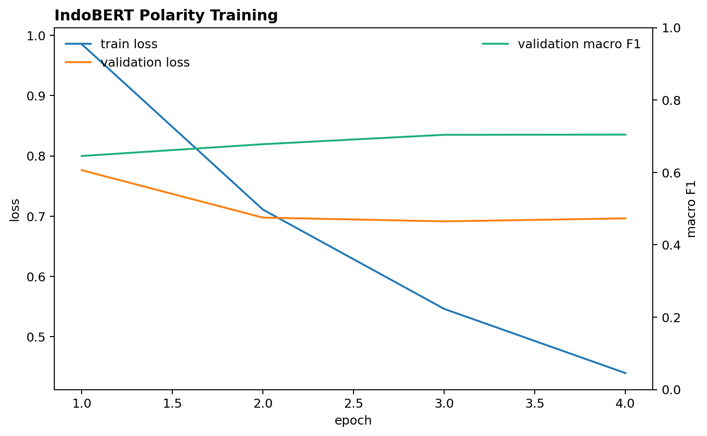
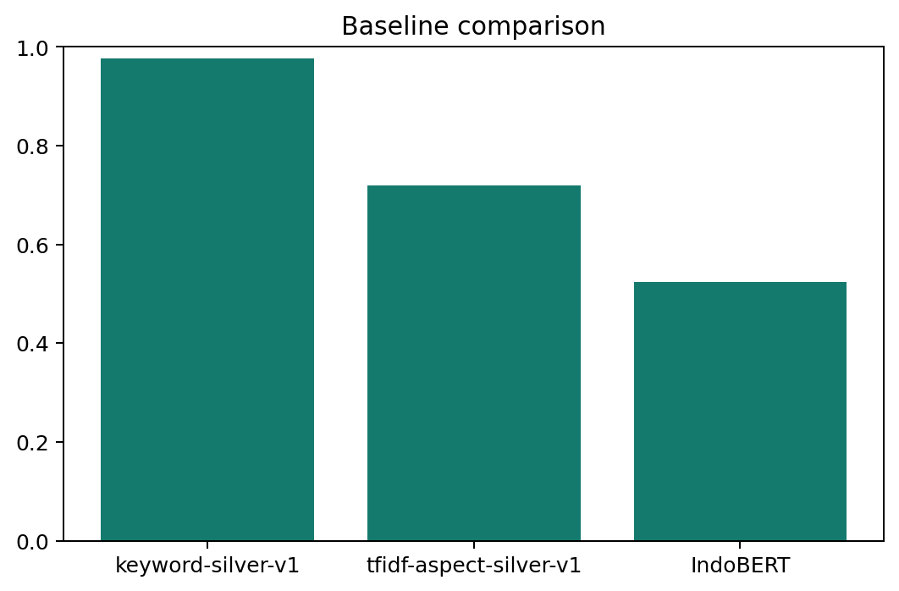
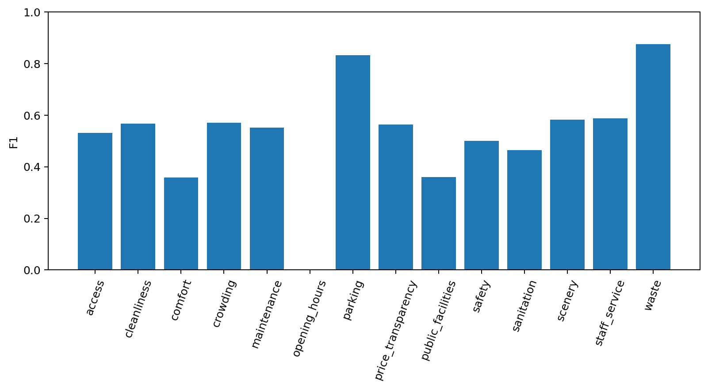
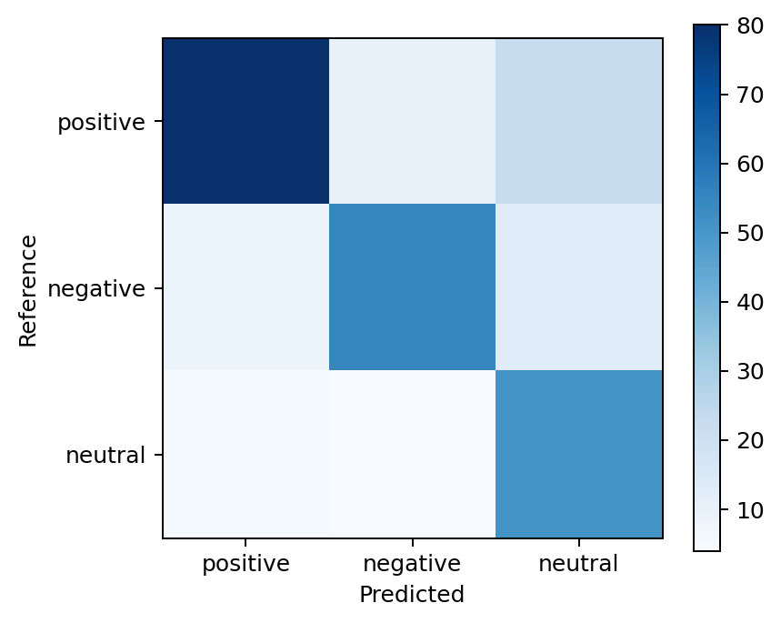

# SIPATURE

## Sistem Pemantauan Ulasan dan Prioritas Tindak Lanjut Pariwisata Toba

**Laporan Analisis *Preliminary Round* — Del AI Hackathon 2026**

**Nama tim:** `[NAMA TIM]`

**Ketua:** `[ANGGOTA 1 - KETUA]`

**Anggota:** `[ANGGOTA 2]`, `[ANGGOTA 3]`

> Dokumen submission tidak mencantumkan identitas institusi pendidikan. Versi PDF wajib berukuran maksimal 25 MB.

---

## Ringkasan Eksekutif

Ulasan wisata menyimpan informasi yang lebih rinci daripada *rating*. Sebuah tempat dapat memperoleh *rating* tinggi, tetapi masih memiliki laporan tentang toilet kotor, jalan rusak, pungutan, parkir, sampah, atau pelayanan. Ketika jumlah ulasan bertambah, pengelola sulit membaca semuanya secara rutin dan menentukan masalah mana yang perlu diperiksa lebih dahulu.

SIPATURE dirancang sebagai ***dashboard*** **dan sistem pendukung keputusan**. Sistem membaca ulasan, mengelompokkan isu ke dalam 14 aspek, menunjukkan kutipan bukti, lalu membantu pengelola menyusun prioritas verifikasi. SIPATURE tidak menyatakan bahwa keluhan pasti benar dan tidak menggantikan pemeriksaan lapangan.

*Pipeline* saat ini berhasil mengolah 22.302 *record* mentah menjadi 22.169 *record* bersih. Dari jumlah tersebut, 12.234 memiliki teks dan 9.935 hanya memiliki *rating*. Sebanyak 1.320 *review* berteks dipilih secara terstruktur untuk membuat label bantu atau ***silver labels***. Label ini digunakan untuk membangun *baseline* *Keyword* dan TF-IDF serta melatih kandidat IndoBERT pada pembagian data yang aman dari kebocoran destinasi.

Pada *locked silver test*, *Keyword* memperoleh *Macro F1* 0,9768 dan TF-IDF memperoleh 0,7201. Nilai ini hanya mengukur kesesuaian terhadap *silver labels*, bukan akurasi terhadap label manusia. Skor *Keyword* sangat tinggi karena memakai kosakata *taxonomy* yang juga berkaitan dengan proses pembentukan *silver labels*. Oleh karena itu, hasil tersebut diperlakukan sebagai batas pembanding, bukan bukti bahwa model telah memahami kondisi nyata.

Kandidat IndoBERT dilatih menggunakan *train/validation*, lalu suhu dan *threshold* dibekukan hanya dari *validation*. Pada satu evaluasi *locked silver test*, deteksi aspek IndoBERT memperoleh *Macro F1* 0,5247, di bawah TF-IDF 0,7201, sedangkan klasifikasi *polarity* berbasis aspek memperoleh *Macro F1* 0,7459. Karena itu, TF-IDF dipertahankan sebagai kandidat detektor aspek yang belajar dari data, sedangkan IndoBERT *polarity* dipertimbangkan sebagai tugas terpisah. Model *severity* tidak dipaksakan karena kelas `high` hanya memiliki 19 contoh *train*, di bawah batas metodologis minimum 20.

### Alur Data dari Awal hingga Produk

**Tabel 1. Alur penggunaan data dari sumber hingga produk**

| Tahap                         | Data yang digunakan                         | Tujuan                                                                              |
| ----------------------------- | -------------------------------------------:| ----------------------------------------------------------------------------------- |
| Data mentah                   | 22.302 *record*                             | Memahami seluruh bahan dari panitia                                                 |
| Pembersihan dan integrasi     | 22.169 *record* bersih                      | Menghapus *record* kosong/duplikat teknis dan menghubungkan *review* ke destinasi   |
| Data teks                     | 12.234 *review*                             | Sumber utama analisis aspek, *polarity*, *severity*, dan *evidence*                 |
| Data *rating-only*            | 9.935 *review*                              | Konteks volume, *rating*, *coverage*, dan kecukupan data; bukan *input* model teks  |
| *Silver annotation*           | 1.320 *review* berteks                      | Membentuk data belajar dan *benchmark* awal yang dapat diaudit                      |
| Train/*validation*/*test*     | 922 / 196 / 202 *review*                    | Melatih, memilih konfigurasi, dan mengevaluasi *baseline* tanpa kebocoran destinasi |
| *Full-corpus inference*       | Seluruh 12.234 *review* berteks             | Selesai: menghasilkan 9.785 prediksi aspek dan 1.682 sinyal destinasi-aspek         |
| Agregasi dan integrasi produk | Seluruh 22.169 *record* bersih + *metadata* | Selesai: menghasilkan proyeksi agregat untuk 103 destinasi dan 210 isu operasional  |

**Interpretasi Tabel 1.** Tidak semua data digunakan untuk tujuan yang sama. Subset berlabel digunakan untuk belajar dan menguji model, sedangkan seluruh data digunakan setelah model dikunci untuk menghasilkan *intelligence* dan konteks *dashboard*. Pemisahan ini menjaga evaluasi tetap adil sekaligus memastikan seluruh data panitia tetap dimanfaatkan pada tahap produk.

### Istilah Penting dalam Bahasa Sederhana

**Tabel 2. Glosarium istilah data dan pemodelan**

| Istilah                     | Arti dalam laporan ini                                                                      | Mengapa digunakan                                                     |
| --------------------------- | ------------------------------------------------------------------------------------------- | --------------------------------------------------------------------- |
| *Record*                    | Satu baris data                                                                             | Menyebut unit dasar di dalam file CSV                                 |
| *Metadata*                  | Informasi tentang tempat, misalnya nama, alamat, kategori, harga, dan koordinat             | Memberi konteks selain isi ulasan                                     |
| Latitude dan longitude      | Angka posisi utara–selatan dan timur–barat suatu lokasi                                     | Memungkinkan tempat ditampilkan dan dianalisis pada peta              |
| *Entity resolution*         | Proses menyatukan penyebutan yang merujuk pada tempat yang sama                             | Menghubungkan *review* dan *metadata* tanpa asal menggabungkan tempat |
| *Canonical destination*     | ID utama yang dipakai untuk mewakili satu tempat dalam *pipeline*                           | Menyatukan data tempat yang muncul dengan ejaan atau sumber berbeda   |
| *Unresolved placeholder*    | ID sementara untuk tempat yang belum dapat dicocokkan dengan yakin                          | Mencegah sistem salah menggabungkan dua tempat                        |
| NLP                         | Teknik komputer untuk mengolah bahasa manusia                                               | Digunakan untuk membaca isi *review* secara otomatis                  |
| *Aspect*                    | Topik khusus dalam *review*, misalnya kebersihan, akses, atau parkir                        | Lebih berguna daripada sentimen umum                                  |
| *Polarity*                  | Arah penilaian suatu aspek: positif, negatif, atau netral                                   | Satu *review* dapat memuji satu aspek dan mengeluhkan aspek lain      |
| *Severity*                  | Tingkat dampak keluhan: rendah, sedang, atau tinggi                                         | Membantu membedakan gangguan kecil dari masalah mendesak              |
| *Evidence*                  | Potongan teks asli yang mendukung hasil analisis                                            | Membuat hasil dapat diperiksa manusia                                 |
| *Taxonomy*                  | Daftar dan batas definisi aspek yang digunakan sistem                                       | Menjaga pelabelan tetap konsisten                                     |
| *Silver labels*             | Label bantu yang dibuat dengan aturan AI dan belum diverifikasi sebagai *gold* oleh manusia | Memungkinkan eksperimen awal secara transparan                        |
| *Baseline*                  | Metode pembanding sederhana                                                                 | Menilai apakah model yang lebih kompleks benar-benar memberi manfaat  |
| TF-IDF                      | Cara mengubah teks menjadi angka berdasarkan pentingnya kata atau potongan kata             | Cepat, ringan, dan kuat sebagai pembanding NLP klasik                 |
| Train, *validation*, *test* | Data untuk belajar, memilih konfigurasi, dan menguji hasil akhir                            | Mencegah model dinilai menggunakan data yang dipakai untuk belajar    |
| *Leakage*                   | Kebocoran informasi yang membuat evaluasi terlihat lebih baik dari kondisi sebenarnya       | Harus dicegah agar perbandingan model adil                            |
| *Macro F1*                  | Rata-rata kualitas prediksi seluruh aspek dengan bobot yang sama                            | Aspek langka tetap diperhatikan                                       |
| *Micro F1*                  | Kualitas prediksi dihitung dari seluruh keputusan secara bersama                            | Menunjukkan performa keseluruhan pada semua label                     |
| *Exact Match*               | Persentase *review* yang seluruh kumpulan aspeknya diprediksi tepat                         | Memberi ukuran yang ketat untuk tugas dengan banyak label             |
| *Hamming Loss*              | Proporsi keputusan aspek yang salah; semakin kecil semakin baik                             | Menunjukkan rata-rata kesalahan pada seluruh aspek                    |
| *Support*                   | Jumlah contoh yang tersedia untuk suatu aspek                                               | Membantu menilai apakah sebuah skor cukup stabil untuk dipercaya      |
| *Class weighting*           | Memberi perhatian lebih pada kelas yang jumlahnya sedikit saat model belajar                | Mengurangi dominasi aspek yang sering muncul                          |
| *One-vs-Rest*               | Satu model ya/tidak dibuat untuk setiap aspek                                               | Memungkinkan satu *review* memiliki beberapa aspek sekaligus          |
| *Logistic Regression*       | Model statistik ringan untuk memperkirakan peluang suatu aspek muncul                       | Cepat, mudah diaudit, dan cocok sebagai *baseline* klasik             |
| *Latency*                   | Waktu yang dibutuhkan model untuk memproses satu *review*                                   | Mengukur kelayakan model digunakan dalam aplikasi                     |
| *Calibration*               | Pemeriksaan apakah tingkat keyakinan model sesuai dengan frekuensi kebenarannya             | Mencegah *confidence* terlihat lebih pasti dari kenyataan             |
| *Locked test*               | Data uji yang tidak boleh dipakai untuk memilih model atau *threshold*                      | Menjaga evaluasi akhir tetap independen                               |
| *Threshold*                 | Batas nilai agar sebuah aspek dianggap terdeteksi                                           | Mengubah *probability* menjadi keputusan ya/tidak                     |
| *Inference*                 | Proses memakai model yang sudah jadi untuk menganalisis data baru                           | Tahap ketika seluruh *review* berteks akan digunakan                  |
| *Aggregation*               | Menggabungkan hasil per *review* menjadi ringkasan per destinasi                            | Menghasilkan informasi yang dapat ditampilkan di *dashboard*          |

**Interpretasi Tabel 2.** Istilah teknis pada laporan digunakan untuk menjelaskan fungsi tertentu dalam *pipeline*, bukan untuk memperumit pembahasan. Glosarium ini menjadi acuan ketika istilah yang sama muncul pada bagian analisis data, *modelling*, evaluasi, dan rancangan produk.

---

# 1. Latar Belakang

Bagian ini menjelaskan konteks pariwisata Toba, potensi dan tantangan dataset, kesenjangan dalam pengelolaan ulasan, serta alasan pengembangan SIPATURE. Selain itu, bagian ini merangkum tujuan, manfaat, ruang lingkup, dan batasan awal solusi sebagai dasar bagi analisis pada bagian berikutnya.

## 1.1 Konteks Pariwisata Toba

Kawasan Danau Toba memiliki ekosistem pariwisata yang saling bergantung. Pengalaman wisatawan tidak hanya ditentukan oleh daya tarik sebuah destinasi, tetapi juga oleh kebersihan, akses jalan, parkir, toilet, keamanan, harga, pelayanan, akomodasi, kuliner, transportasi, dan informasi operasional. Masalah pada salah satu unsur tersebut dapat memengaruhi kenyamanan pengunjung dan citra kawasan secara keseluruhan.

Peningkatan kualitas pariwisata membutuhkan informasi yang dapat digunakan untuk mengambil tindakan. Pengelola perlu mengetahui bukan hanya tempat mana yang populer, tetapi juga masalah apa yang berulang, seberapa banyak bukti yang tersedia, dan hal apa yang perlu diperiksa lebih dahulu. Informasi tersebut penting agar sumber daya yang terbatas dapat diarahkan pada kebutuhan yang paling relevan.

## 1.2 Potensi dan Tantangan Dataset

Dataset yang disediakan panitia mencakup objek wisata, akomodasi, kuliner, transportasi, fasilitas, lokasi, harga, jam operasional, *rating*, dan ulasan pengguna. Cakupan ini memungkinkan analisis pariwisata dilakukan sebagai satu ekosistem, bukan sebagai daftar destinasi yang berdiri sendiri. Ulasan pengguna menjadi komponen penting karena memuat pengalaman langsung yang tidak selalu tercermin pada *metadata* atau *rating* rata-rata.

Namun, data tersebut masih mentah dan realistis. Informasi tersebar di sejumlah file dengan struktur yang berbeda, beberapa nama tempat tidak konsisten, sebagian *field* kosong, dan tidak semua *review* memiliki teks. Tempat yang sama juga dapat muncul dengan variasi nama pada sumber *review* dan *metadata*. Oleh sebab itu, data tidak dapat langsung dimasukkan ke model. Diperlukan pemeriksaan kualitas, pembersihan, penyamaan struktur, penghubungan entitas, dan dokumentasi perubahan data sebelum analisis dilakukan.

Kondisi ini sejalan dengan tujuan Del AI Hackathon 2026, yaitu memanfaatkan dataset utama panitia secara bermakna dan mengubah data pariwisata yang belum terintegrasi menjadi *insight*, layanan, atau sistem pendukung keputusan. SIPATURE menggabungkan ruang eksplorasi **operasional destinasi** dan ***data intelligence***. NLP (*Natural Language Processing*) digunakan sebagai pendekatan AI utama untuk memahami isi ulasan, sedangkan hasil analisis disajikan dalam bentuk ***dashboard*** dan ***decision support system*** bagi pengelola. Dengan demikian, SIPATURE tidak berhenti pada proses klasifikasi teks: data yang telah dibersihkan dan diintegrasikan diubah menjadi informasi visual, bukti ulasan, ukuran kecukupan data, serta prioritas verifikasi yang mendukung pengambilan keputusan operasional.

## 1.3 Kesenjangan Informasi dalam Pengelolaan Ulasan

*Rating* rata-rata memberikan gambaran umum, tetapi tidak menjelaskan penyebab pengalaman pengunjung. Dua destinasi dengan *rating* yang sama dapat menghadapi masalah yang berbeda. Satu tempat mungkin memiliki keluhan mengenai toilet dan sampah, sedangkan tempat lain menghadapi masalah akses, parkir, pelayanan, atau transparansi harga. Bahkan *review* dengan *rating* tinggi dapat tetap mengandung kritik pada aspek tertentu.

Membaca ulasan satu per satu juga tidak efisien ketika jumlahnya mencapai ribuan. Keluhan penting dapat tertutup oleh *review* positif, komentar singkat, atau tempat yang mempunyai volume ulasan lebih besar. Jika pengelola hanya melihat jumlah keluhan mentah, destinasi populer berisiko selalu terlihat paling bermasalah karena memiliki lebih banyak *review*. Sebaliknya, persentase keluhan yang tinggi pada tempat dengan sedikit *review* dapat terlihat terlalu ekstrem dan belum tentu stabil.

Dengan demikian, kebutuhan utamanya bukan sekadar analisis sentimen positif dan negatif. Pengelola memerlukan sistem yang dapat mengidentifikasi **aspek yang dibicarakan**, menunjukkan **potongan bukti dari review**, memperhitungkan **jumlah dan kecukupan data**, serta menyusun **prioritas verifikasi** tanpa menyatakan keluhan pengguna sebagai fakta lapangan.

## 1.4 Gagasan Solusi SIPATURE

SIPATURE merupakan singkatan dari **Sistem Pemantauan Ulasan dan Prioritas Tindak Lanjut Pariwisata Toba**. Nama ini juga memiliki kedekatan dengan nilai budaya Batak. Secara kontekstual, kata *pature* mengandung makna membenahi, menata, atau memperbaiki, sedangkan *sipature* dapat dimaknai sebagai pihak yang membenahi. Semangat tersebut selaras dengan ungkapan Batak *Marsipature Huta Na Be*, yaitu ajakan untuk bersama-sama membangun dan memperbaiki kampung halaman masing-masing. Dalam SIPATURE, semangat itu diwujudkan melalui pemanfaatan suara pengunjung untuk membantu pengelola mengenali hal yang perlu diperiksa dan dibenahi demi peningkatan kualitas pariwisata Toba. Dengan demikian, nama SIPATURE tidak hanya berfungsi sebagai akronim teknis, tetapi juga membawa pesan lokal tentang kepedulian, gotong royong, dan tanggung jawab merawat kawasan Toba.

Solusi ini dirancang sebagai *dashboard* dan sistem pendukung keputusan yang mengubah *review* menjadi sinyal operasional per destinasi. Model membaca teks *review*, mengelompokkan pembahasan ke dalam 14 aspek, menentukan arah penilaian per aspek, menilai tingkat dampak untuk keluhan negatif, dan mempertahankan kutipan *evidence* yang dapat diperiksa.

Hasil per *review* kemudian diringkas pada tingkat destinasi dengan mempertimbangkan volume bukti, *severity*, *freshness*, dan kecukupan data. Destinasi dengan data sedikit tidak otomatis diberi penilaian baik atau buruk, tetapi ditandai sebagai `Insufficient Data`. Sinyal prioritas juga tetap berstatus belum terverifikasi sampai pengelola melakukan pemeriksaan. Dengan pendekatan ini, SIPATURE berfungsi sebagai alat penyaring dan pemberi arah awal, bukan sebagai pengganti inspeksi lapangan atau keputusan manusia.

Pengguna utama SIPATURE adalah pengelola destinasi yang perlu memantau keluhan dan menentukan pemeriksaan operasional. Pemerintah daerah atau pengelola kawasan menjadi pengguna sekunder untuk melihat pola lintas destinasi. Dalam pengembangan berikutnya, hasil agregat juga dapat membantu penyusunan program perbaikan fasilitas, koordinasi dengan pelaku layanan pendukung, dan evaluasi perubahan kondisi dari waktu ke waktu.

## 1.5 Tujuan dan Manfaat

Tujuan pengembangan SIPATURE adalah:

1. Mengintegrasikan *review* dan *metadata* pariwisata Toba ke dalam struktur data yang dapat ditelusuri.
2. Mengidentifikasi aspek pengalaman wisatawan secara lebih spesifik daripada sentimen umum.
3. Menyediakan *evidence* anonim agar hasil model dapat diperiksa kembali.
4. Membedakan sinyal yang memiliki dukungan memadai dari kondisi yang datanya belum cukup.
5. Membantu pengelola menyusun urutan verifikasi secara lebih cepat dan transparan.
6. Menyediakan fondasi data dan model yang dapat dikembangkan menjadi produk pada *Final Round*.

Manfaat yang diharapkan bagi pengelola adalah berkurangnya waktu untuk membaca *review* secara manual, meningkatnya kemampuan menemukan isu berulang, dan tersedianya dasar yang lebih jelas untuk menentukan tindak lanjut. Bagi pemerintah atau pengelola kawasan, SIPATURE dapat memberikan gambaran lintas destinasi dengan tetap mempertahankan konteks *evidence* dan keterbatasan data. Bagi wisatawan dan pelaku lokal, tindak lanjut yang lebih terarah diharapkan berkontribusi pada pengalaman wisata yang lebih aman, nyaman, informatif, dan berkelanjutan.

## 1.6 Ruang Lingkup dan Batasan Awal

Ruang lingkup preliminary berfokus pada pengolahan dataset panitia, pengembangan *taxonomy* aspek, pembuatan *silver labels*, pembangunan *baseline* *Keyword* dan TF-IDF, pelatihan kandidat IndoBERT, evaluasi *leakage-safe*, serta rancangan integrasi model dengan *dashboard*. Analisis utama menggunakan *review* berteks, sedangkan *rating-only* digunakan sebagai konteks volume, distribusi *rating*, dan kecukupan data. *Metadata* lokasi digunakan untuk menghubungkan *review* dengan destinasi dan mendukung penyajian geospasial.

SIPATURE tidak menilai kebenaran faktual sebuah keluhan, tidak menentukan sanksi, dan tidak mempublikasikan identitas *reviewer*. *Silver labels* yang digunakan pada tahap awal bukan *human-gold labels*, sehingga hasil evaluasi belum dapat disebut sebagai akurasi terhadap penilaian manusia. Selain itu, keterbatasan *metadata* tidak boleh ditafsirkan sebagai bukti bahwa fasilitas atau layanan tidak tersedia di dunia nyata. Batasan tersebut dijaga agar solusi tetap transparan, etis, dan dapat dipertanggungjawabkan.

---

# 2. Analisis Permasalahan

Bagian ini membahas kondisi dan karakteristik utama dataset pariwisata Toba sebagai dasar perumusan masalah SIPATURE. Pembahasan mencakup skala dan kualitas data, proses integrasi, kelengkapan metadata, potensi geospasial, hubungan volume ulasan dengan sinyal keluhan, masalah yang dipilih, serta risiko yang perlu dimitigasi.

## 2.1 Temuan Utama Data

Bagian ini menyajikan hasil pemeriksaan awal terhadap skala, komposisi, ketersediaan informasi, sumber, dan proses integrasi data. Pembahasan dibagi menjadi beberapa subbagian agar hubungan antara temuan, tabel, dan visual dapat diikuti secara lebih sistematis.

### 2.1.1 Skala dan Komposisi Data

Tim memeriksa dan mengolah 14 file CSV yang disediakan panitia. Seluruh file berhasil dibaca tanpa kesalahan, kemudian diperiksa struktur kolom, jumlah baris, kelengkapan nilai, dan perannya dalam proses analisis. Dua file ulasan utama berisi total 22.302 *record*. Setelah tahap pembersihan dan penghubungan data, diperoleh 22.169 *record* bersih yang seluruhnya memiliki `destination_id` teknis.


**Gambar 1. Ukuran file berdasarkan jumlah *record*.**

Dua batang terpanjang adalah file ulasan wisata dan ulasan restoran/hotel, masing-masing 12.691 dan 9.611 *record*. File lainnya jauh lebih kecil karena terutama berisi *metadata*, jam operasional, transportasi, atau informasi pendukung. Visual ini menunjukkan bahwa kekuatan utama dataset berada pada ulasan, sedangkan file kecil digunakan untuk memperkaya konteks tempat.

**Tabel 3. Ringkasan hasil pemeriksaan dan pembersihan data**

| Temuan                 | Nilai                                 | Implikasi                                               |
| ---------------------- | -------------------------------------:| ------------------------------------------------------- |
| *Record* mentah        | 22.302                                | Volume terlalu besar untuk dibaca manual secara rutin   |
| *Record* bersih        | 22.169                                | Menjadi dasar integrasi dan agregasi                    |
| *Review* berteks       | 12.234                                | Dapat dianalisis dengan NLP                             |
| *Rating-only*          | 9.935                                 | Berguna sebagai konteks, tetapi tidak menjelaskan aspek |
| *Rating* bintang lima  | 15.595 dari 22.243 *rating* *integer* | Data sangat condong ke *rating* tinggi                  |
| *Canonical* IDs teknis | 388                                   | 322 *metadata anchors* dan 66 *unresolved placeholders* |

**Interpretasi Tabel 3.** Dataset memiliki volume *review* yang besar, tetapi hanya sekitar separuh *record* yang mempunyai teks. Karena model NLP memerlukan teks, *review rating-only* dipisahkan untuk konteks agregasi. Dominasi *rating* bintang lima dan keberadaan *unresolved placeholders* juga menunjukkan bahwa sistem perlu memperhitungkan ketidakseimbangan serta ketidakpastian data.

### 2.1.2 Ketersediaan Teks dan Distribusi *Rating*


**Gambar 2. Ketersediaan informasi pada data mentah.**

Dari 22.302 *record*, hampir semua memiliki *rating*, tetapi hanya 12.280 yang memiliki teks sebelum *cleaning*. Sebanyak 9.978 *record* hanya memiliki *rating* dan 83 merupakan duplikat fisik berlebih. Setelah *cleaning* yang lebih ketat, angka yang digunakan *pipeline* menjadi 12.234 *review* berteks dan 9.935 *rating-only*. Perbedaan angka sebelum dan sesudah *cleaning* menunjukkan bahwa data perlu diperiksa sebelum dipakai oleh model.

*Rating* tinggi tidak selalu berarti tidak ada masalah. Karena itu, SIPATURE membaca isi ulasan dan tidak menggunakan *rating* untuk menentukan *polarity* atau *severity* sebuah aspek.


**Gambar 3. Distribusi *rating* pada data mentah.**

Batang bintang lima jauh lebih tinggi daripada *rating* lain. Artinya, model yang hanya mengikuti kelas mayoritas dapat terlihat baik, padahal belum tentu menemukan keluhan penting. Karena itu SIPATURE membaca teks dan menggunakan *Macro F1* agar aspek yang jarang tetap diperhatikan.

### 2.1.3 Dataset Sumber dan Perannya

Dataset panitia tidak diperlakukan sebagai satu tabel besar yang langsung digabung. Setiap jenis file memiliki makna berbeda, sehingga dibaca dengan aturan yang sesuai sebelum dipertemukan melalui nama tempat, kategori, alamat, dan koordinat.

**Tabel 4. Daftar dataset sumber dan perannya dalam pipeline**

| Kelompok                 | Nama file CSV sumber                  | Peran dalam *pipeline*                                   |
| ------------------------ | ------------------------------------- | -------------------------------------------------------- |
| *Review* wisata          | `wisata-v2.csv`                       | Sumber ulasan dan *rating* objek wisata                  |
| *Review* hotel/restoran  | `resto-hotel-v2.csv`                  | Sumber ulasan dan *rating* hotel/restoran                |
| *Metadata* wisata        | `wisata-metadata.csv`                 | Nama, kategori, alamat, koordinat, status, *rating*      |
| *Metadata* restoran      | `resto-metadata.csv`                  | Nama, koordinat, *rating*, harga, fasilitas, status      |
| *Metadata* hotel         | `hotel-metadata.csv`                  | Nama, koordinat, *rating*, harga, fasilitas, status      |
| Data tempat wisata       | `tempat-wisata-v1.csv`                | Fasilitas, *review*, dan status tambahan                 |
| Jam operasional          | `waktu operasional destinasi.csv`     | *Enrichment* jam dan fasilitas destinasi                 |
| Transportasi             | `transportasi.csv`                    | Rute, tarif, dan jadwal transportasi                     |
| Data kawasan             | `Info Seputar Danau Toba (TOP 3).csv` | Informasi ekosistem wilayah yang lebar dan tidak seragam |
| Atraksi tambahan         | `Attractions Info.csv`                | Deskripsi atraksi, lokasi, jam, tiket, budaya            |
| Hotel/restoran pendukung | `hotel-resto-v1.csv`                  | Daftar tempat pendukung dengan *field* heterogen         |
| Kuliner                  | `kuliner.csv`                         | Deskripsi kuliner                                        |
| Artikel kawasan          | `Artikel Danau Toba.csv`              | Konteks artikel, bukan label model                       |

**Interpretasi Tabel 4.** Dua file *review* menjadi sumber utama analisis bahasa. Tiga file *metadata* utama menyediakan identitas dan lokasi tempat. File lainnya berfungsi sebagai *enrichment* atau konteks tambahan dan tidak seluruhnya menjadi label model. Pemisahan peran ini mencegah artikel atau *field* pendukung diperlakukan sebagai *ground truth* secara keliru.

### 2.1.4 Integrasi, Pembersihan, dan Penghubungan Entitas

Proses penggabungan dilakukan bertahap sebagaimana diringkas pada Tabel 5.

**Tabel 5. Tahapan integrasi dataset SIPATURE**

| Tahap integrasi              | Dataset masukan                                                                                   | Proses utama                                                                       | Keluaran                                                              |
| ---------------------------- | ------------------------------------------------------------------------------------------------- | ---------------------------------------------------------------------------------- | --------------------------------------------------------------------- |
| Standardisasi *review*       | `wisata-v2.csv`, `resto-hotel-v2.csv`                                                             | Menyamakan nama kolom, normalisasi teks/*rating*, membentuk ID dan status *review* | Tabel *review*: `review_id`, nama tempat, teks, *rating*, dan tanggal |
| Standardisasi *metadata*     | `wisata-metadata.csv`, `resto-metadata.csv`, `hotel-metadata.csv`                                 | Menyamakan nama, kategori, alamat, koordinat, harga, fasilitas, dan status         | Tabel *metadata* tempat                                               |
| *Enrichment*                 | `tempat-wisata-v1.csv`, `waktu operasional destinasi.csv`, `transportasi.csv`, dan file pendukung | Menata jam operasional, fasilitas, rute, tarif, serta konteks kawasan              | Tabel *enrichment* terstruktur                                        |
| *Entity resolution*          | Tabel *review*, *metadata*, dan *enrichment*                                                      | Membandingkan nama, jenis, alamat, serta koordinat secara konservatif              | Hubungan *review*–destinasi dan daftar kandidat tidak pasti           |
| Pembentukan data *canonical* | Hasil *entity resolution*                                                                         | Menetapkan ID utama dan *unresolved placeholder* bila kecocokan belum pasti        | `canonical_reviews.parquet` dan `canonical_destinations.parquet`      |

**Interpretasi Tabel 5.** Integrasi tidak dilakukan dengan menumpuk seluruh CSV sekaligus karena struktur dan makna *field* berbeda. *Review* terlebih dahulu distandardisasi, *metadata* tempat dibentuk secara terpisah, dan file pendukung dijadikan *enrichment*. Ketiga kelompok baru dipertemukan melalui *entity resolution*. Pendekatan ini mengurangi risiko salah mengartikan kolom atau menggabungkan dua tempat yang berbeda.

Setelah standardisasi struktur pada Tabel 5, proses dilanjutkan melalui dua tahap yang berbeda. Tahap pertama membersihkan baris *review* dan menentukan data yang layak dipertahankan. Tahap kedua menghubungkan nama tempat dari berbagai sumber dengan identitas destinasi yang konsisten. Pemisahan ini penting karena Gambar 4 menggunakan satuan jumlah *review*, sedangkan Gambar 5 menggunakan satuan jumlah hubungan entitas tempat.

#### Tahap 1: Pembersihan dan Pemisahan Data *Review*


**Gambar 4. Alur pembersihan dan pemisahan data *review*.**

Proses dimulai dari 22.302 *record* mentah. Sebanyak 89 baris duplikat teknis berlebih dan 44 baris tanpa *rating* maupun teks dikeluarkan, sehingga tersisa 22.169 *record* bersih. Dari data bersih tersebut, 12.234 *record* memiliki teks dan dapat digunakan untuk analisis NLP, sedangkan 9.935 lainnya hanya memiliki *rating* dan tetap dipertahankan sebagai konteks agregasi.

Batang “Clean textual” pada Gambar 4 bukan tahap penghapusan lanjutan dari 22.169 *record* bersih, melainkan subset dari data bersih yang mempunyai teks. Dengan demikian, hubungan angkanya adalah 22.302 data mentah dikurangi 89 duplikat dan 44 data kosong menjadi 22.169 data bersih; selanjutnya, 22.169 data bersih dipisahkan menjadi 12.234 *review* berteks dan 9.935 *rating-only records*. Data yang dikeluarkan tetap dicatat pada artefak audit agar proses pembersihan dapat ditelusuri.

#### Tahap 2: Penghubungan Identitas Tempat

Setelah data *review* bersih tersedia, nama tempat pada file *review*, *metadata*, dan sumber pendukung dibandingkan melalui *entity resolution*. Pada tahap ini, unit yang dihitung bukan lagi jumlah *review*, melainkan **810 hubungan kandidat antarsumber tempat**. Satu hubungan menunjukkan upaya menghubungkan satu penyebutan tempat dari suatu sumber dengan identitas destinasi yang menjadi acuan.

Tahap ini diimplementasikan menggunakan ***Python*** dan ***Pandas*** untuk normalisasi, pengelompokan, serta penggabungan data. Pustaka ***RapidFuzz*** digunakan untuk menghitung kemiripan nama dan alamat melalui metode `ratio` dan `token_set_ratio`. Koordinat dibandingkan menggunakan rumus ***Haversine*** untuk mengukur jarak antarlokasi, sedangkan jenis tempat digunakan sebagai pembatas agar objek wisata tidak dicocokkan dengan hotel atau restoran secara keliru. ID destinasi dibentuk secara deterministik menggunakan **SHA-256** agar hasil pengelompokan dapat direproduksi. Kandidat dengan kecocokan nama, alamat, jenis, atau koordinat yang belum cukup kuat dimasukkan ke pemeriksaan manual dan tidak digabungkan secara otomatis.


**Gambar 5. Status 810 hubungan entitas tempat setelah pemeriksaan.**

Sebanyak 698 hubungan dapat dicocokkan otomatis karena memiliki bukti yang kuat. Sebanyak 45 hubungan dikonfirmasi setelah pemeriksaan manusia, sedangkan 31 hubungan dikonfirmasi sebagai tidak cocok dan dipertahankan secara terpisah. Empat hubungan masih memerlukan pemeriksaan lebih lanjut, dan 32 hubungan belum dapat diselesaikan karena bukti yang tersedia belum cukup.

Hubungan yang belum cukup kuat tidak dipaksa bergabung. Sistem memberikan `unresolved placeholder`, yaitu ID sementara yang menjaga *review* tetap dapat dikelompokkan tanpa mengklaim bahwa dua penyebutan merujuk pada tempat yang sama. Status tidak cocok dan belum terselesaikan bukan berarti data dibuang; keduanya merupakan mekanisme pengaman untuk mencegah penggabungan tempat yang salah.

Keluaran kedua tahap tersebut adalah 22.169 *review* bersih yang seluruhnya memiliki `destination_id` teknis dan dapat dikelompokkan ke dalam 388 *canonical IDs*. Sebanyak 322 ID berasal dari tempat yang memiliki acuan *metadata*, sedangkan 66 lainnya merupakan *unresolved placeholders*. Dengan alur ini, analisis per destinasi dapat dilakukan tanpa mengorbankan kehati-hatian dalam penghubungan identitas tempat.

## 2.2 Kelengkapan dan Potensi Geospasial

Analisis pada bagian ini bertujuan menilai apakah *metadata* tempat cukup lengkap untuk mendukung identifikasi destinasi, penyajian peta, dan analisis kedekatan layanan. Pemeriksaan dilakukan terhadap ketersediaan atribut penting, seperti nama, alamat, koordinat, kategori, fasilitas, dan jam operasional, kemudian dilanjutkan dengan melihat pola persebaran lokasi hotel, restoran, dan destinasi wisata.


**Gambar 6. Kelengkapan *metadata* hotel, restoran, dan wisata.**

Warna gelap berarti *field* lebih lengkap. Nama, alamat, koordinat, dan status tersedia hampir penuh, sehingga cukup kuat untuk *linkage* dan peta. Sebaliknya, fasilitas hotel tersedia 83% tetapi fasilitas restoran hanya 4% dan wisata 0% pada file *metadata* utama; jam operasional juga tidak merata. SIPATURE tidak menganggap *field* kosong sebagai “tidak ada fasilitas”, melainkan sebagai data yang belum cukup.


**Gambar 7. Sebaran latitude dan longitude pada 323 *metadata* *records*.**

Latitude menunjukkan posisi utara–selatan, sedangkan longitude menunjukkan posisi timur–barat. Setiap titik mewakili hotel, restoran, atau destinasi wisata. Titik wisata tersebar lebih luas, sementara hotel dan restoran lebih mengelompok pada beberapa pusat layanan. Gambar ini menarik untuk solusi karena membuktikan bahwa data dapat dikembangkan menjadi peta persebaran destinasi, analisis kedekatan layanan, dan perbandingan kawasan. Plot ini menunjukkan koordinat, bukan jarak perjalanan atau batas administratif.

## 2.3 Hubungan Volume *Review* dan Sinyal Keluhan

Analisis berikut digunakan untuk melihat hubungan antara banyaknya *review* berteks dan proporsi ulasan yang mengandung kata kandidat keluhan pada setiap tempat. Tujuannya adalah menguji apakah persentase keluhan dapat langsung digunakan sebagai dasar prioritas atau perlu dibaca bersama jumlah bukti, distribusi *rating*, dan kecukupan data.


**Gambar 8. Hubungan jumlah *review* berteks dengan *candidate complaint rate*.**

Setiap titik mewakili satu tempat. Semakin ke kanan posisi titik, semakin banyak *review* berteks yang tersedia. Semakin tinggi posisi titik, semakin besar proporsi *review* yang memuat kata kandidat keluhan. Warna titik menunjukkan *rating* rata-rata dan digunakan sebagai konteks tambahan, bukan sebagai penentu ada atau tidaknya keluhan.

Persentase yang tinggi belum selalu berarti sebuah tempat lebih bermasalah. Sebagai contoh, satu *review* kandidat keluhan dari dua *review* berteks menghasilkan persentase 50%, sedangkan 20 *review* kandidat keluhan dari 100 *review* menghasilkan persentase 20%. Tempat pertama mempunyai persentase lebih tinggi, tetapi hanya didukung oleh satu komentar sehingga hasilnya lebih mudah berubah ketika *review* baru masuk. Sebaliknya, tempat kedua memiliki lebih banyak bukti meskipun persentasenya lebih rendah. Grafik juga tidak memperlihatkan hubungan sederhana bahwa *rating* tinggi selalu diikuti sinyal keluhan rendah, atau bahwa tempat dengan lebih banyak *review* selalu memiliki proporsi keluhan lebih besar.

**Interpretasi Gambar 8.** Jumlah kandidat keluhan dan persentasenya harus dibaca secara bersama. Urutan pemantauan tidak dapat ditentukan hanya dari persentase mentah karena hasil pada tempat dengan sedikit *review* cenderung belum stabil. SIPATURE kemudian menggunakan jumlah dukungan, kecukupan data, dan *Bayesian smoothing* untuk mengurangi pengaruh nilai ekstrem akibat sampel kecil. Istilah *candidate complaint rate* pada grafik hanya menunjukkan pencarian awal menggunakan kata kandidat keluhan. Nilai tersebut bukan hasil klasifikasi model final, bukan ukuran jumlah pengunjung, dan bukan konfirmasi bahwa masalah benar-benar terjadi di lapangan.

## 2.4 Masalah yang Dipilih

Masalah utama dirumuskan sebagai berikut:

**Rumusan masalah:** Bagaimana membantu pengelola mengubah ribuan ulasan yang tersebar menjadi daftar isu yang spesifik, didukung oleh sinyal yang dapat ditelusuri, dan dapat diprioritaskan untuk verifikasi?

Sistem rekomendasi wisata tidak dipilih sebagai fokus utama karena dataset juga menyimpan peluang yang kuat untuk membantu pengelola. SIPATURE mengubah feedback pengunjung menjadi sinyal awal untuk tindakan, bukan hanya daftar tempat yang menarik.

## 2.5 Risiko yang Harus Diatasi

**Tabel 6. Risiko utama data, model, dan produk beserta mitigasinya**

| Risiko                                  | Dampak                                        | Mitigasi                                                                                     |
| --------------------------------------- | --------------------------------------------- | -------------------------------------------------------------------------------------------- |
| *Rating* dan kelas tidak seimbang       | Masalah langka dapat tertutup                 | *Stratified sampling*, *Macro F1*, dan *class weighting*                                     |
| Nama tempat tidak konsisten             | *Review* dapat terhubung ke tempat yang salah | *Conservative entity resolution* dan *unresolved placeholder*                                |
| Ulasan berulang                         | Model dapat menghafal teks                    | Pengelompokan duplikat dan teks berulang ketika membentuk *split*                            |
| *False alert*                           | Reputasi destinasi dapat dirugikan            | Bahasa netral, *threshold*, dukungan agregat, artefak bukti terbatas, dan verifikasi manusia |
| Data sedikit atau usang                 | Skor terlihat lebih pasti daripada kenyataan  | *Data sufficiency*, bobot *freshness*, dan status `Insufficient Data`                        |
| *Silver labels* mengandung bias *rules* | Evaluasi terlihat terlalu optimistis          | Menyebut hasil sebagai *silver agreement* dan merencanakan *human-gold reference*            |
| Teks ulasan terungkap                   | Risiko privasi, atribusi, dan penyalahgunaan  | Menampilkan agregat aman untuk privasi; teks dan artefak tingkat *reviewer* tetap terbatas   |
| Rekomendasi dianggap keputusan otomatis | Tindakan dilakukan tanpa pemeriksaan lapangan | Menempatkan SIPATURE sebagai alat triase; keputusan akhir tetap pada pengelola               |

**Interpretasi Tabel 6.** Risiko terbesar bukan hanya kesalahan klasifikasi, tetapi juga salah menggabungkan destinasi, ketimpangan *support*, kebocoran teks ulasan, dan potensi kerugian reputasi akibat *false alert*. Karena itu, aplikasi preliminary hanya memakai proyeksi agregat yang aman untuk privasi. Teks *evidence*, ID *review*, dan artefak tingkat *reviewer* dipertahankan pada penyimpanan terkontrol untuk audit, tetapi belum ditampilkan sebelum pemeriksaan privasi dan ahli selesai. Manusia tetap menjadi pengambil keputusan akhir.

---

# 3. Desain dan Indikator Keberhasilan Solusi

Bagian ini menjelaskan desain SIPATURE sebagai *dashboard* dan sistem pendukung keputusan yang mengubah ulasan menjadi sinyal operasional per destinasi. Pembahasan mencakup alur kerja sistem dari data hingga aplikasi, *taxonomy* aspek yang digunakan, fitur utama yang tersedia, perbedaan SIPATURE dari *dashboard* sentimen umum, serta indikator untuk membedakan keberhasilan teknis yang telah terukur dari dampak operasional yang masih memerlukan validasi ahli dan *pilot* pengguna.

## 3.1 Cara Kerja SIPATURE

Cara kerja SIPATURE terdiri atas tujuh langkah. Pertama, dataset panitia diperiksa, dibersihkan, dan distandardisasi. Kedua, *review* dihubungkan dengan *metadata* destinasi melalui *entity resolution* yang konservatif. Ketiga, detektor aspek TF-IDF yang telah dikunci membaca 12.234 *review* berteks. Keempat, arah *polarity* ditentukan menggunakan *fallback* leksikal berversi; komponen ini dinyatakan secara eksplisit sebagai aturan deterministik dan bukan model IndoBERT produksi. Kelima, hasil per *review* diagregasikan menjadi sinyal destinasi-aspek. Keenam, sistem menghitung kecukupan data dan prioritas verifikasi hanya dari komponen yang tersedia. Ketujuh, proyeksi agregat yang aman untuk privasi disajikan melalui *dashboard* agar pengelola dapat menentukan apa yang perlu diperiksa lebih dahulu.

Inferensi korpus penuh menghasilkan 9.785 prediksi aspek dan 1.682 sinyal destinasi-aspek. Dari 388 *canonical IDs* teknis, 322 memiliki acuan metadata dan koordinat yang dapat dipetakan. Setelah aturan kecukupan dan kelayakan operasional diterapkan, keluaran aplikasi mencakup 103 destinasi dengan 210 isu atau kandidat intervensi yang dapat ditindaklanjuti. Sebanyak 66 *unresolved placeholders* tetap dapat diaudit, tetapi tidak dipetakan dan tidak diberi peringkat operasional.

SIPATURE menggunakan *taxonomy* 14 aspek:

**Tabel 7. Taxonomy aspek yang dianalisis SIPATURE**

| Kelompok              | Aspek yang dianalisis                                                                    |
| --------------------- | ---------------------------------------------------------------------------------------- |
| Lingkungan            | Kebersihan, sampah dan limbah, toilet dan sanitasi, serta kepadatan dan antrean          |
| Infrastruktur         | Akses dan kondisi rute, parkir, serta fasilitas publik dan aksesibilitas                 |
| Pengalaman pengunjung | Pemandangan, kenyamanan, keselamatan dan keamanan, serta harga dan transparansi pungutan |
| Operasional           | Pelayanan petugas, perawatan dan kerusakan, serta jam operasional                        |

**Interpretasi Tabel 7.** Empat kelompok aspek memisahkan isu lingkungan, infrastruktur, pengalaman pengunjung, dan operasional. Pembagian ini membuat hasil lebih mudah dihubungkan dengan unit atau jenis tindakan yang relevan dibandingkan sentimen positif atau negatif secara umum. Sebagai contoh, keluhan toilet dapat diarahkan pada pemeriksaan sanitasi, sedangkan keluhan jalan dapat diarahkan pada pemeriksaan akses dan kondisi rute.

Satu *review* dapat membahas beberapa aspek. Setiap aspek dapat memiliki *polarity* `positive`, `negative`, atau `neutral`. Pada produk preliminary, model *severity* tidak tersedia karena kelas `high` hanya memiliki 19 contoh *train*, di bawah batas metodologis minimum 20. *Facility gap* dan *feasibility* juga tidak tersedia. Ketiga komponen tersebut tidak diisi dengan nol atau nilai netral buatan, melainkan dinormalisasi keluar dari formula prioritas. Teks *evidence* dan artefak tingkat *reviewer* tetap berada pada penyimpanan terbatas sampai pemeriksaan privasi dan ahli selesai.

## 3.2 Fitur Utama

1. **Overview kualitas data.** Menampilkan jumlah *record* bersih, *review* berteks, cakupan destinasi, versi model, dan keterbatasan komponen analisis.
2. **Peta prioritas verifikasi.** Menampilkan 322 destinasi berkoordinat dengan bentuk dan warna yang membedakan tingkat prioritas, tanpa menganggap sinyal sebagai kondisi lapangan yang telah terbukti.
3. **Rapor destinasi.** Menjelaskan *support*, frekuensi keluhan, *data confidence*, aspek utama, komponen skor yang tersedia, dan rekomendasi verifikasi.
4. **Antrean verifikasi dan kandidat intervensi.** Menyajikan 210 isu pada 103 destinasi yang lolos aturan kelayakan operasional.
5. **Status `Insufficient Data`.** Membedakan data yang belum cukup dari kondisi yang benar-benar tidak memiliki isu terdeteksi.
6. **Simulasi skenario.** Memperlihatkan perubahan skor jika isu tertentu diasumsikan selesai, dengan penjelasan bahwa hasilnya bukan prediksi kausal.
7. **Analisis satu *review*.** Antarmuka langsung menggunakan *baseline* leksikal dan telah disiapkan sebagai titik integrasi model produksi berikutnya. Hasil input tidak mengubah data *dashboard*.
8. **Batas privasi yang eksplisit.** Aplikasi menampilkan dukungan dan sinyal agregat; kutipan teks, ID *review*, dan provenance tingkat *reviewer* belum dipublikasikan.

### 3.2.1 Implementasi Antarmuka Preliminary

Tiga tampilan berikut dipilih untuk mendokumentasikan aplikasi karena mewakili alur kerja utama SIPATURE: memantau kondisi secara regional, menentukan antrean verifikasi, kemudian memeriksa alasan dan tindak lanjut pada satu destinasi. Ketiganya juga menggunakan proyeksi agregat yang aman untuk privasi dan tidak menampilkan teks ulasan atau identitas *reviewer*.


**Gambar 9. *Overview* regional dan peta prioritas verifikasi SIPATURE.**

Tampilan *overview* merangkum keluaran utama *pipeline*, yaitu 12.234 *review* berteks, 9.785 prediksi aspek, 103 destinasi *actionable*, dan 322 destinasi berkoordinat. Peta menghubungkan sinyal dengan lokasi, sedangkan panel kanan menunjukkan urutan awal destinasi untuk diperiksa. Filter nama tempat, kabupaten, jenis, aspek, dan status kecukupan data membantu pengelola mempersempit pemantauan. Warna dan peringkat pada tampilan ini merupakan sinyal prioritas verifikasi, bukan bukti bahwa kondisi lapangan telah dipastikan.


**Gambar 10. Antrean verifikasi dan kandidat langkah tindak lanjut.**

Tampilan antrean menerjemahkan skor agregat menjadi daftar kerja yang lebih operasional. Setiap baris memperlihatkan destinasi, aspek utama, jumlah dukungan negatif dibandingkan seluruh sebutan aspek, serta langkah verifikasi berikutnya. Penyajian tersebut membantu pengelola memahami alasan sebuah destinasi berada pada urutan tertentu tanpa membuka teks ulasan mentah. Label `evidence restricted` menegaskan bahwa kutipan pendukung masih ditahan sampai pemeriksaan privasi dan hak akses selesai; rekomendasi yang ditampilkan tetap harus dinilai manusia.


**Gambar 11. Rapor destinasi dan penjelasan komponen prioritas.**

Rapor destinasi menyediakan konteks di balik satu sinyal: jumlah *review*, aspek yang dilaporkan, *support*, proporsi sinyal negatif yang telah di-*smooth*, *data confidence*, rekomendasi verifikasi, dan kandidat intervensi. Bagian *explainability* menyatakan komponen yang belum tersedia, seperti *severity*, *facility gap*, dan *feasibility*, sehingga pengguna tidak menganggap skor dihitung dari data yang sebenarnya tidak ada. Panel simulasi ditempatkan sebagai analisis berbasis asumsi dan secara eksplisit bukan prediksi kausal atau jaminan dampak intervensi.

**Interpretasi Gambar 9–11.** Ketiga tampilan membuktikan bahwa hasil model tidak berhenti sebagai metrik eksperimen, tetapi telah dihubungkan ke alur **wilayah → antrean → rapor destinasi**. Informasi disajikan sebagai alat triase yang dapat dijelaskan: pengguna dapat melihat cakupan data, alasan prioritas, dukungan agregat, data yang belum tersedia, dan langkah pemeriksaan berikutnya. Namun, tangkapan layar ini hanya membuktikan integrasi teknis dan rancangan interaksi; relevansi urutan, ketepatan rekomendasi, dan dampaknya terhadap waktu kerja pengelola masih harus diuji melalui penilaian ahli dan *pilot* pengguna.

## 3.3 Diferensiasi

**Tabel 8. Perbedaan SIPATURE dengan *dashboard* sentimen umum**

| *Dashboard* sentimen umum                   | SIPATURE                                                                       |
| ------------------------------------------- | ------------------------------------------------------------------------------ |
| Menampilkan positif/negatif secara umum     | Memisahkan ulasan ke dalam 14 aspek yang lebih operasional                     |
| Berfokus pada *rating* atau jumlah sentimen | Menampilkan *support*, sinyal agregat, komponen skor, dan *data confidence*    |
| Keluhan dapat terlihat sebagai fakta        | Menggunakan bahasa “dilaporkan” dan meminta verifikasi lapangan                |
| Semua tempat dapat terlihat sebanding       | Menandai data yang belum cukup dan tidak meranking destinasi *unresolved*      |
| Teks ulasan dapat tampil tanpa pembatasan   | Menahan teks dan artefak tingkat *reviewer* sampai pemeriksaan privasi selesai |

**Interpretasi Tabel 8.** Nilai tambah SIPATURE terletak pada pemisahan isu per aspek, dukungan agregat, kecukupan data, dan bahasa verifikasi yang tidak menghakimi destinasi. Artefak teks yang mendasari sinyal dipertahankan untuk audit terkontrol, tetapi belum dipublikasikan. Dengan demikian, transparansi model tetap dijaga tanpa mengorbankan batas privasi pada produk preliminary.

## 3.4 Indikator Keberhasilan

**Tabel 9. Indikator keberhasilan dan hasil yang telah terukur**

| Lapisan                | Indikator                                                 | Hasil yang sudah terukur                                                         |
| ---------------------- | --------------------------------------------------------- | -------------------------------------------------------------------------------- |
| Data                   | Seluruh *clean review* memiliki `destination_id`          | Tercapai: 22.169/22.169                                                          |
| *Split*                | Tidak ada *destination*/duplicate/repeated-text *leakage* | Tercapai pada audit *leakage-safe split*                                         |
| Model                  | Macro dan *Micro F1* pada *split* yang sama               | Tersedia terhadap *silver labels* untuk Keyword, TF-IDF, dan IndoBERT            |
| Inferensi korpus penuh | Seluruh *review* berteks diproses                         | 12.234 *review*; 9.785 prediksi aspek; 1.682 sinyal destinasi-aspek              |
| Cakupan operasional    | Destinasi dan isu yang lolos aturan kelayakan             | 103 destinasi dan 210 isu/kandidat intervensi                                    |
| Integrasi produk       | Proyeksi agregat tersedia pada aplikasi                   | Tercapai; *overview*, peta, rapor, antrean, simulator, dan analyzer tersedia     |
| *Evidence*             | Kutipan sesuai dengan sumber dan aman ditampilkan         | Schema menjamin span sumber; audit manusia dan pemeriksaan privasi belum selesai |
| *Early warning*        | Presisi terhadap penilaian ahli                           | Belum tersedia; validasi internal memakai *sensitivity analysis* dan *gold reference* tim (review ahli eksternal di luar cakupan) |
| Dampak pengguna        | Relevansi prioritas dan waktu kerja                       | Belum diuji bersama pengelola                                                    |

**Interpretasi Tabel 9.** Fondasi data, evaluasi model, inferensi korpus penuh, dan integrasi teknis aplikasi telah selesai. Namun, keberhasilan teknis tidak disamakan dengan dampak operasional. Ketepatan *early warning*, kualitas *evidence*, relevansi intervensi, kesesuaian peringkat, dan penghematan waktu tetap memerlukan penilaian ahli serta *pilot* bersama pengguna.

---

# 4. Perencanaan Implementasi

Bagian ini menjelaskan tahapan implementasi SIPATURE dari hasil preliminary menuju produk yang lebih utuh. Pembahasan mencakup status setiap komponen yang telah dibangun, penggunaan data pada tahap pelatihan hingga aplikasi, serta pekerjaan yang diprioritaskan pada *Final Round* beserta keluaran dan kriteria penyelesaiannya.

## 4.1 Alur Implementasi

Implementasi dimulai dari fondasi data: inventory, pemeriksaan kualitas, *cleaning*, dan penghubungan *review* ke destinasi. Setelah fondasi tersebut stabil, *taxonomy* dan *silver labels* dibuat untuk membangun *benchmark* awal. *Keyword* dan TF-IDF kemudian dibandingkan pada *split* yang sama dan bebas dari kebocoran yang terdeteksi.

Detektor aspek TF-IDF dibekukan setelah evaluasi dan telah dijalankan pada seluruh 12.234 *review* berteks. Hasilnya diagregasikan menjadi proyeksi aman untuk privasi dan diintegrasikan ke aplikasi SIPATURE. Pada proyeksi ini, *polarity* menggunakan *fallback* leksikal berversi, bukan kandidat IndoBERT. Tahap berikutnya adalah pembentukan *human-gold reference* oleh tiga anggota tim, pemeriksaan privasi *evidence*, dan *pilot* bersama pengelola untuk menilai apakah isu serta urutan prioritas benar-benar membantu pekerjaan mereka.

**Tabel 10. Status implementasi dari preliminary menuju produk utuh**

| Tahap                                | Status preliminary                     | Rencana pengembangan berikutnya                                       |
| ------------------------------------ | -------------------------------------- | --------------------------------------------------------------------- |
| Fondasi data dan *entity resolution* | Selesai dan dapat ditelusuri           | Pembaruan data terjadwal dan audit *linkage* baru                     |
| Deteksi aspek TF-IDF                 | Selesai dan dipakai untuk korpus penuh | Evaluasi ulang setelah tersedia *human-gold labels*                   |
| *Polarity*                           | *Fallback* leksikal berversi           | Integrasi model kontekstual jika lolos evaluasi dan *deployment gate* |
| *Severity*                           | Tidak tersedia                         | Tambah anotasi kelas langka sebelum pelatihan ulang                   |
| Agregasi dan prioritas               | Selesai secara teknis                  | Validasi peringkat bersama pengelola                                  |
| Aplikasi preliminary                 | Proyeksi agregat telah terintegrasi    | Workflow status, autentikasi, audit log, dan monitoring               |
| Kutipan *evidence*                   | Disimpan secara terbatas               | Tampilkan hanya setelah pemeriksaan privasi dan hak akses             |
| *Pilot* pengguna                     | Belum dilakukan                        | Uji 5–10 destinasi dan bandingkan dengan proses manual                |

**Interpretasi Tabel 10.** Produk preliminary telah membuktikan rantai dari data mentah hingga aplikasi, tetapi belum menutup seluruh kebutuhan operasional. Pengembangan berikutnya berfokus pada validasi manusia, keamanan akses, kualitas *polarity*, dan workflow tindak lanjut, bukan sekadar menambah jumlah fitur.

## 4.2 Kapan Seluruh Data Digunakan

Penggunaan data dibagi agar *training* dan evaluasi tidak bercampur dengan penggunaan produk:

1. **Saat *training*:** 922 *silver records* digunakan untuk melatih TF-IDF dan kandidat model lain.
2. **Saat memilih model:** 196 *validation* *records* digunakan untuk memilih *representation* dan *threshold*.
3. **Saat evaluasi:** 202 *locked-test records* digunakan setelah konfigurasi dibekukan.
4. **Saat inferensi korpus penuh:** TF-IDF terkunci dijalankan pada seluruh 12.234 *review* berteks dan menghasilkan 9.785 prediksi aspek.
5. **Saat agregasi aplikasi:** prediksi digabungkan dengan seluruh 22.169 *clean records* dan *metadata* destinasi menjadi 1.682 sinyal destinasi-aspek.
6. **Saat proyeksi produk:** hanya agregat yang aman untuk privasi digunakan aplikasi, menghasilkan 103 destinasi dan 210 isu yang dapat ditindaklanjuti.

*Rating-only* tidak dipaksa menjadi *input* NLP. Data tersebut digunakan untuk volume, distribusi *rating*, *coverage*, *visitor exposure*, dan *data sufficiency*. Pemisahan ini menjaga agar setiap jenis data dipakai sesuai informasi yang benar-benar dimilikinya dan mencegah *rating* dianggap sebagai label aspek atau *polarity*.

## 4.3 Rencana Implementasi pada *Final Round*

Pada *Final Round*, pengembangan tidak dimulai kembali dari nol. Fondasi data, model pembanding, inferensi korpus penuh, kontrak data, dan aplikasi preliminary dipertahankan sebagai dasar yang sudah dapat dijalankan. Pekerjaan final difokuskan pada penutupan kesenjangan yang paling memengaruhi keandalan produk, yaitu validasi manusia, keamanan *evidence*, integrasi model yang benar, dan alur tindak lanjut bagi pengelola.

**Tabel 11. Prioritas implementasi SIPATURE pada Final Round**

| Urutan | Fokus                        | Aktivitas utama                                                                                                    | Keluaran yang ditargetkan                                                | Kriteria selesai                                                                                      |
| ------:| ---------------------------- | ------------------------------------------------------------------------------------------------------------------ | ------------------------------------------------------------------------ | ----------------------------------------------------------------------------------------------------- |
| 1      | Validasi internal dan privasi | Membentuk *human-gold reference* oleh tiga anggota tim, memeriksa dukungan kutipan, relevansi intervensi, risiko reputasi, dan PII | Hasil *gold annotation* (agreement + adjudication) dan keputusan akses *evidence* | Setiap kasus memiliki keputusan; kutipan yang tidak aman tetap ditahan |
| 2      | Penetapan model final        | Membandingkan TF-IDF terkunci dengan kandidat model kontekstual tanpa menyesuaikan model pada *locked test*        | Model aspek dan *polarity* berversi beserta *threshold* dan *model card* | Model terpilih dapat dimuat ulang, memiliki metrik, versi, hash, dan keterbatasan yang terdokumentasi |
| 3      | Inferensi dan agregasi ulang | Menjalankan model terpilih pada korpus berteks, membentuk agregat, serta memvalidasi schema dan hash               | Ekspor agregat baru yang dapat ditelusuri dan aman untuk aplikasi        | Seluruh tahap lulus validasi; data terbatas tidak masuk ke proyeksi publik                            |
| 4      | Integrasi model ke aplikasi  | Menghubungkan ekspor *batch* dan endpoint analisis satu *review* melalui kontrak yang stabil                       | *Dashboard* memakai versi model final dan Analyzer memakai adapter final | Versi model, jenis skor, status komponen, *loading*, *error*, dan *empty state* tampil dengan benar   |
| 5      | Workflow verifikasi          | Menambahkan status `unverified`, `confirmed`, `rejected`, dan `uncertain`, catatan alasan, serta riwayat perubahan | Alur tindak lanjut yang dapat dipakai pengelola                          | Satu sinyal dapat ditinjau hingga keputusan tanpa mengubah prediksi sumber                            |
| 6      | Pengujian sistem dan UX      | Menguji responsif, aksesibilitas, API, performa, privasi aset statis, *fallback* peta, dan skenario tanpa internet | Build stabil untuk desktop/mobile dan lingkungan demo                    | *Typecheck*, build, route test, privacy scan, dan skenario demo utama lulus                           |
| 7      | Demo dan dokumentasi         | Menyiapkan kasus utama, penjelasan model, batas klaim, panduan penggunaan, serta rencana *pilot*                   | Demo end-to-end dan dokumentasi yang konsisten dengan aplikasi           | Narasi, angka, versi model, dan hasil pada laporan, slide, video, serta aplikasi tidak bertentangan   |

**Interpretasi Tabel 11.** Urutan implementasi menempatkan validasi dan privasi sebelum membuka *evidence* atau mengganti model di aplikasi. Model yang lebih kompleks hanya digunakan jika memberi manfaat terukur dan dapat direproduksi; jika tidak, TF-IDF tetap menjadi pilihan yang sah. Integrasi FE menggunakan kontrak respons yang stabil sehingga perubahan model tidak memerlukan perombakan halaman, sedangkan workflow verifikasi menyimpan keputusan manusia secara terpisah dari prediksi asli.

Fitur yang diprioritaskan pada *Final Round* adalah fitur yang memperkuat rantai **data → model → sinyal → verifikasi → tindak lanjut**. Fitur noninti seperti *chatbot*, sistem pemesanan, notifikasi kompleks, prediksi dampak ekonomi, dan klaim keberhasilan intervensi tidak dipaksakan. Pembatasan ruang lingkup ini menjaga agar waktu pengembangan digunakan untuk meningkatkan keandalan AI, keterlacakan hasil, keamanan data, dan kualitas pengalaman pengguna.

---

# 5. *Modelling*

Bagian ini menjelaskan proses pembangunan model SIPATURE mulai dari persiapan data hingga terbentuknya kandidat model yang dapat dievaluasi. Pembahasan mencakup pembersihan dan penghubungan data ke destinasi, perubahan format data pada setiap tahap *pipeline*, penyusunan *taxonomy* dan *silver labels*, pembagian *train*, *validation*, dan *locked test* yang aman dari kebocoran, pembangunan *baseline* Keyword dan TF-IDF, serta pelatihan kandidat IndoBERT untuk deteksi aspek dan klasifikasi *polarity*.

## 5.1 Persiapan Data

*Cleaning* melakukan normalisasi Unicode dan spasi tanpa menghilangkan tanda baca, negasi, *typo*, atau *mixed language* yang penting bagi NLP. *Entity resolution* menghubungkan *review* ke *canonical destination* secara konservatif. Semua *review* bersih memperoleh *destination ID*; kandidat yang belum dapat dipastikan disimpan sebagai *unresolved placeholder* agar tidak dipaksa bergabung.

**Entity resolution** adalah proses menyatukan penyebutan yang merujuk pada tempat yang sama. Contohnya, nama tempat dapat memiliki perbedaan ejaan pada file *review* dan *metadata*. Pendekatan konservatif berarti sistem lebih memilih menandai hubungan sebagai belum pasti daripada salah menggabungkan dua tempat yang berbeda.


**Gambar 12. Hasil penghubungan 22.169 clean reviews ke *destination ID*.**

Sebanyak 16.979 *review* terhubung otomatis karena kecocokannya kuat, 3.901 menggunakan alias yang telah diverifikasi, dan sisanya ditempatkan pada kategori *no-match*, *unresolved*, atau manual *review*. Semua *review* tetap memperoleh ID teknis agar dapat dikelompokkan saat *split*, tetapi *unresolved* ID tidak diklaim sebagai destinasi baru yang telah terverifikasi.


**Gambar 13. Komposisi 388 *canonical* IDs teknis.**

Sebanyak 322 ID berasal dari *metadata anchors* dan dapat dipetakan, sedangkan 66 adalah *unresolved placeholders*. Ini menjelaskan bahwa “388 destinasi teknis” bukan berarti 388 tempat wisata unik yang semuanya sudah diverifikasi; sebagian adalah kelompok aman untuk analisis dan *split*. Setelah aturan kecukupan dan kelayakan diterapkan, 103 destinasi masuk ke keluaran operasional. Perbedaan angka tersebut mencegah destinasi *unresolved* atau tanpa sinyal memadai diperlakukan seolah-olah memiliki prioritas lapangan.

## 5.2 Contoh Perubahan Bentuk Data

*Pipeline* menyimpan hasil antara agar setiap tahap dapat diperiksa dan tidak bergantung pada memori notebook. Contoh berikut disederhanakan dan disanitasi dari struktur *artifact* aktual. Artefak tingkat *review*, teks sumber, dan identitas *reviewer* tidak termasuk dalam proyeksi publik.

### A. Bentuk Awal: CSV

CSV adalah file teks berbentuk tabel. Satu baris mewakili satu *review* sumber. Agar contoh tetap mudah dibaca pada halaman portrait, satu baris CSV berikut ditampilkan secara vertikal per *field*.

**Tabel 11A. Contoh satu record pada CSV sumber**

| *Field* sumber    | Contoh nilai                             | Peran dalam *pipeline*                         |
| ----------------- | ---------------------------------------- | ---------------------------------------------- |
| `place-name`      | Pantai Pasir Putih Lumban Bul-bul Balige | Nama tempat yang akan dihubungkan ke destinasi |
| `reviewer-rating` | 5                                        | Konteks *rating* dari sumber                   |
| `review-text`     | “Pantainya bersih ...”                   | Teks yang dapat dianalisis dengan NLP          |
| `published-at`    | setahun lalu                             | Informasi waktu publikasi dari sumber          |
| `scraped-at-date` | 2025-07-29                               | Tanggal data dikumpulkan                       |

**Interpretasi Tabel 11A.** Pada file CSV asli, kelima *field* tersebut berada dalam satu baris horizontal. Tampilan vertikal tidak mengubah struktur data; bentuk ini hanya digunakan agar pembaca dapat melihat hubungan antara nama kolom, contoh nilai, dan fungsinya tanpa harus membaca baris kode yang panjang. Nama *reviewer* tidak dibawa ke *output* publik.

### B. Setelah *Cleaning* dan *Entity Resolution*: Parquet

Parquet adalah format tabel terkompresi. Dibanding CSV, Parquet lebih cepat dibaca oleh *pipeline*, mempertahankan tipe data, dan cocok untuk dataset antara yang besar. Contoh satu row dari `canonical_reviews.parquet`:

```json
{
  "review_id": "review_a9d17694b1521309",
  "source_kind": "wisata",
  "place_name_raw": "Pantai Pasir Putih Lumban Bul-bul Balige",
  "review_text_raw": "Pantainya bersih, hanya saja gerai makanan cenderung agak monoton.",
  "rating": 5.0,
  "destination_id": "dest_wisata_675974ac1b278e",
  "duplicate_group_id": "dup_6d3c085d5f680b65"
}
```

`review_id` memastikan setiap *review* dapat dilacak, `destination_id` menunjukkan tempat hasil *entity resolution*, dan `duplicate_group_id` membantu mencegah teks yang sama bocor ke *split* berbeda. Teks asli dipertahankan pada penyimpanan terkontrol untuk kebutuhan audit, bukan dikirim ke proyeksi publik aplikasi.

### C. Setelah *Annotation*: JSONL

JSONL adalah format dengan satu objek JSON per baris. Format ini cocok untuk label multilabel karena satu *review* dapat memiliki beberapa aspek. Contoh struktur berikut dipersingkat dari `silver-v1.0.0.jsonl`; file aktual tetap terbatas karena memuat teks tingkat *review*:

```json
{
  "review_id": "review_000332d077bc2a6e",
  "destination_id": "dest_wisata_0ff99a3eeafd42",
  "text": "pemandangan bagus ... video informasi rusak tak dapat dilihat",
  "labels": [
    {
      "aspect": "scenery",
      "polarity": "positive",
      "severity": null,
      "evidence_text": "pemandangan bagus lihat dari atas.",
      "vote_count": 3,
      "confidence": 1.0
    },
    {
      "aspect": "maintenance",
      "polarity": "negative",
      "severity": "medium",
      "evidence_text": "video informasi ... rusak tak dapat dilihat",
      "vote_count": 3,
      "confidence": 1.0
    }
  ],
  "silver_status": "consensus"
}
```

`evidence_text` adalah potongan teks yang mendukung label. `vote_count: 3` berarti tiga *rule passes* memberi keputusan yang sama, bukan tiga manusia. `confidence: 1.0` adalah konsistensi votes, bukan probabilitas terkalibrasi.

### D. Bentuk *Output* Inferensi dan Proyeksi Aplikasi

Setelah TF-IDF dikunci, model dijalankan pada seluruh 12.234 *review* berteks. Proses ini menghasilkan 9.785 prediksi aspek pada 5.942 *review* yang memiliki sedikitnya satu prediksi. Contoh berikut menunjukkan struktur *prediction record* yang disanitasi; artefak aktual tetap berada pada penyimpanan terbatas:

```json
{
  "review_id": "review_a9d17694b1521309",
  "destination_id": "dest_wisata_675974ac1b278e",
  "model_version": "a9-tfidf-lexical-v1.0.4",
  "predictions": [
    {
      "aspect": "cleanliness",
      "aspect_probability": 0.91,
      "polarity": "positive",
      "polarity_probability": null,
      "severity_status": "unavailable_no_supported_model"
    }
  ]
}
```

*Prediction record* selanjutnya digabungkan berdasarkan `destination_id`. Sistem menghitung jumlah *mention*, sinyal negatif, *model confidence*, *persistence*, *freshness*, *visitor exposure*, dan kecukupan data. *Severity*, *facility gap*, dan *feasibility* tidak tersedia sehingga tidak dimasukkan sebagai nol atau nilai netral.

Contoh **proyeksi ringkasan destinasi yang aman untuk privasi** pada *dashboard*:

```json
{
  "destination_id": "dest_wisata_675974ac1b278e",
  "model_version": "a9-tfidf-lexical-v1.0.4",
  "data_confidence": "medium",
  "review_coverage": {
    "total_clean_records": 120,
    "textual_records": 76,
    "rating_only_records": 44
  },
  "issues": [
    {
      "aspect": "cleanliness",
      "negative_mentions": 8,
      "support": 14,
      "priority": "monitor",
      "evidence_status": "withheld_pending_privacy_review"
    }
  ],
  "verification_status": "unverified"
}
```

`data_confidence` menjelaskan kecukupan data, bukan keyakinan bahwa kondisi lapangan benar. `support` adalah jumlah dukungan *review*, `priority` menentukan urutan pemeriksaan, dan `verification_status` menunjukkan bahwa pengelola belum mengonfirmasi sinyal tersebut. Proyeksi publik tidak memuat teks *evidence*, `review_id`, identitas *reviewer*, tautan profil, atau provenance baris sumber. Angka pada contoh hanya menjelaskan struktur dan bukan hasil aktual suatu destinasi tertentu.

Urutan transformasi aktualnya adalah: CSV sumber dibaca dan distandardisasi; hasil bersih disimpan sebagai Parquet; subset *annotation* disimpan sebagai JSONL untuk *training* dan evaluasi; TF-IDF terkunci menghasilkan *prediction* bagi 12.234 *review* berteks; 9.785 prediksi tersebut digabungkan menjadi 1.682 sinyal destinasi-aspek; lalu generator yang memverifikasi hash membuat proyeksi agregat untuk aplikasi. Hasil akhirnya mencakup 388 ID teknis, 322 destinasi berkoordinat, 103 destinasi *actionable*, dan 210 isu atau kandidat intervensi.

## 5.3 Mengapa Hanya 1.320 *Review* yang Berlabel

Dari 12.234 *review* berteks, dipilih 1.320 *review* untuk *annotation* awal:

- 120 *review* untuk *pilot*;
- 1.200 *review* untuk *main sample*;
- pemilihan mempertimbangkan *destination*, *rating*, panjang teks, jenis sumber, penanda bahasa, *recency*, *candidate complaint*, dan aspek langka.

Tujuannya adalah memperoleh subset yang cukup beragam dan dapat diaudit, bukan menyatakan bahwa subset tersebut mewakili prevalensi seluruh populasi. Tiga *deterministic rule passes* menghasilkan ***AI-assisted weak-supervision silver labels***. Hasilnya adalah 489 `consensus`, 334 `review_recommended`, dan 497 `no_supported_aspect` *records*.

*Silver labels* bukan *human gold*. `pass_agreement` 0,8827 mengukur konsistensi *rules* dan bukan *inter-annotator agreement* atau *calibrated probability*.


**Gambar 14. Jumlah *silver labels* per aspek pada *main sample* 1.200 *review*.**

Satu *review* dapat memiliki beberapa aspek, sehingga total batang tidak sama dengan jumlah *review*. Pemandangan, pelayanan staf, transparansi harga, dan kebersihan memiliki *support* terbesar. Jam operasional, keselamatan, kepadatan, dan sampah jauh lebih sedikit. Ketimpangan ini menjadi alasan penggunaan *stratified sampling*, *class weighting*, dan *Macro F1*. Distribusi ini berasal dari *sample* yang sengaja memperbanyak aspek langka, sehingga tidak boleh dianggap sebagai prevalensi seluruh pariwisata Toba.


**Gambar 15. Distribusi *polarity* dan *severity* pada *main sample*.**

Bagian kiri menunjukkan lebih banyak label positif daripada negatif/netral. Bagian kanan hanya menghitung label negatif: *severity* rendah paling banyak, diikuti sedang, sedangkan tinggi relatif sedikit. Gambar ini menjelaskan mengapa *severity* tinggi tidak dapat dinilai hanya dengan *accuracy*; jumlahnya kecil dan setiap *false alert* berpotensi merugikan reputasi destinasi.

## 5.4 *Leakage-Safe* *Split*

Seluruh 1.320 *silver records* dibagi berdasarkan *destination*, bukan secara acak per *review*:

**Tabel 12. Pembagian *leakage-safe train*, *validation*, dan *locked test***

| *Split*       | *Records* | *Destinations* | Fungsi                                   |
| ------------- | ---------:| --------------:| ---------------------------------------- |
| Train         | 922       | 187            | Model belajar pola                       |
| *Validation*  | 196       | 40             | Memilih *representation* dan *threshold* |
| *Locked test* | 202       | 40             | Evaluasi setelah konfigurasi dikunci     |

**Interpretasi Tabel 12.** Proporsi destinasi mendekati 70/15/15, sedangkan jumlah *record* dapat berbeda karena tiap destinasi memiliki volume *review* yang tidak sama. Audit memastikan tidak ada *overlap review ID*, *destination*, *technical duplicate group*, atau *normalized repeated-text group*. Seluruh 14 aspek muncul pada *validation* dan *test*, tetapi *support* beberapa aspek masih kecil, misalnya `opening_hours` hanya memiliki dua contoh pada *test*.

## 5.5 *Baseline* *Keyword*

*Keyword baseline* menggunakan *lexicon* aspek, konteks lokal, *polarity* cues, *contrast marker*, *intensity*, dan *severity* *rules*. Model ini transparan dan mudah dijelaskan, tetapi sangat bergantung pada kata yang sudah dikenal.

## 5.6 *Baseline* TF-IDF

TF-IDF mengubah teks menjadi pola kata dan potongan karakter. Tiga *representation* diuji hanya pada *validation*:

**Tabel 13. Perbandingan representasi TF-IDF pada *validation* split**

| *Representation*      | *Validation* *Macro F1* terhadap silver |
| --------------------- | ---------------------------------------:|
| *Word* unigram/bigram | 0,7780                                  |
| *Character* 3–5 gram  | 0,7314                                  |
| *Word* + *character*  | 0,8117                                  |

**Interpretasi Tabel 13.** Kombinasi *word* dan *character* memperoleh *Macro F1* *validation* tertinggi sehingga dipilih sebagai *baseline* TF-IDF final. *Classifier* menggunakan *One-vs-Rest Logistic Regression* dengan *class weighting*. *Threshold* setiap aspek dipilih hanya dari *validation*.



**Gambar 16. Pemilihan TF-IDF *representation* menggunakan *validation* *split*.**

`Word` memakai pola satu atau dua kata, `char` memakai potongan 3–5 karakter yang membantu menghadapi variasi ejaan, sedangkan `word_char` menggabungkan keduanya. Kombinasi memperoleh *Macro F1* *validation* tertinggi, yaitu 0,8117. *Locked test* tidak digunakan untuk memilih *representation* ini.

Konfigurasi gabungan *word* dan *character* tersebut kemudian dibekukan dan digunakan sebagai detektor aspek pada inferensi korpus penuh. Pemilihan ini mengikuti hasil evaluasi, bukan asumsi bahwa model yang lebih kompleks selalu lebih baik.

## 5.7 Pelatihan Kandidat IndoBERT

Kandidat model lanjutan menggunakan `indobenchmark/indobert-base-p1` pada revisi yang dikunci `c2cd0b51ddce6580eb35263b39b0a1e5fb0a39e2`. Model berlisensi MIT berdasarkan *metadata model card*, menggunakan arsitektur BERT dasar 12 lapisan dengan sekitar 124,5 juta parameter, serta `BertTokenizer` berbasis WordPiece. Pelatihan dilakukan pada Google Colab dengan GPU Tesla T4 menggunakan Python 3.12.13, PyTorch 2.7.1, dan Transformers 4.53.2.

Model aspek menerima satu *review* dan menghasilkan 14 *logits* multilabel. Pelatihan menggunakan *weighted binary cross-entropy* agar aspek dengan *support* kecil tidak tertutup oleh kelas yang lebih sering. Model *polarity* dibentuk sebagai klasifikasi berbasis aspek: teks masukan memuat aspek yang sedang dinilai dan isi *review*, kemudian model memilih `positive`, `negative`, atau `neutral` menggunakan *weighted cross-entropy*. Pemilihan *checkpoint* hanya menggunakan *validation Macro F1* dan tidak membaca *locked test*.

**Tabel 14. Hasil pelatihan IndoBERT pada *silver validation***

| Tugas                         | *Epoch* pertama *Macro F1* | Terbaik *Macro F1* | *Best epoch* | *Validation loss* | Waktu *training* |
| ----------------------------- | --------------------------:| ------------------:| ------------:| -----------------:| ----------------:|
| Deteksi aspek multilabel      | 0,2822                     | 0,4012             | 4            | 0,7824            | 100,10 detik     |
| *Aspect-conditioned polarity* | 0,6453                     | 0,7044             | 4            | 0,6962            | 126,55 detik     |

**Interpretasi Tabel 14.** Kedua tugas meningkat hingga *epoch* keempat. Nilai aspek 0,4012 masih memakai *threshold* sementara 0,50 dan bukan hasil final karena setiap aspek dapat memerlukan batas keputusan berbeda. Nilai *polarity* 0,7044 dihitung pada pasangan aspek yang tersedia dalam *silver validation*. Semua angka pada tabel adalah *silver agreement* di *validation*, bukan performa terhadap *human-gold labels* dan bukan hasil *locked test*.



**Gambar 17. Riwayat *loss* dan *validation Macro F1* model aspek IndoBERT.**

Kurva menunjukkan *training loss* dan *validation loss* menurun selama empat *epoch*, sementara *validation Macro F1* meningkat dari 0,2822 menjadi 0,4012. Hasil ini mendukung pemilihan *checkpoint* *epoch* keempat, tetapi belum menentukan *threshold* deteksi final.



**Gambar 18. Riwayat *loss* dan *validation Macro F1* model *polarity* IndoBERT.**

*Validation Macro F1 polarity* meningkat dari 0,6453 menjadi 0,7044. *Validation loss* mulai mendatar dan sedikit meningkat pada *epoch* keempat, sedangkan F1 hanya naik tipis dari 0,7039 menjadi 0,7044. Karena itu, penambahan *epoch* belum memiliki dasar yang cukup sebelum dilakukan analisis kesalahan.

Panjang masukan dikunci pada 192 token. Batas ini mencakup 896 dari 922 *review train* atau 97,18% dan 192 dari 196 *review validation* atau 97,96% tanpa pemotongan. Setelah pelatihan, model aspek dan *polarity* berhasil dimuat ulang sepenuhnya luring dengan `local_files_only=true`. Bentuk keluarannya masing-masing `[1, 14]` dan `[1, 3]`; 65 dari 65 hash *artifact* juga berhasil diverifikasi.

Keberhasilan pelatihan, verifikasi hash, dan *reload* luring membuktikan bahwa kandidat IndoBERT dapat direproduksi, tetapi tidak otomatis menjadikannya model produk. Kandidat deteksi aspek IndoBERT tidak dipilih karena hasil *locked silver test* lebih rendah daripada TF-IDF. Kandidat *polarity* IndoBERT juga tidak digunakan pada proyeksi aplikasi karena bobot produksinya tidak tersedia di *workspace* saat inferensi korpus penuh dijalankan; produk menggunakan `lexical-polarity-v1` yang diberi versi jelas dan tidak menghasilkan probabilitas.

Model *severity* tidak dilatih. Setiap kelas diwajibkan memiliki sedikitnya 20 contoh *train* dan 5 contoh *validation*, tetapi kelas `high` hanya memiliki 19 contoh *train* dan 6 contoh *validation*. Menurunkan batas hanya untuk menghasilkan *artifact* akan melemahkan metodologi. Oleh sebab itu, SIPATURE belum memiliki hasil atau klaim performa *severity*.

Pada tahap kalibrasi IndoBERT, *temperature scaling* memilih suhu 0,60 hanya dari *validation*. Pemilihan *threshold* per aspek meningkatkan *validation Macro F1* dari 0,4012 menjadi 0,5535 dan *Micro F1* dari 0,4326 menjadi 0,5696. NLL membaik dari 0,4533 menjadi 0,4236, ECE dari 0,2706 menjadi 0,2253, dan Brier Score dari 0,1441 menjadi 0,1388. Setelah model, konfigurasi, suhu, serta *threshold* dibekukan dan dicatat dengan hash, IndoBERT dievaluasi tepat satu kali pada *locked test*.

---

# 6. Evaluasi Model

Bagian ini mengevaluasi kemampuan model dalam mendeteksi aspek dan menentukan *polarity* secara terkontrol. Keyword, TF-IDF, dan kandidat IndoBERT dibandingkan pada *locked silver test* yang sama dengan *Macro F1* sebagai metrik utama, dilengkapi *Micro F1*, hasil per aspek, kualitas probabilitas, *latency*, dan analisis kesalahan. Seluruh hasil pada bagian ini menunjukkan kesesuaian terhadap *silver labels*, bukan akurasi terhadap penilaian manusia atau konfirmasi kondisi destinasi di lapangan.

## 6.1 Protokol

Ketiga model dinilai pada *locked test* yang sama. *Macro F1* dipakai sebagai metrik utama karena semua aspek perlu diperhatikan, termasuk aspek langka. *Micro F1*, per-*aspect* F1, *Precision@Alert*, kualitas probabilitas, dan *latency* dilaporkan sebagai pelengkap. IndoBERT hanya mengakses test setelah kalibrasi validation dan pembekuan konfigurasi selesai; `evaluation-state.json` mencatat satu kali *inference pass*.

*Config* dan *threshold* dipilih pada *train/validation*. *Locked-test metrics* tidak boleh ditimpa; eksperimen baru harus memakai versi baru.

## 6.2 Hasil *Locked Silver Test*

**Tabel 15. Perbandingan deteksi aspek pada *locked silver test***

| Metric                 | *Keyword* | TF-IDF *word*+char | IndoBERT |
| ---------------------- | ---------:| ------------------:| --------:|
| *Macro F1*             | 0,9768    | 0,7201             | 0,5247   |
| *Micro F1*             | 0,9783    | 0,8040             | 0,5241   |
| *Latency*, ms/*review* | 1,8953    | 0,1101             | 8,4693   |

**Interpretasi Tabel 15.** *Keyword* memiliki *agreement* paling tinggi terhadap *silver reference*, tetapi hasil ini sangat dipengaruhi oleh penggunaan kosakata *taxonomy* yang juga berkaitan dengan pembentukan *silver labels*. Di antara model yang belajar dari data, TF-IDF mengungguli IndoBERT sebesar 0,1953 *Macro F1* dan 0,2799 *Micro F1*, sekaligus lebih cepat. Kompleksitas model tidak otomatis memberi hasil lebih baik pada 922 contoh *train* dengan label lemah dan distribusi aspek yang timpang. Seluruh angka merupakan *silver agreement*, bukan *human-gold performance*.



**Gambar 19. Perbandingan *Macro F1* tiga model terhadap *locked silver test*.**

Semakin tinggi batang, semakin sesuai prediksi dengan *silver reference*. *Keyword* tampak sangat tinggi karena menggunakan kosakata yang berkaitan erat dengan pembentukan *silver labels*. TF-IDF menjadi model deteksi aspek yang belajar dari data dengan hasil terbaik pada benchmark ini. Angka ini bukan performa terhadap label manusia.

*Keyword* memperoleh nilai sangat tinggi karena kosakata *taxonomy* juga berkaitan dengan cara *silver labels* dibentuk. Dengan kata lain, model *Keyword* sangat baik dalam meniru *reference* *rules*. Hal ini tidak membuktikan bahwa model mampu memahami semua bentuk keluhan nyata.

TF-IDF lebih independen dari *runtime* *rules*, tetapi tetap belajar dari *silver targets*. Hasil per aspek menunjukkan keterbatasan pada kelas langka:

**Tabel 16. Contoh hasil IndoBERT pada aspek dengan *support* terbatas**

| Aspek             | IndoBERT F1 | *Test* *support* |
| ----------------- | -----------:| ----------------:|
| opening_hours     | 0,0000      | 2                |
| crowding          | 0,5714      | 6                |
| public_facilities | 0,3600      | 18               |
| safety            | 0,5000      | 8                |
| waste             | 0,8750      | 9                |

**Interpretasi Tabel 16.** Nilai F1 harus dibaca bersama *support*. `opening_hours` memiliki F1 nol tetapi hanya dua contoh pada *test*, sehingga estimasinya belum stabil. `waste` memiliki F1 tinggi, namun *support* sembilan juga masih terbatas. Tabel ini mendukung perlunya tambahan *reference* yang lebih kuat dan evaluasi per aspek, bukan hanya satu nilai rata-rata.



**Gambar 20. Per-*aspect* F1 IndoBERT pada *locked silver test*.**

IndoBERT paling kuat pada `waste` dan `parking`, sedangkan `opening_hours` memperoleh F1 nol. Perbedaan tersebut tidak boleh dibaca tanpa *support*: `opening_hours` hanya memiliki dua contoh dan `waste` sembilan contoh pada *test*, sehingga sedikit kesalahan sangat memengaruhi skor.

## 6.3 *Calibration*, *Alert*, dan *Polarity*

Pada *locked test*, IndoBERT memperoleh ECE 0,2021 dan Brier Score 0,1258. Kedua angka mengukur kualitas probabilitas terhadap *silver reference*. *Precision@Alert* keseluruhan adalah 0,5886 pada 175 prediksi, sehingga seluruh *alert* tidak boleh disebut berpresisi tinggi. Dari lima aspek yang mencapai target presisi 0,80 pada *validation*, empat mempertahankannya pada *test*: `parking` 1,0000, `scenery` 0,8889, `staff_service` 1,0000, dan `waste` 1,0000. `cleanliness` turun menjadi 0,7143, menunjukkan bahwa target *validation* bukan jaminan pada data baru.

Kandidat model *polarity* IndoBERT memperoleh *Macro F1* 0,7459 pada 248 pasangan aspek yang tersedia dalam *silver test*. Evaluasi *polarity* menggunakan aspek referensi, bukan aspek hasil prediksi, agar kesalahan deteksi aspek tidak tercampur dengan kualitas klasifikasi positif, negatif, dan netral. Nilai ini merupakan hasil evaluasi kandidat dan bukan performa komponen *polarity* yang digunakan pada proyeksi aplikasi.



**Gambar 21. *Confusion matrix polarity* IndoBERT pada *locked silver test*.**

Kesalahan terbesar adalah 22 contoh positif yang diprediksi netral, disusul 13 contoh negatif yang diprediksi netral. Model *severity* tetap tidak tersedia karena data *train* tidak memenuhi batas minimum *support*; tidak ada metrik *severity* yang diklaim.

## 6.4 Interpretasi yang Bertanggung Jawab

Hasil *split*, pembangunan *baseline*, pelatihan, kalibrasi, dan evaluasi mendukung empat kesimpulan:

1. *Pipeline* *split* dan evaluasi dapat berjalan tanpa kebocoran *destination*/repeated text yang terdeteksi.
2. Combined TF-IDF menjadi detektor aspek terpilih di antara model yang belajar dari data, dapat dimuat ulang, cepat, dan telah digunakan untuk inferensi korpus penuh.
3. IndoBERT tidak dipilih untuk deteksi aspek produk; kandidat *polarity* IndoBERT yang dievaluasi juga bukan komponen *polarity* pada aplikasi saat ini.
4. Proyeksi aplikasi memakai *fallback* *polarity* leksikal berversi, sedangkan *human-gold reference* tetap diperlukan sebelum mengklaim performa dunia nyata atau presisi *alert* operasional.

---

# 7. Hasil dan Pembahasan

Bagian ini merangkum hasil yang telah dicapai dari pengolahan data, evaluasi model, inferensi korpus penuh, agregasi sinyal, hingga integrasi aplikasi SIPATURE. Hasil teknis dibahas bersama keterbatasan yang masih berlaku agar capaian preliminary tidak ditafsirkan sebagai validasi lapangan. Bagian ini juga menjelaskan hubungan antara model dan produk, dampak yang diharapkan bagi pengelola, serta arah pengembangan yang diprioritaskan pada *Final Round*.

## 7.1 Hasil yang Sudah Tersedia

Hasil preliminary dapat diringkas ke dalam empat lapisan:

**Tabel 17. Ringkasan hasil aktual preliminary SIPATURE**

| Lapisan              | Hasil aktual                                                                                                             |
| -------------------- | ------------------------------------------------------------------------------------------------------------------------ |
| Data                 | 14 file CSV diperiksa; 22.302 *record* mentah menjadi 22.169 *record* bersih                                             |
| Integrasi            | 388 *canonical IDs* teknis: 322 beracuan metadata dan dapat dipetakan, 66 *unresolved placeholders*                      |
| Data belajar         | *Taxonomy* 14 aspek; 1.320 *silver records*; *split* 922/196/202 tanpa kebocoran destinasi atau teks berulang terdeteksi |
| Model                | TF-IDF aspek *Macro F1* 0,7201; IndoBERT aspek 0,5247; kandidat IndoBERT *polarity* 0,7459 pada *locked silver test*     |
| Inferensi korpus     | 12.234 *review* berteks diproses; 5.942 memiliki prediksi; 9.785 prediksi aspek                                          |
| Agregasi             | 1.682 sinyal destinasi-aspek pada 280 destinasi yang memiliki sinyal                                                     |
| Keluaran operasional | 103 destinasi dan 210 isu atau kandidat intervensi yang dapat ditindaklanjuti                                            |
| Produk               | Proyeksi agregat terintegrasi pada *overview*, peta, rapor, antrean, simulator, analyzer, dan *fallback* peta luring     |

**Interpretasi Tabel 17.** SIPATURE telah membuktikan satu rantai teknis lengkap dari data mentah, pembersihan, pembentukan data belajar, evaluasi model, inferensi korpus penuh, agregasi, hingga aplikasi. Namun, keluaran operasional masih berupa sinyal triase. Dukungan agregat, status data, penjelasan, dan rekomendasi verifikasi dapat ditampilkan, sedangkan kutipan *evidence*, ID *review*, dan artefak tingkat *reviewer* tetap terbatas sampai pemeriksaan privasi dan ahli selesai. Analyzer pada UI langsung juga masih menggunakan *baseline* leksikal dan tidak mengubah prioritas *batch*.

## 7.2 Apa yang Belum Boleh Diklaim

Hasil evaluasi model masih menggunakan *silver labels*, bukan label manusia atau konfirmasi kondisi lapangan. Oleh karena itu, *Macro F1* Keyword sebesar 0,9768 tidak dapat disebut sebagai akurasi dunia nyata, sedangkan *Macro F1* TF-IDF sebesar 0,7201 belum membuktikan performa terhadap *human-gold reference*. Kandidat IndoBERT untuk deteksi aspek belum mengungguli TF-IDF pada *locked silver test* dan tidak dipilih sebagai detektor aspek final saat ini. Komponen *polarity* pada aplikasi juga masih berupa *fallback* leksikal berversi, bukan kandidat IndoBERT produksi, serta tidak menghasilkan probabilitas. SIPATURE belum memiliki model atau metrik *severity*, sementara komponen *facility gap* dan *feasibility* juga belum tersedia.

Pada tingkat produk, *priority score* belum divalidasi bersama *stakeholder*. *Evidence correctness*, kesesuaian peringkat, dan penghematan waktu belum diukur terhadap penilaian manusia; *Precision@Alert* yang tersedia masih dihitung terhadap *silver reference*. Aplikasi hanya menggunakan proyeksi agregat yang aman untuk privasi, sedangkan *prediction record*, teks *evidence*, dan provenance tingkat *reviewer* tetap berada pada penyimpanan terbatas. Validasi internal dibatasi pada *sensitivity analysis* bobot dan *gold reference* oleh tiga anggota tim; penilaian ahli eksternal berada di luar cakupan. Selain itu, Analyzer langsung masih menggunakan *baseline* leksikal dan belum merupakan model produksi final.

## 7.3 Hubungan Model dengan Produk

Benchmark menunjukkan bahwa kombinasi TF-IDF *word* dan *character* lebih kuat daripada kandidat IndoBERT untuk deteksi aspek pada *locked silver test*. Konfigurasi TF-IDF tersebut dibekukan dan digunakan untuk memproses 12.234 *review* berteks. Karena bobot kandidat IndoBERT *polarity* tidak tersedia di *workspace* ketika inferensi korpus dijalankan, *polarity* menggunakan `lexical-polarity-v1`, yaitu *fallback* deterministik yang diberi versi jelas dan tidak menghasilkan probabilitas.

Inferensi menghasilkan 9.785 prediksi aspek dan agregasi menghasilkan 1.682 sinyal destinasi-aspek. Sistem menerapkan bobot *freshness* dan duplikat, Bayesian smoothing, serta aturan kecukupan data. Bobot prioritas hanya dinormalisasi atas *complaint frequency*, *model confidence*, *persistence*, dan *visitor exposure* yang tersedia. *Severity*, *facility gap*, dan *feasibility* tidak diimputasi.

Proyeksi agregat yang aman untuk privasi telah diintegrasikan ke aplikasi SIPATURE dengan versi model, waktu pembuatan, hash sumber, *taxonomy*, *support*, *data confidence*, rekomendasi verifikasi, serta status komponen yang belum tersedia. Teks ulasan, kutipan *evidence*, `review_id`, identitas *reviewer*, dan provenance baris sumber tetap pada penyimpanan terkontrol.

Alur ini mencegah angka evaluasi bercampur dengan *output* produksi. Data *training* menjawab “apakah model sesuai dengan *reference*?”, sedangkan *full-corpus inference* menjawab “isu apa yang dilaporkan pada seluruh data?”.

## 7.4 Dampak yang Diharapkan

SIPATURE diharapkan membantu pengelola mengurangi waktu membaca ulasan, menemukan isu yang berulang, dan memulai verifikasi dari masalah yang memiliki dukungan agregat serta kecukupan data memadai. Pemerintah daerah dapat melihat pola lintas destinasi tanpa menganggap sistem sebagai pengganti inspeksi.

**Tabel 18. Indikator dampak pada pilot**

| Dampak yang diharapkan          | Indikator                                                              | Cara pengukuran                                                       |
| ------------------------------- | ---------------------------------------------------------------------- | --------------------------------------------------------------------- |
| Mengurangi beban membaca ulasan | Waktu penyelesaian tugas manual dibandingkan tugas berbantuan SIPATURE | Median waktu, rentang antar-kuartil, dan persentase penghematan waktu |
| Meningkatkan relevansi temuan   | Proporsi isu yang dinilai relevan oleh pengelola                       | Status `confirmed`, `rejected`, atau `uncertain`                      |
| Memperbaiki urutan verifikasi   | Kesesuaian peringkat SIPATURE dengan urutan buatan pengelola           | *Ranking agreement* dan evaluasi kualitatif                           |
| Menjaga keterlacakan            | Proporsi sinyal yang didukung kutipan sumber pada audit terkontrol     | *Evidence correctness rate* dan *unsupported alert rate*              |
| Mengurangi risiko reputasi      | Proporsi *false alert* pada kategori berisiko                          | Presisi per aspek dan pencatatan alasan penolakan                     |
| Mendorong tindak lanjut         | Sinyal yang berubah menjadi rencana verifikasi atau intervensi         | Jumlah dan proporsi status workflow                                   |

**Interpretasi Tabel 18.** Indikator dampak belum diberi angka karena *pilot* pengguna belum dilakukan. SIPATURE tidak mengklaim penghematan waktu, peningkatan kualitas destinasi, atau manfaat ekonomi sebelum tersedia pengukuran pembanding. Pemeriksaan *evidence* dilakukan pada lingkungan terkontrol agar evaluasi keterlacakan tidak membuka data tingkat *reviewer*.

## 7.5 Kesimpulan dan Arah Pengembangan *Final Round*

Hasil preliminary menunjukkan bahwa kekuatan SIPATURE tidak hanya berada pada satu model, tetapi pada rantai teknis yang telah bekerja dari data mentah hingga aplikasi. Sebanyak 22.302 *record* mentah telah dibersihkan menjadi 22.169 *record*, seluruh *review* telah memperoleh identitas destinasi teknis, 12.234 *review* berteks telah diproses, dan hasilnya telah diubah menjadi 1.682 sinyal destinasi-aspek serta 210 isu operasional pada 103 destinasi. Aplikasi juga telah menyediakan peta, antrean verifikasi, rapor destinasi, rekomendasi pemeriksaan, simulasi berbasis asumsi, dan batas privasi yang eksplisit. Fondasi ini membuat pengembangan *Final Round* dapat dimulai dari produk yang sudah berjalan, bukan dari prototipe kosong.

Keputusan model preliminary juga menjadi titik awal yang jelas. TF-IDF tetap menjadi detektor aspek terpilih karena memperoleh *Macro F1* 0,7201 pada *locked silver test*, lebih tinggi daripada IndoBERT aspek 0,5247. IndoBERT tidak otomatis ditetapkan sebagai model *Final Round*. Kandidat IndoBERT *polarity*, yang memperoleh *Macro F1* 0,7459 pada aspek referensi, akan diperlakukan sebagai kandidat kontekstual yang harus dibandingkan dan diuji kembali dalam rangkaian produk. Model kontekstual hanya akan menggantikan atau melengkapi komponen preliminary jika tersedia bobot yang dapat diverifikasi, memberi manfaat terukur terhadap referensi yang lebih kuat, dapat dimuat ulang secara luring, dan lulus *deployment*, privasi, serta *integration gate*. Jika syarat tersebut tidak terpenuhi, TF-IDF dan *fallback* leksikal yang diberi label jelas tetap menjadi pilihan deployment yang sah.

Untuk memanfaatkan infrastruktur **DGX B200 IT Del** secara relevan, SIPATURE akan menambahkan ***Grounded Verification Copilot*** berbasis model *open-weight* multimodal modern, dengan keluarga **Qwen vision-language** sebagai kandidat utama. Versi dan ukuran model ditetapkan setelah pemeriksaan lisensi, dukungan Bahasa Indonesia, kebutuhan memori, latensi, dan kemampuan menghasilkan keluaran terstruktur. Model ini tidak menggantikan TF-IDF sebagai mesin pemantauan korpus dan tidak dipakai untuk menciptakan skor prioritas. TF-IDF tetap berfungsi sebagai detektor dan penyaring isu yang cepat serta dapat diaudit, sedangkan model multimodal digunakan hanya setelah sebuah isu masuk antrean verifikasi.

Tujuan *copilot* adalah membantu petugas menjawab pertanyaan operasional yang lebih sulit daripada klasifikasi teks: **apa yang perlu diperiksa di lapangan, bukti apa yang mendukung sinyal, apakah temuan lapangan konsisten dengan isu yang dilaporkan, dan tindak lanjut apa yang layak dipertimbangkan?** Untuk satu kasus, sistem mengambil konteks secara terbatas dari proyeksi SIPATURE, yaitu identitas destinasi, aspek, *support*, waktu, metadata, rekomendasi pemeriksaan, serta kutipan *evidence* yang telah lolos pemeriksaan privasi. Petugas kemudian dapat menambahkan catatan inspeksi dan foto kondisi lapangan. Qwen memproses konteks teks dan visual tersebut untuk menghasilkan ringkasan kasus, daftar pemeriksaan, pertanyaan yang masih belum terjawab, dan usulan status `confirmed`, `rejected`, atau `uncertain` dalam schema JSON yang tetap harus disahkan manusia.

Arsitektur *Final Round* dengan demikian membagi tugas model secara jelas:

1. **TF-IDF sebagai *signal engine*.** Memproses seluruh ulasan, mendeteksi 14 aspek, dan mempertahankan hasil preliminary sebagai pembanding serta *fallback* yang ringan.
2. **Model *polarity* terpilih sebagai *context layer*.** Kandidat IndoBERT *polarity* atau kandidat kontekstual lain hanya dipakai jika mengungguli *fallback* leksikal pada evaluasi yang ditetapkan dan dapat direproduksi.
3. **Qwen multimodal sebagai *verification reasoning layer*.** Membaca paket kasus yang telah dibatasi, foto inspeksi, dan catatan petugas untuk membantu verifikasi, bukan menentukan kebenaran secara otomatis.
4. **Retrieval dan schema guard sebagai pengendali.** Model hanya menerima sumber yang diizinkan, wajib menunjuk ID bukti yang digunakan, dan harus mengembalikan keluaran terstruktur. Jika bukti tidak cukup atau sumber bertentangan, jawaban yang benar adalah `uncertain`, bukan melengkapi informasi dengan asumsi.
5. **Manusia sebagai pengambil keputusan.** Keputusan, alasan, dan tindak lanjut petugas disimpan terpisah dari keluaran model sehingga prediksi awal tidak dapat ditimpa dan seluruh perubahan dapat diaudit.

Pemanfaatan B200 menjadi jelas karena layanan perlu menjalankan inferensi model multimodal berukuran lebih besar secara lokal, menjaga data inspeksi tidak dikirim ke API eksternal, dan tetap memberi respons interaktif saat demo. Jika waktu memungkinkan, B200 juga digunakan untuk menguji kuantisasi dan *parameter-efficient fine-tuning* pada contoh instruksi yang telah disanitasi, bukan untuk melatih model dasar dari awal. Hasil konfigurasi harus dibandingkan pada kualitas *grounded answer*, kepatuhan schema, tingkat sitasi bukti, hallucination rate, latensi, dan penggunaan memori. Model dipakai hanya jika memberi manfaat nyata dibandingkan template deterministik; jika tidak, sistem kembali ke checklist dan ringkasan berbasis aturan.

Demo utama *Final Round* ditargetkan memperlihatkan alur berikut: SIPATURE memilih satu isu prioritas dari hasil 12.234 ulasan; pengelola membuka rapor destinasi; *copilot* membuat checklist berdasarkan aspek dan bukti yang diizinkan; petugas mengunggah foto serta catatan inspeksi; model multimodal membandingkan temuan dengan paket kasus; lalu sistem mengusulkan status dan tindak lanjut beserta rujukan sumber. Petugas menerima, menolak, atau mengubah usulan tersebut, dan keputusan masuk ke *audit trail*. Sebagai contoh, sinyal “toilet dan sanitasi” tidak cukup dijawab dengan sentimen negatif: *copilot* meminta pemeriksaan air, kebersihan, drainase, aksesibilitas, dan log perawatan, kemudian menandai bagian mana yang didukung ulasan, foto, catatan petugas, atau masih belum diketahui.

Strategi ini membuat penggunaan Qwen dan DGX B200 memiliki tujuan produk yang spesifik, bukan sekadar mengikuti tren model generatif. SIPATURE menggabungkan kekuatan model klasik untuk pemantauan skala besar, model kontekstual untuk memahami bahasa, dan model multimodal untuk membantu verifikasi lapangan. Nilai pembeda utamanya adalah perubahan dari ***review intelligence*** menjadi ***evidence-grounded action***: sistem tidak hanya menjawab “apa yang dikeluhkan wisatawan?”, tetapi juga membantu pengelola membuktikan atau menolak sinyal tersebut secara terstruktur, aman, dan dapat ditelusuri.

---

# 8. Deklarasi Penggunaan AI

AI generatif digunakan untuk membantu perancangan solusi, pengembangan kode, *debugging*, audit aturan, penyusunan dokumentasi, dan pembuatan narasi laporan. *AI-assisted weak supervision* juga digunakan untuk menghasilkan *silver labels* melalui tiga *deterministic rule passes*.

Penggunaan AI dibatasi secara metodologis dan operasional. *Silver labels* tidak disebut sebagai anotasi manusia atau *gold labels*, sedangkan kesepakatan antar-*AI pass* tidak disebut sebagai *inter-annotator agreement*. Nilai *confidence* berbasis *vote* juga tidak ditafsirkan sebagai probabilitas terkalibrasi. AI tidak digunakan untuk menentukan tindakan lapangan secara otomatis karena hasil sistem hanya berfungsi sebagai sinyal awal yang perlu diperiksa.

*Evidence* berasal dari kutipan *verbatim* pada ulasan sumber dan tidak dibuat oleh model. Teks serta artefak tingkat *reviewer* tetap berada pada penyimpanan terkontrol sampai pemeriksaan privasi dan ahli selesai. Kode dan *artifact* diperiksa melalui *lint*, *unit test*, *schema validation*, *hash verification*, *model reload*, dan pembacaan hasil untuk mengurangi risiko kesalahan yang berasal dari bantuan AI.

Keputusan operasional tetap memerlukan verifikasi manusia karena ulasan adalah laporan pengguna, bukan konfirmasi kondisi aktual.

---

## Referensi dan *Traceability*

1. Del AI Hackathon 2026, *Challenge Guidebook*, 2026.
2. Del AI Hackathon 2026, *Technical Meeting*, 13 Juli 2026.
3. Laporan data: `docs/eda-report.md`.
4. Laporan *cleaning* dan *entity resolution*: `docs/cleaning-entity-resolution-report.md`.
5. Laporan *taxonomy* dan *silver annotation*: `docs/taxonomy-annotation-report.md`.
6. Laporan *split* dan *baseline*: `docs/leakage-safe-split-baseline-report.md`.
7. Laporan pelatihan kandidat IndoBERT: `docs/indobert-training-report.md`.
8. Laporan kalibrasi dan evaluasi IndoBERT: `docs/indobert-a8-evaluation-report.md`.
9. Laporan inferensi korpus penuh dan agregasi prioritas: `docs/a9-inference-priority-report.md`.
10. Laporan integrasi produk preliminary: `docs/a10-preliminary-product-integration.md`.
11. *Responsible AI*: `docs/responsible-ai.md`.
12. *Reproducibility*: `docs/reproducibility-runbook.md`.

**Tabel 19. Hubungan klaim laporan dengan *artifact* teknis**

| Klaim utama                                    | *Artifact*                                                        |
| ---------------------------------------------- | ----------------------------------------------------------------- |
| Inventory dan jumlah data                      | `ml/artifacts/reports/data_inventory.json`                        |
| *Cleaning*                                     | `ml/artifacts/reports/cleaning_summary.json`                      |
| *Entity resolution* dan 388 ID teknis          | `ml/artifacts/reports/entity_resolution_summary.json`             |
| *Silver labels*                                | `ml/artifacts/reports/silver_annotation_summary.json`             |
| Locked *split*                                 | `ml/data/splits/split_manifest_silver_v1.json`                    |
| *Baseline metrics*                             | `ml/artifacts/metrics/*-silver-v1-test-metrics.json`              |
| *Baseline error analysis*                      | `ml/artifacts/reports/baseline_silver_test_errors.csv`            |
| Pelatihan kandidat IndoBERT                    | `docs/indobert-training-report.md`                                |
| Bukti dan hash IndoBERT                        | `docs/evidence/indobert/20260801-1024_indobert-silver-v1/`        |
| Kalibrasi dan evaluasi IndoBERT                | `docs/evidence/indobert/20260801_indobert-silver-v1_a8-evidence/` |
| Inferensi 12.234 *review* dan 1.682 sinyal     | `docs/evidence/a9/20260801-a9-tfidf-lexical-v1-r5/summary.json`   |
| Proyeksi 103 destinasi dan 210 isu operasional | `sipature-app/src/data/generated/corpus.json`                     |
| Integrasi proyeksi agregat ke aplikasi         | `docs/a10-preliminary-product-integration.md`                     |

**Interpretasi Tabel 19.** Setiap klaim kuantitatif utama memiliki *artifact* sumber yang dapat diperiksa. *Traceability* ini membedakan hasil aktual dari rencana dan memungkinkan reproduksi tanpa menaruh data mentah atau artefak terbatas di laporan publik. Repositori publik cukup memuat schema, hash, konfigurasi, ringkasan agregat, dan dokumentasi verifikasi; data tingkat *reviewer* tetap berada pada penyimpanan terkontrol.

> *Raw data*, teks *evidence*, *review-level predictions*, *review-level annotation*, *split records*, model *artifact*, dan *error cases* bersifat *restricted* dan tidak dipublikasikan tanpa pemeriksaan lisensi, privasi, dan hak akses.
