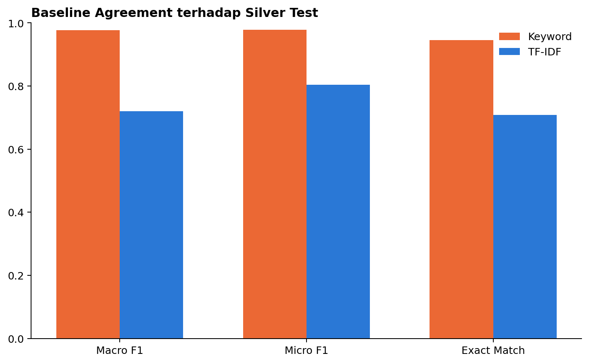
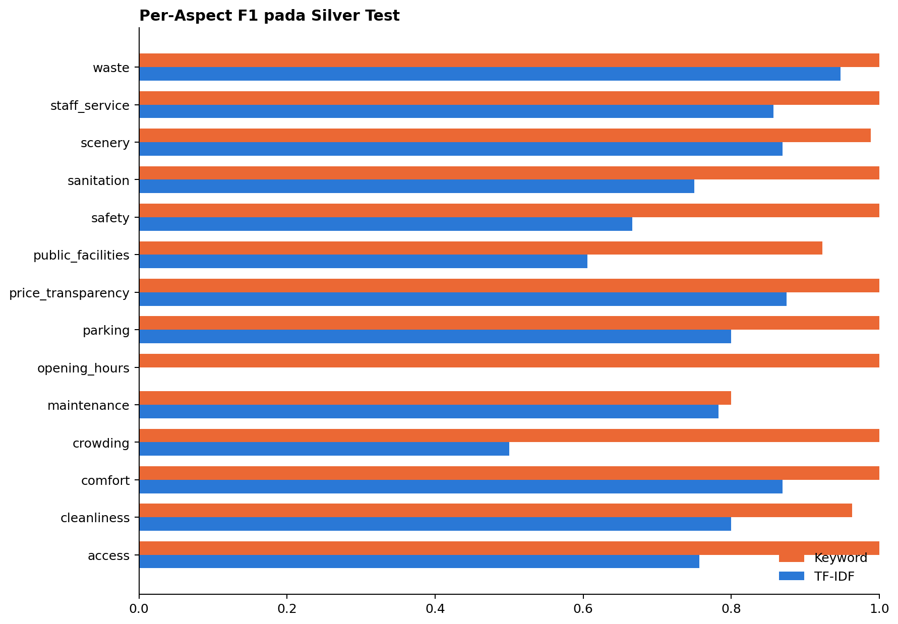

# SIPATURE

## Sistem Pemantauan Ulasan dan Prioritas Tindak Lanjut Pariwisata Toba

**Laporan Analisis *Preliminary Round* — Del AI Hackathon 2026**

**Nama tim:** `[DIISI SEBELUM SUBMISSION]`

**Anggota:** `[DIISI SEBELUM SUBMISSION]`

> Dokumen submission tidak mencantumkan identitas institusi pendidikan. Versi PDF wajib berukuran maksimal 25 MB.

---

## Ringkasan Eksekutif

Ulasan wisata menyimpan informasi yang lebih rinci daripada *rating*. Sebuah tempat dapat memperoleh *rating* tinggi, tetapi masih memiliki laporan tentang toilet kotor, jalan rusak, pungutan, parkir, sampah, atau pelayanan. Ketika jumlah ulasan bertambah, pengelola sulit membaca semuanya secara rutin dan menentukan masalah mana yang perlu diperiksa lebih dahulu.

SIPATURE dirancang sebagai ***dashboard*** **dan sistem pendukung keputusan**. Sistem membaca ulasan, mengelompokkan isu ke dalam 14 aspek, menunjukkan kutipan bukti, lalu membantu pengelola menyusun prioritas verifikasi. SIPATURE tidak menyatakan bahwa keluhan pasti benar dan tidak menggantikan pemeriksaan lapangan.

*Pipeline* saat ini berhasil mengolah 22.302 *record* mentah menjadi 22.169 *record* bersih. Dari jumlah tersebut, 12.234 memiliki teks dan 9.935 hanya memiliki *rating*. Sebanyak 1.320 *review* berteks dipilih secara terstruktur untuk membuat label bantu atau ***silver labels***. Label ini digunakan untuk membangun dan membandingkan *baseline* *Keyword* serta TF-IDF pada pembagian data yang aman dari kebocoran destinasi.

Pada *locked silver test*, *Keyword* memperoleh *Macro F1* 0,9768 dan TF-IDF memperoleh 0,7201. Nilai ini hanya mengukur kesesuaian terhadap *silver labels*, bukan akurasi terhadap label manusia. Skor *Keyword* sangat tinggi karena memakai kosakata *taxonomy* yang juga berkaitan dengan proses pembentukan *silver labels*. Oleh karena itu, hasil tersebut diperlakukan sebagai batas pembanding, bukan bukti bahwa model telah memahami kondisi nyata.

### Alur Data dari Awal hingga Produk

**Tabel 1. Alur penggunaan data dari sumber hingga produk**

| Tahap                                     | Data yang digunakan                         | Tujuan                                                                              |
| ----------------------------------------- | -------------------------------------------:| ----------------------------------------------------------------------------------- |
| Data mentah                               | 22.302 *record*                             | Memahami seluruh bahan dari panitia                                                 |
| Pembersihan dan integrasi                 | 22.169 *record* bersih                      | Menghapus *record* kosong/duplikat teknis dan menghubungkan *review* ke destinasi   |
| Data teks                                 | 12.234 *review*                             | Sumber utama analisis aspek, *polarity*, *severity*, dan *evidence*                 |
| Data *rating-only*                        | 9.935 *review*                              | Konteks volume, *rating*, *coverage*, dan kecukupan data; bukan *input* model teks  |
| *Silver annotation*                       | 1.320 *review* berteks                      | Membentuk data belajar dan *benchmark* awal yang dapat diaudit                      |
| Train/*validation*/*test*                 | 922 / 196 / 202 *review*                    | Melatih, memilih konfigurasi, dan mengevaluasi *baseline* tanpa kebocoran destinasi |
| *Full-corpus inference*, tahap berikutnya | Seluruh 12.234 *review* berteks             | Menghasilkan sinyal isu untuk seluruh *corpus* setelah model dikunci                |
| Aggregasi produk, tahap berikutnya        | Seluruh 22.169 *record* bersih + *metadata* | Menyusun ringkasan destinasi, *data confidence*, dan prioritas verifikasi           |

**Interpretasi Tabel 1.** Tidak semua data digunakan untuk tujuan yang sama. Subset berlabel digunakan untuk belajar dan menguji model, sedangkan seluruh data digunakan setelah model dikunci untuk menghasilkan *intelligence* dan konteks *dashboard*. Pemisahan ini menjaga evaluasi tetap adil sekaligus memastikan seluruh data panitia tetap dimanfaatkan pada tahap produk.

### Istilah Penting dalam Bahasa Sederhana

**Tabel 2. Glosarium istilah data dan pemodelan**

| Istilah                     | Arti dalam laporan ini                                                                      | Mengapa digunakan                                                     |
| --------------------------- | ------------------------------------------------------------------------------------------- | --------------------------------------------------------------------- |
| *Record*                    | Satu baris data                                                                             | Menyebut unit dasar di dalam file CSV                                 |
| *Metadata*                  | Informasi tentang tempat, misalnya nama, alamat, kategori, harga, dan koordinat             | Memberi konteks selain isi ulasan                                     |
| Latitude dan longitude      | Angka posisi utara–selatan dan timur–barat suatu lokasi                                     | Memungkinkan tempat ditampilkan dan dianalisis pada peta              |
| *Entity resolution*         | Proses menyatukan penyebutan yang merujuk pada tempat yang sama                             | Menghubungkan *review* dan *metadata* tanpa asal menggabungkan tempat |
| *Canonical destination*     | ID utama yang dipakai untuk mewakili satu tempat dalam *pipeline*                           | Menyatukan data tempat yang muncul dengan ejaan atau sumber berbeda   |
| *Unresolved placeholder*    | ID sementara untuk tempat yang belum dapat dicocokkan dengan yakin                          | Mencegah sistem salah menggabungkan dua tempat                        |
| NLP                         | Teknik komputer untuk mengolah bahasa manusia                                               | Digunakan untuk membaca isi *review* secara otomatis                  |
| *Aspect*                    | Topik khusus dalam *review*, misalnya kebersihan, akses, atau parkir                        | Lebih berguna daripada sentimen umum                                  |
| *Polarity*                  | Arah penilaian suatu aspek: positif, negatif, atau netral                                   | Satu *review* dapat memuji satu aspek dan mengeluhkan aspek lain      |
| *Severity*                  | Tingkat dampak keluhan: rendah, sedang, atau tinggi                                         | Membantu membedakan gangguan kecil dari masalah mendesak              |
| *Evidence*                  | Potongan teks asli yang mendukung hasil analisis                                            | Membuat hasil dapat diperiksa manusia                                 |
| *Taxonomy*                  | Daftar dan batas definisi aspek yang digunakan sistem                                       | Menjaga pelabelan tetap konsisten                                     |
| *Silver labels*             | Label bantu yang dibuat dengan aturan AI dan belum diverifikasi sebagai *gold* oleh manusia | Memungkinkan eksperimen awal secara transparan                        |
| *Baseline*                  | Metode pembanding sederhana                                                                 | Menilai apakah model yang lebih kompleks benar-benar memberi manfaat  |
| TF-IDF                      | Cara mengubah teks menjadi angka berdasarkan pentingnya kata atau potongan kata             | Cepat, ringan, dan kuat sebagai pembanding NLP klasik                 |
| Train, *validation*, *test* | Data untuk belajar, memilih konfigurasi, dan menguji hasil akhir                            | Mencegah model dinilai menggunakan data yang dipakai untuk belajar    |
| *Leakage*                   | Kebocoran informasi yang membuat evaluasi terlihat lebih baik dari kondisi sebenarnya       | Harus dicegah agar perbandingan model adil                            |
| *Macro F1*                  | Rata-rata kualitas prediksi seluruh aspek dengan bobot yang sama                            | Aspek langka tetap diperhatikan                                       |
| *Micro F1*                  | Kualitas prediksi dihitung dari seluruh keputusan secara bersama                            | Menunjukkan performa keseluruhan pada semua label                     |
| *Exact Match*               | Persentase *review* yang seluruh kumpulan aspeknya diprediksi tepat                         | Memberi ukuran yang ketat untuk tugas dengan banyak label             |
| *Hamming Loss*              | Proporsi keputusan aspek yang salah; semakin kecil semakin baik                             | Menunjukkan rata-rata kesalahan pada seluruh aspek                    |
| *Support*                   | Jumlah contoh yang tersedia untuk suatu aspek                                               | Membantu menilai apakah sebuah skor cukup stabil untuk dipercaya      |
| *Class weighting*           | Memberi perhatian lebih pada kelas yang jumlahnya sedikit saat model belajar                | Mengurangi dominasi aspek yang sering muncul                          |
| *One-vs-Rest*               | Satu model ya/tidak dibuat untuk setiap aspek                                               | Memungkinkan satu *review* memiliki beberapa aspek sekaligus          |
| *Logistic Regression*       | Model statistik ringan untuk memperkirakan peluang suatu aspek muncul                       | Cepat, mudah diaudit, dan cocok sebagai *baseline* klasik             |
| *Latency*                   | Waktu yang dibutuhkan model untuk memproses satu *review*                                   | Mengukur kelayakan model digunakan dalam aplikasi                     |
| *Calibration*               | Pemeriksaan apakah tingkat keyakinan model sesuai dengan frekuensi kebenarannya             | Mencegah *confidence* terlihat lebih pasti dari kenyataan             |
| *Locked test*               | Data uji yang tidak boleh dipakai untuk memilih model atau *threshold*                      | Menjaga evaluasi akhir tetap independen                               |
| *Threshold*                 | Batas nilai agar sebuah aspek dianggap terdeteksi                                           | Mengubah *probability* menjadi keputusan ya/tidak                     |
| *Inference*                 | Proses memakai model yang sudah jadi untuk menganalisis data baru                           | Tahap ketika seluruh *review* berteks akan digunakan                  |
| *Aggregation*               | Menggabungkan hasil per *review* menjadi ringkasan per destinasi                            | Menghasilkan informasi yang dapat ditampilkan di *dashboard*          |

**Interpretasi Tabel 2.** Istilah teknis pada laporan digunakan untuk menjelaskan fungsi tertentu dalam *pipeline*, bukan untuk memperumit pembahasan. Glosarium ini menjadi acuan ketika istilah yang sama muncul pada bagian analisis data, *modelling*, evaluasi, dan rancangan produk.

---

# 1. Latar Belakang

Bagian ini menjelaskan konteks pariwisata Toba, potensi dan tantangan dataset, kesenjangan dalam pengelolaan ulasan, serta alasan pengembangan SIPATURE. Selain itu, bagian ini merangkum tujuan, manfaat, ruang lingkup, dan batasan awal solusi sebagai dasar bagi analisis pada bagian berikutnya.

## 1.1 Konteks Pariwisata Toba

Kawasan Danau Toba memiliki ekosistem pariwisata yang saling bergantung. Pengalaman wisatawan tidak hanya ditentukan oleh daya tarik sebuah destinasi, tetapi juga oleh kebersihan, akses jalan, parkir, toilet, keamanan, harga, pelayanan, akomodasi, kuliner, transportasi, dan informasi operasional. Masalah pada salah satu unsur tersebut dapat memengaruhi kenyamanan pengunjung dan citra kawasan secara keseluruhan.

Peningkatan kualitas pariwisata membutuhkan informasi yang dapat digunakan untuk mengambil tindakan. Pengelola perlu mengetahui bukan hanya tempat mana yang populer, tetapi juga masalah apa yang berulang, seberapa banyak bukti yang tersedia, dan hal apa yang perlu diperiksa lebih dahulu. Informasi tersebut penting agar sumber daya yang terbatas dapat diarahkan pada kebutuhan yang paling relevan.

## 1.2 Potensi dan Tantangan Dataset

Dataset yang disediakan panitia mencakup objek wisata, akomodasi, kuliner, transportasi, fasilitas, lokasi, harga, jam operasional, *rating*, dan ulasan pengguna. Cakupan ini memungkinkan analisis pariwisata dilakukan sebagai satu ekosistem, bukan sebagai daftar destinasi yang berdiri sendiri. Ulasan pengguna menjadi komponen penting karena memuat pengalaman langsung yang tidak selalu tercermin pada *metadata* atau *rating* rata-rata.

Namun, data tersebut masih mentah dan realistis. Informasi tersebar di sejumlah file dengan struktur yang berbeda, beberapa nama tempat tidak konsisten, sebagian *field* kosong, dan tidak semua *review* memiliki teks. Tempat yang sama juga dapat muncul dengan variasi nama pada sumber *review* dan *metadata*. Oleh sebab itu, data tidak dapat langsung dimasukkan ke model. Diperlukan pemeriksaan kualitas, pembersihan, penyamaan struktur, penghubungan entitas, dan dokumentasi perubahan data sebelum analisis dilakukan.

Kondisi ini sejalan dengan tujuan Del AI Hackathon 2026, yaitu memanfaatkan dataset utama panitia secara bermakna dan mengubah data pariwisata yang belum terintegrasi menjadi *insight*, layanan, atau sistem pendukung keputusan. SIPATURE menggabungkan ruang eksplorasi **operasional destinasi** dan ***data intelligence***. NLP (*Natural Language Processing*) digunakan sebagai pendekatan AI utama untuk memahami isi ulasan, sedangkan hasil analisis disajikan dalam bentuk ***dashboard*** dan ***decision support system*** bagi pengelola. Dengan demikian, SIPATURE tidak berhenti pada proses klasifikasi teks: data yang telah dibersihkan dan diintegrasikan diubah menjadi informasi visual, bukti ulasan, ukuran kecukupan data, serta prioritas verifikasi yang mendukung pengambilan keputusan operasional.

## 1.3 Kesenjangan Informasi dalam Pengelolaan Ulasan

*Rating* rata-rata memberikan gambaran umum, tetapi tidak menjelaskan penyebab pengalaman pengunjung. Dua destinasi dengan *rating* yang sama dapat menghadapi masalah yang berbeda. Satu tempat mungkin memiliki keluhan mengenai toilet dan sampah, sedangkan tempat lain menghadapi masalah akses, parkir, pelayanan, atau transparansi harga. Bahkan *review* dengan *rating* tinggi dapat tetap mengandung kritik pada aspek tertentu.

Membaca ulasan satu per satu juga tidak efisien ketika jumlahnya mencapai ribuan. Keluhan penting dapat tertutup oleh *review* positif, komentar singkat, atau tempat yang mempunyai volume ulasan lebih besar. Jika pengelola hanya melihat jumlah keluhan mentah, destinasi populer berisiko selalu terlihat paling bermasalah karena memiliki lebih banyak *review*. Sebaliknya, persentase keluhan yang tinggi pada tempat dengan sedikit *review* dapat terlihat terlalu ekstrem dan belum tentu stabil.

Dengan demikian, kebutuhan utamanya bukan sekadar analisis sentimen positif dan negatif. Pengelola memerlukan sistem yang dapat mengidentifikasi **aspek yang dibicarakan**, menunjukkan **potongan bukti dari review**, memperhitungkan **jumlah dan kecukupan data**, serta menyusun **prioritas verifikasi** tanpa menyatakan keluhan pengguna sebagai fakta lapangan.

## 1.4 Gagasan Solusi SIPATURE

SIPATURE merupakan singkatan dari **Sistem Pemantauan Ulasan dan Prioritas Tindak Lanjut Pariwisata Toba**. Nama ini juga memiliki kedekatan dengan nilai budaya Batak. Secara kontekstual, kata *pature* mengandung makna membenahi, menata, atau memperbaiki, sedangkan *sipature* dapat dimaknai sebagai pihak yang membenahi. Semangat tersebut selaras dengan ungkapan Batak *Marsipature Huta Na Be*, yaitu ajakan untuk bersama-sama membangun dan memperbaiki kampung halaman masing-masing. Dalam SIPATURE, semangat itu diwujudkan melalui pemanfaatan suara pengunjung untuk membantu pengelola mengenali hal yang perlu diperiksa dan dibenahi demi peningkatan kualitas pariwisata Toba. Dengan demikian, nama SIPATURE tidak hanya berfungsi sebagai akronim teknis, tetapi juga membawa pesan lokal tentang kepedulian, gotong royong, dan tanggung jawab merawat kawasan Toba.

Solusi ini dirancang sebagai *dashboard* dan sistem pendukung keputusan yang mengubah *review* menjadi sinyal operasional per destinasi. Model membaca teks *review*, mengelompokkan pembahasan ke dalam 14 aspek, menentukan arah penilaian per aspek, menilai tingkat dampak untuk keluhan negatif, dan mempertahankan kutipan *evidence* yang dapat diperiksa.

Hasil per *review* kemudian diringkas pada tingkat destinasi dengan mempertimbangkan volume bukti, *severity*, *freshness*, dan kecukupan data. Destinasi dengan data sedikit tidak otomatis diberi penilaian baik atau buruk, tetapi ditandai sebagai `Insufficient Data`. Sinyal prioritas juga tetap berstatus belum terverifikasi sampai pengelola melakukan pemeriksaan. Dengan pendekatan ini, SIPATURE berfungsi sebagai alat penyaring dan pemberi arah awal, bukan sebagai pengganti inspeksi lapangan atau keputusan manusia.

Pengguna utama SIPATURE adalah pengelola destinasi yang perlu memantau keluhan dan menentukan pemeriksaan operasional. Pemerintah daerah atau pengelola kawasan menjadi pengguna sekunder untuk melihat pola lintas destinasi. Dalam pengembangan berikutnya, hasil agregat juga dapat membantu penyusunan program perbaikan fasilitas, koordinasi dengan pelaku layanan pendukung, dan evaluasi perubahan kondisi dari waktu ke waktu.

## 1.5 Tujuan dan Manfaat

Tujuan pengembangan SIPATURE adalah:

1. Mengintegrasikan *review* dan *metadata* pariwisata Toba ke dalam struktur data yang dapat ditelusuri.
2. Mengidentifikasi aspek pengalaman wisatawan secara lebih spesifik daripada sentimen umum.
3. Menyediakan *evidence* anonim agar hasil model dapat diperiksa kembali.
4. Membedakan sinyal yang memiliki dukungan memadai dari kondisi yang datanya belum cukup.
5. Membantu pengelola menyusun urutan verifikasi secara lebih cepat dan transparan.
6. Menyediakan fondasi data dan model yang dapat dikembangkan menjadi produk pada *Final Round*.

Manfaat yang diharapkan bagi pengelola adalah berkurangnya waktu untuk membaca *review* secara manual, meningkatnya kemampuan menemukan isu berulang, dan tersedianya dasar yang lebih jelas untuk menentukan tindak lanjut. Bagi pemerintah atau pengelola kawasan, SIPATURE dapat memberikan gambaran lintas destinasi dengan tetap mempertahankan konteks *evidence* dan keterbatasan data. Bagi wisatawan dan pelaku lokal, tindak lanjut yang lebih terarah diharapkan berkontribusi pada pengalaman wisata yang lebih aman, nyaman, informatif, dan berkelanjutan.

## 1.6 Ruang Lingkup dan Batasan Awal

Ruang lingkup preliminary berfokus pada pengolahan dataset panitia, pengembangan *taxonomy* aspek, pembuatan *silver labels*, pembangunan *baseline* *Keyword* dan TF-IDF, evaluasi *leakage-safe*, serta rancangan integrasi model dengan *dashboard*. Analisis utama menggunakan *review* berteks, sedangkan *rating-only* digunakan sebagai konteks volume, distribusi *rating*, dan kecukupan data. *Metadata* lokasi digunakan untuk menghubungkan *review* dengan destinasi dan mendukung penyajian geospasial.

SIPATURE tidak menilai kebenaran faktual sebuah keluhan, tidak menentukan sanksi, dan tidak mempublikasikan identitas *reviewer*. *Silver labels* yang digunakan pada tahap awal bukan *human-gold labels*, sehingga hasil evaluasi belum dapat disebut sebagai akurasi terhadap penilaian manusia. Selain itu, keterbatasan *metadata* tidak boleh ditafsirkan sebagai bukti bahwa fasilitas atau layanan tidak tersedia di dunia nyata. Batasan tersebut dijaga agar solusi tetap transparan, etis, dan dapat dipertanggungjawabkan.

---

# 2. Analisis Permasalahan

Bagian ini membahas kondisi dan karakteristik utama dataset pariwisata Toba sebagai dasar perumusan masalah SIPATURE. Pembahasan mencakup skala dan kualitas data, proses integrasi, kelengkapan metadata, potensi geospasial, hubungan volume ulasan dengan sinyal keluhan, masalah yang dipilih, serta risiko yang perlu dimitigasi.

## 2.1 Temuan Utama Data

Bagian ini menyajikan hasil pemeriksaan awal terhadap skala, komposisi, ketersediaan informasi, sumber, dan proses integrasi data. Pembahasan dibagi menjadi beberapa subbagian agar hubungan antara temuan, tabel, dan visual dapat diikuti secara lebih sistematis.

### 2.1.1 Skala dan Komposisi Data

Tim memeriksa dan mengolah 14 file CSV yang disediakan panitia. Seluruh file berhasil dibaca tanpa kesalahan, kemudian diperiksa struktur kolom, jumlah baris, kelengkapan nilai, dan perannya dalam proses analisis. Dua file ulasan utama berisi total 22.302 *record*. Setelah tahap pembersihan dan penghubungan data, diperoleh 22.169 *record* bersih yang seluruhnya memiliki `destination_id` teknis.


**Gambar 1. Ukuran file berdasarkan jumlah *record*.**

Dua batang terpanjang adalah file ulasan wisata dan ulasan restoran/hotel, masing-masing 12.691 dan 9.611 *record*. File lainnya jauh lebih kecil karena terutama berisi *metadata*, jam operasional, transportasi, atau informasi pendukung. Visual ini menunjukkan bahwa kekuatan utama dataset berada pada ulasan, sedangkan file kecil digunakan untuk memperkaya konteks tempat.

**Tabel 3. Ringkasan hasil pemeriksaan dan pembersihan data**

| Temuan                 | Nilai                                 | Implikasi                                               |
| ---------------------- | -------------------------------------:| ------------------------------------------------------- |
| *Record* mentah        | 22.302                                | Volume terlalu besar untuk dibaca manual secara rutin   |
| *Record* bersih        | 22.169                                | Menjadi dasar integrasi dan agregasi                    |
| *Review* berteks       | 12.234                                | Dapat dianalisis dengan NLP                             |
| *Rating-only*          | 9.935                                 | Berguna sebagai konteks, tetapi tidak menjelaskan aspek |
| *Rating* bintang lima  | 15.595 dari 22.243 *rating* *integer* | Data sangat condong ke *rating* tinggi                  |
| *Canonical* IDs teknis | 388                                   | 322 *metadata anchors* dan 66 *unresolved placeholders* |

**Interpretasi Tabel 3.** Dataset memiliki volume *review* yang besar, tetapi hanya sekitar separuh *record* yang mempunyai teks. Karena model NLP memerlukan teks, *review rating-only* dipisahkan untuk konteks agregasi. Dominasi *rating* bintang lima dan keberadaan *unresolved placeholders* juga menunjukkan bahwa sistem perlu memperhitungkan ketidakseimbangan serta ketidakpastian data.

### 2.1.2 Ketersediaan Teks dan Distribusi *Rating*


**Gambar 2. Ketersediaan informasi pada data mentah.**

Dari 22.302 *record*, hampir semua memiliki *rating*, tetapi hanya 12.280 yang memiliki teks sebelum *cleaning*. Sebanyak 9.978 *record* hanya memiliki *rating* dan 83 merupakan duplikat fisik berlebih. Setelah *cleaning* yang lebih ketat, angka yang digunakan *pipeline* menjadi 12.234 *review* berteks dan 9.935 *rating-only*. Perbedaan angka sebelum dan sesudah *cleaning* menunjukkan bahwa data perlu diperiksa sebelum dipakai oleh model.

*Rating* tinggi tidak selalu berarti tidak ada masalah. Karena itu, SIPATURE membaca isi ulasan dan tidak menggunakan *rating* untuk menentukan *polarity* atau *severity* sebuah aspek.


**Gambar 3. Distribusi *rating* pada data mentah.**

Batang bintang lima jauh lebih tinggi daripada *rating* lain. Artinya, model yang hanya mengikuti kelas mayoritas dapat terlihat baik, padahal belum tentu menemukan keluhan penting. Karena itu SIPATURE membaca teks dan menggunakan *Macro F1* agar aspek yang jarang tetap diperhatikan.

### 2.1.3 Dataset Sumber dan Perannya

Dataset panitia tidak diperlakukan sebagai satu tabel besar yang langsung digabung. Setiap jenis file memiliki makna berbeda, sehingga dibaca dengan aturan yang sesuai sebelum dipertemukan melalui nama tempat, kategori, alamat, dan koordinat.

**Tabel 4. Daftar dataset sumber dan perannya dalam pipeline**

| Kelompok                 | Nama file CSV sumber                  | Peran dalam *pipeline*                                   |
| ------------------------ | ------------------------------------- | -------------------------------------------------------- |
| *Review* wisata          | `wisata-v2.csv`                       | Sumber ulasan dan *rating* objek wisata                  |
| *Review* hotel/restoran  | `resto-hotel-v2.csv`                  | Sumber ulasan dan *rating* hotel/restoran                |
| *Metadata* wisata        | `wisata-metadata.csv`                 | Nama, kategori, alamat, koordinat, status, *rating*      |
| *Metadata* restoran      | `resto-metadata.csv`                  | Nama, koordinat, *rating*, harga, fasilitas, status      |
| *Metadata* hotel         | `hotel-metadata.csv`                  | Nama, koordinat, *rating*, harga, fasilitas, status      |
| Data tempat wisata       | `tempat-wisata-v1.csv`                | Fasilitas, *review*, dan status tambahan                 |
| Jam operasional          | `waktu operasional destinasi.csv`     | *Enrichment* jam dan fasilitas destinasi                 |
| Transportasi             | `transportasi.csv`                    | Rute, tarif, dan jadwal transportasi                     |
| Data kawasan             | `Info Seputar Danau Toba (TOP 3).csv` | Informasi ekosistem wilayah yang lebar dan tidak seragam |
| Atraksi tambahan         | `Attractions Info.csv`                | Deskripsi atraksi, lokasi, jam, tiket, budaya            |
| Hotel/restoran pendukung | `hotel-resto-v1.csv`                  | Daftar tempat pendukung dengan *field* heterogen         |
| Kuliner                  | `kuliner.csv`                         | Deskripsi kuliner                                        |
| Artikel kawasan          | `Artikel Danau Toba.csv`              | Konteks artikel, bukan label model                       |

**Interpretasi Tabel 4.** Dua file *review* menjadi sumber utama analisis bahasa. Tiga file *metadata* utama menyediakan identitas dan lokasi tempat. File lainnya berfungsi sebagai *enrichment* atau konteks tambahan dan tidak seluruhnya menjadi label model. Pemisahan peran ini mencegah artikel atau *field* pendukung diperlakukan sebagai *ground truth* secara keliru.

### 2.1.4 Integrasi, Pembersihan, dan Penghubungan Entitas

Proses penggabungan dilakukan bertahap sebagaimana diringkas pada Tabel 5.

**Tabel 5. Tahapan integrasi dataset SIPATURE**

| Tahap integrasi              | Dataset masukan                                                                                   | Proses utama                                                                       | Keluaran                                                              |
| ---------------------------- | ------------------------------------------------------------------------------------------------- | ---------------------------------------------------------------------------------- | --------------------------------------------------------------------- |
| Standardisasi *review*       | `wisata-v2.csv`, `resto-hotel-v2.csv`                                                             | Menyamakan nama kolom, normalisasi teks/*rating*, membentuk ID dan status *review* | Tabel *review*: `review_id`, nama tempat, teks, *rating*, dan tanggal |
| Standardisasi *metadata*     | `wisata-metadata.csv`, `resto-metadata.csv`, `hotel-metadata.csv`                                 | Menyamakan nama, kategori, alamat, koordinat, harga, fasilitas, dan status         | Tabel *metadata* tempat                                               |
| *Enrichment*                 | `tempat-wisata-v1.csv`, `waktu operasional destinasi.csv`, `transportasi.csv`, dan file pendukung | Menata jam operasional, fasilitas, rute, tarif, serta konteks kawasan              | Tabel *enrichment* terstruktur                                        |
| *Entity resolution*          | Tabel *review*, *metadata*, dan *enrichment*                                                      | Membandingkan nama, jenis, alamat, serta koordinat secara konservatif              | Hubungan *review*–destinasi dan daftar kandidat tidak pasti           |
| Pembentukan data *canonical* | Hasil *entity resolution*                                                                         | Menetapkan ID utama dan *unresolved placeholder* bila kecocokan belum pasti        | `canonical_reviews.parquet` dan `canonical_destinations.parquet`      |

**Interpretasi Tabel 5.** Integrasi tidak dilakukan dengan menumpuk seluruh CSV sekaligus karena struktur dan makna *field* berbeda. *Review* terlebih dahulu distandardisasi, *metadata* tempat dibentuk secara terpisah, dan file pendukung dijadikan *enrichment*. Ketiga kelompok baru dipertemukan melalui *entity resolution*. Pendekatan ini mengurangi risiko salah mengartikan kolom atau menggabungkan dua tempat yang berbeda.

Setelah standardisasi struktur pada Tabel 5, proses dilanjutkan melalui dua tahap yang berbeda. Tahap pertama membersihkan baris *review* dan menentukan data yang layak dipertahankan. Tahap kedua menghubungkan nama tempat dari berbagai sumber dengan identitas destinasi yang konsisten. Pemisahan ini penting karena Gambar 4 menggunakan satuan jumlah *review*, sedangkan Gambar 5 menggunakan satuan jumlah hubungan entitas tempat.

#### Tahap 1: Pembersihan dan Pemisahan Data *Review*


**Gambar 4. Alur pembersihan dan pemisahan data *review*.**

Proses dimulai dari 22.302 *record* mentah. Sebanyak 89 baris duplikat teknis berlebih dan 44 baris tanpa *rating* maupun teks dikeluarkan, sehingga tersisa 22.169 *record* bersih. Dari data bersih tersebut, 12.234 *record* memiliki teks dan dapat digunakan untuk analisis NLP, sedangkan 9.935 lainnya hanya memiliki *rating* dan tetap dipertahankan sebagai konteks agregasi.

Batang “Clean textual” pada Gambar 4 bukan tahap penghapusan lanjutan dari 22.169 *record* bersih, melainkan subset dari data bersih yang mempunyai teks. Dengan demikian, hubungan angkanya adalah 22.302 data mentah dikurangi 89 duplikat dan 44 data kosong menjadi 22.169 data bersih; selanjutnya, 22.169 data bersih dipisahkan menjadi 12.234 *review* berteks dan 9.935 *rating-only records*. Data yang dikeluarkan tetap dicatat pada artefak audit agar proses pembersihan dapat ditelusuri.

#### Tahap 2: Penghubungan Identitas Tempat

Setelah data *review* bersih tersedia, nama tempat pada file *review*, *metadata*, dan sumber pendukung dibandingkan melalui *entity resolution*. Pada tahap ini, unit yang dihitung bukan lagi jumlah *review*, melainkan **810 hubungan kandidat antarsumber tempat**. Satu hubungan menunjukkan upaya menghubungkan satu penyebutan tempat dari suatu sumber dengan identitas destinasi yang menjadi acuan.

Tahap ini diimplementasikan menggunakan ***Python*** dan ***Pandas*** untuk normalisasi, pengelompokan, serta penggabungan data. Pustaka ***RapidFuzz*** digunakan untuk menghitung kemiripan nama dan alamat melalui metode `ratio` dan `token_set_ratio`. Koordinat dibandingkan menggunakan rumus ***Haversine*** untuk mengukur jarak antarlokasi, sedangkan jenis tempat digunakan sebagai pembatas agar objek wisata tidak dicocokkan dengan hotel atau restoran secara keliru. ID destinasi dibentuk secara deterministik menggunakan **SHA-256** agar hasil pengelompokan dapat direproduksi. Kandidat dengan kecocokan nama, alamat, jenis, atau koordinat yang belum cukup kuat dimasukkan ke pemeriksaan manual dan tidak digabungkan secara otomatis.


**Gambar 5. Status 810 hubungan entitas tempat setelah pemeriksaan.**

Sebanyak 698 hubungan dapat dicocokkan otomatis karena memiliki bukti yang kuat. Sebanyak 45 hubungan dikonfirmasi setelah pemeriksaan manusia, sedangkan 31 hubungan dikonfirmasi sebagai tidak cocok dan dipertahankan secara terpisah. Empat hubungan masih memerlukan pemeriksaan lebih lanjut, dan 32 hubungan belum dapat diselesaikan karena bukti yang tersedia belum cukup.

Hubungan yang belum cukup kuat tidak dipaksa bergabung. Sistem memberikan `unresolved placeholder`, yaitu ID sementara yang menjaga *review* tetap dapat dikelompokkan tanpa mengklaim bahwa dua penyebutan merujuk pada tempat yang sama. Status tidak cocok dan belum terselesaikan bukan berarti data dibuang; keduanya merupakan mekanisme pengaman untuk mencegah penggabungan tempat yang salah.

Keluaran kedua tahap tersebut adalah 22.169 *review* bersih yang seluruhnya memiliki `destination_id` teknis dan dapat dikelompokkan ke dalam 388 *canonical IDs*. Sebanyak 322 ID berasal dari tempat yang memiliki acuan *metadata*, sedangkan 66 lainnya merupakan *unresolved placeholders*. Dengan alur ini, analisis per destinasi dapat dilakukan tanpa mengorbankan kehati-hatian dalam penghubungan identitas tempat.

## 2.2 Kelengkapan dan Potensi Geospasial

Analisis pada bagian ini bertujuan menilai apakah *metadata* tempat cukup lengkap untuk mendukung identifikasi destinasi, penyajian peta, dan analisis kedekatan layanan. Pemeriksaan dilakukan terhadap ketersediaan atribut penting, seperti nama, alamat, koordinat, kategori, fasilitas, dan jam operasional, kemudian dilanjutkan dengan melihat pola persebaran lokasi hotel, restoran, dan destinasi wisata.


**Gambar 6. Kelengkapan *metadata* hotel, restoran, dan wisata.**

Warna gelap berarti *field* lebih lengkap. Nama, alamat, koordinat, dan status tersedia hampir penuh, sehingga cukup kuat untuk *linkage* dan peta. Sebaliknya, fasilitas hotel tersedia 83% tetapi fasilitas restoran hanya 4% dan wisata 0% pada file *metadata* utama; jam operasional juga tidak merata. SIPATURE tidak menganggap *field* kosong sebagai “tidak ada fasilitas”, melainkan sebagai data yang belum cukup.


**Gambar 7. Sebaran latitude dan longitude pada 323 *metadata* *records*.**

Latitude menunjukkan posisi utara–selatan, sedangkan longitude menunjukkan posisi timur–barat. Setiap titik mewakili hotel, restoran, atau destinasi wisata. Titik wisata tersebar lebih luas, sementara hotel dan restoran lebih mengelompok pada beberapa pusat layanan. Gambar ini menarik untuk solusi karena membuktikan bahwa data dapat dikembangkan menjadi peta persebaran destinasi, analisis kedekatan layanan, dan perbandingan kawasan. Plot ini menunjukkan koordinat, bukan jarak perjalanan atau batas administratif.

## 2.3 Hubungan Volume *Review* dan Sinyal Keluhan

Analisis berikut digunakan untuk melihat hubungan antara banyaknya *review* berteks dan proporsi ulasan yang mengandung kata kandidat keluhan pada setiap tempat. Tujuannya adalah menguji apakah persentase keluhan dapat langsung digunakan sebagai dasar prioritas atau perlu dibaca bersama jumlah bukti, distribusi *rating*, dan kecukupan data.


**Gambar 8. Hubungan jumlah *review* berteks dengan *candidate complaint rate*.**

Satu titik mewakili satu tempat; posisi horizontal menunjukkan jumlah *review* berteks dan posisi vertikal menunjukkan persentase *review* yang memuat kata kandidat keluhan. Warna menunjukkan *rating* rata-rata. Tempat dengan sedikit *review* dapat memiliki persentase ekstrem hanya karena satu atau dua komentar, sedangkan tempat ber-volume besar cenderung lebih stabil. Karena itu *priority* score tidak boleh memakai persentase mentah saja; sistem perlu mempertimbangkan jumlah bukti dan kecukupan data. *Candidate complaint rate* adalah pencarian kata awal, bukan hasil model final atau konfirmasi masalah.

## 2.4 Masalah yang Dipilih

Masalah utama dirumuskan sebagai berikut:

> Bagaimana membantu pengelola mengubah ribuan ulasan yang tersebar menjadi daftar isu yang spesifik, memiliki bukti, dan dapat diprioritaskan untuk verifikasi?

Sistem rekomendasi wisata tidak dipilih sebagai fokus utama karena dataset juga menyimpan peluang yang kuat untuk membantu pengelola. SIPATURE mengubah feedback pengunjung menjadi sinyal awal untuk tindakan, bukan hanya daftar tempat yang menarik.

## 2.5 Risiko yang Harus Diatasi

**Tabel 6. Risiko utama data dan model beserta mitigasinya**

| Risiko                                  | Dampak                                        | Mitigasi                                                             |
| --------------------------------------- | --------------------------------------------- | -------------------------------------------------------------------- |
| *Rating* dan kelas tidak seimbang       | Masalah langka dapat tertutup                 | *Stratified sampling*, *Macro F1*, *class weighting*                 |
| Nama tempat tidak konsisten             | *Review* dapat terhubung ke tempat yang salah | *Conservative* *entity resolution* dan *unresolved placeholder*      |
| Ulasan berulang                         | Model dapat menghafal teks                    | Duplicate dan repeated-text grouping saat *split*                    |
| *False alert*                           | Merugikan reputasi tempat                     | *Evidence*, bahasa netral, *threshold*, *human verification*         |
| Data sedikit atau usang                 | Skor terlihat lebih pasti daripada kenyataan  | *Data sufficiency*, *freshness*, dan `Insufficient Data`             |
| *Silver labels* mengandung bias *rules* | Evaluasi terlalu optimistis                   | Label hasil sebagai *silver agreement* dan rencanakan *human review* |

**Interpretasi Tabel 6.** Risiko terbesar bukan hanya kesalahan model, tetapi juga kualitas penggabungan data, ketimpangan *support*, dan potensi kerugian reputasi akibat *false alert*. Mitigasi disusun agar sistem menampilkan bukti serta ketidakpastian dan tetap menempatkan manusia sebagai pengambil keputusan akhir.

---

# 3. Desain dan Indikator Keberhasilan Solusi

## 3.1 Cara Kerja SIPATURE

Cara kerja SIPATURE terdiri atas tujuh langkah. Pertama, dataset panitia diperiksa dan dibersihkan. Kedua, *review* dihubungkan dengan *metadata* destinasi melalui *entity resolution*. Ketiga, model membaca *review* berteks untuk mendeteksi aspek. Keempat, setiap aspek dilengkapi dengan *polarity*, *severity* bila negatif, dan *evidence*. Kelima, hasil per *review* diagregasikan pada tingkat destinasi. Keenam, sistem menghitung kecukupan data dan prioritas verifikasi. Ketujuh, *dashboard* menyajikan hasil kepada pengelola untuk diperiksa sebelum tindakan dilakukan.

SIPATURE menggunakan *taxonomy* 14 aspek:

**Tabel 7. *Taxonomy* aspek yang dianalisis SIPATURE**

| Kelompok      | Aspek                                        |
| ------------- | -------------------------------------------- |
| Lingkungan    | cleanliness, waste, sanitation, crowding     |
| Infrastruktur | access, parking, public_facilities           |
| Pengalaman    | scenery, comfort, safety, price_transparency |
| Operasional   | staff_service, maintenance, opening_hours    |

**Interpretasi Tabel 7.** Empat kelompok aspek memisahkan isu lingkungan, infrastruktur, pengalaman pengunjung, dan operasional. Pembagian ini membuat hasil lebih mudah dihubungkan dengan unit atau jenis tindakan yang relevan dibandingkan sentimen positif/negatif secara umum.

Dalam bahasa pengguna, aspek tersebut berarti: kebersihan umum, sampah, toilet/sanitasi, kepadatan, akses jalan, parkir, fasilitas publik, pemandangan, kenyamanan, keselamatan, transparansi harga, pelayanan staf, perawatan, dan jam operasional. Nama teknis berbahasa Inggris dipertahankan di data agar konsisten dengan model dan kode, sedangkan *dashboard* dapat menampilkan terjemahan Indonesia.

Satu *review* dapat membahas beberapa aspek. Setiap aspek memiliki *polarity* `positive`, `negative`, atau `neutral`. *Severity* `low`, `medium`, dan `high` hanya diberikan untuk aspek negatif berdasarkan dampak yang tertulis, bukan berdasarkan *rating*.

## 3.2 Fitur Utama

- Ringkasan kondisi data dan jumlah destinasi yang dapat dianalisis.
- Peta dan halaman detail destinasi.
- Daftar aspek positif, negatif, dan netral.
- Kutipan *evidence* *verbatim* yang anonim.
- *Intervention queue* untuk membantu memilih lokasi yang perlu diverifikasi.
- Status `Insufficient Data` ketika bukti belum cukup.
- *Analyzer* untuk mendemonstrasikan analisis satu *review*.

## 3.3 Diferensiasi

**Tabel 8. Perbedaan SIPATURE dengan *dashboard* sentimen umum**

| *Dashboard* sentimen umum                   | SIPATURE                                                 |
| ------------------------------------------- | -------------------------------------------------------- |
| Menampilkan positif/negatif secara umum     | Menampilkan 14 isu yang lebih operasional                |
| Berfokus pada *rating* atau jumlah sentimen | Menampilkan *evidence*, *support*, dan *data confidence* |
| Keluhan dapat terlihat sebagai fakta        | Menggunakan bahasa “dilaporkan” dan meminta verifikasi   |
| Semua tempat dapat terlihat sebanding       | Menandai data yang belum cukup                           |

**Interpretasi Tabel 8.** Nilai tambah SIPATURE terletak pada keluaran yang dapat diperiksa dan ditindaklanjuti. Sistem tidak berhenti pada jumlah sentimen, tetapi menyertakan aspek, *evidence*, *support*, dan kecukupan data serta menggunakan bahasa yang tidak menghakimi destinasi.

## 3.4 Indikator Keberhasilan

**Tabel 9. Indikator keberhasilan dan hasil yang telah terukur**

| Lapisan         | Indikator                                                 | Hasil yang sudah terukur                                              |
| --------------- | --------------------------------------------------------- | --------------------------------------------------------------------- |
| Data            | Seluruh clean *review* memiliki *destination ID*          | Tercapai: 22.169/22.169                                               |
| *Split*         | Tidak ada *destination*/duplicate/repeated-text *leakage* | Tercapai pada A6                                                      |
| *Baseline*      | Macro dan *Micro F1* pada *split* yang sama               | Tersedia terhadap *silver labels*                                     |
| *Evidence*      | Kutipan sesuai dengan teks sumber                         | Dijaga oleh *annotation* schema; *human system audit* belum dilakukan |
| *Early warning* | Precision *alert* berisiko tinggi                         | Belum tersedia; memerlukan *reference* yang lebih kuat                |
| Produk          | Waktu analisis dan relevansi prioritas                    | Belum diuji bersama pengguna                                          |

**Interpretasi Tabel 9.** Indikator membedakan hasil yang telah terukur dari sasaran yang masih memerlukan *pilot* atau *human evaluation*. Data *linkage* dan *leakage* audit telah tersedia, sedangkan ketepatan *early warning* serta dampak terhadap pekerjaan pengguna belum boleh diklaim.

---

# 4. Perencanaan Implementasi

## 4.1 Alur Implementasi

Implementasi dimulai dari fondasi data: inventory, pemeriksaan kualitas, *cleaning*, dan penghubungan *review* ke destinasi. Setelah fondasi tersebut stabil, *taxonomy* dan *silver labels* dibuat untuk membangun *benchmark* awal. *Keyword* dan TF-IDF kemudian dibandingkan pada *split* yang sama dan bebas dari kebocoran yang terdeteksi.

Pengembangan berikutnya berfokus pada model bahasa Indonesia yang lebih memahami konteks, lalu *calibration* dan *error analysis*. Model hanya diterapkan ke seluruh *corpus* setelah konfigurasi dikunci. Hasil per *review* kemudian digabungkan per destinasi, diberi ukuran kecukupan data, dan diekspor ke *dashboard*. Tahap terakhir adalah *pilot* bersama pengelola untuk menilai apakah isu, *evidence*, dan urutan prioritas benar-benar membantu pekerjaan mereka.

## 4.2 Kapan Seluruh Data Digunakan

Penggunaan data dibagi agar *training* dan evaluasi tidak bercampur dengan penggunaan produk:

1. **Saat *training*:** 922 *silver records* digunakan untuk melatih TF-IDF dan nantinya model lain.
2. **Saat memilih model:** 196 *validation* *records* digunakan untuk memilih *representation* dan *threshold*.
3. **Saat evaluasi:** 202 *locked-test records* digunakan setelah konfigurasi dibekukan.
4. **Saat produksi:** model terpilih dijalankan pada seluruh 12.234 *review* berteks.
5. **Saat agregasi *dashboard*:** hasil model digabungkan dengan seluruh 22.169 clean *records* dan *metadata* destinasi.

*Rating-only* tidak dipaksa menjadi *input* NLP. Data tersebut digunakan untuk volume, distribusi *rating*, *coverage*, dan *data sufficiency*. Pemisahan ini menjaga agar setiap jenis data dipakai sesuai informasi yang benar-benar dimilikinya.

## 4.3 Rencana *Pilot* dan Keberlanjutan

*Pilot* akan memilih 5–10 destinasi dengan jenis dan volume *review* yang berbeda. Pengelola menilai apakah isu, *evidence*, dan urutan prioritas relevan. Sinyal dapat diberi status `confirmed`, `rejected`, atau `uncertain`.

Keberlanjutan sistem memerlukan jadwal pembaruan data, *versioned model*, audit *false alert*, dan pemilik proses yang bertanggung jawab menindaklanjuti *queue*. Jika kondisi data tidak cukup, sistem harus menyatakan ketidakpastian dan bukan memberi nilai baik secara otomatis.

---

# 5. *Modelling*

## 5.1 Persiapan Data

*Cleaning* melakukan normalisasi Unicode dan spasi tanpa menghilangkan tanda baca, negasi, *typo*, atau *mixed language* yang penting bagi NLP. *Entity resolution* menghubungkan *review* ke *canonical destination* secara konservatif. Semua *review* bersih memperoleh *destination ID*; kandidat yang belum dapat dipastikan disimpan sebagai *unresolved placeholder* agar tidak dipaksa bergabung.

**Entity resolution** adalah proses menyatukan penyebutan yang merujuk pada tempat yang sama. Contohnya, nama tempat dapat memiliki perbedaan ejaan pada file *review* dan *metadata*. Pendekatan konservatif berarti sistem lebih memilih menandai hubungan sebagai belum pasti daripada salah menggabungkan dua tempat yang berbeda.


**Gambar 9. Hasil penghubungan 22.169 clean reviews ke *destination ID*.**

Sebanyak 16.979 *review* terhubung otomatis karena kecocokannya kuat, 3.901 menggunakan alias yang telah diverifikasi, dan sisanya ditempatkan pada kategori *no-match*, *unresolved*, atau manual *review*. Semua *review* tetap memperoleh ID teknis agar dapat dikelompokkan saat *split*, tetapi *unresolved* ID tidak diklaim sebagai destinasi baru yang telah terverifikasi.


**Gambar 10. Komposisi 388 *canonical* IDs teknis.**

Sebanyak 322 ID berasal dari *metadata anchors* dan 66 adalah *unresolved placeholders*. Ini menjelaskan bahwa “388 destinasi teknis” bukan berarti 388 tempat wisata unik yang semuanya sudah diverifikasi; sebagian adalah kelompok aman untuk analisis dan *split*.

## 5.2 Contoh Perubahan Bentuk Data

*Pipeline* menyimpan hasil antara agar setiap tahap dapat diperiksa dan tidak bergantung pada memori notebook. Contoh berikut disederhanakan dari *artifact* aktual dan tidak memuat identitas *reviewer*.

### A. Bentuk Awal: CSV

CSV adalah file teks berbentuk tabel. Satu baris mewakili satu *review* sumber. Nama kolom dua file *review* utama dipetakan ke *field* yang sama sebelum digabung.

```csv
place-name,reviewer-rating,review-text,published-at,scraped-at-date
Pantai Pasir Putih Lumban Bul-bul Balige,5,"Pantainya bersih ...",setahun lalu,2025-07-29
```

Kolom pentingnya adalah nama tempat, *rating*, teks *review*, waktu publikasi, dan tanggal pengambilan data. Nama *reviewer* tidak dibawa ke *output* publik.

### B. Setelah *Cleaning* dan *Entity Resolution*: Parquet

Parquet adalah format tabel terkompresi. Dibanding CSV, Parquet lebih cepat dibaca oleh *pipeline*, mempertahankan tipe data, dan cocok untuk dataset antara yang besar. Contoh satu row dari `canonical_reviews.parquet`:

```json
{
  "review_id": "review_a9d17694b1521309",
  "source_kind": "wisata",
  "place_name_raw": "Pantai Pasir Putih Lumban Bul-bul Balige",
  "review_text_raw": "Pantainya bersih, hanya saja gerai makanan cenderung agak monoton.",
  "rating": 5.0,
  "destination_id": "dest_wisata_675974ac1b278e",
  "duplicate_group_id": "dup_6d3c085d5f680b65"
}
```

`review_id` memastikan setiap *review* dapat dilacak, `destination_id` menunjukkan tempat hasil *entity resolution*, dan `duplicate_group_id` membantu mencegah teks yang sama bocor ke *split* berbeda. Teks asli tetap disimpan untuk *evidence*.

### C. Setelah *Annotation*: JSONL

JSONL adalah format dengan satu objek JSON per baris. Format ini cocok untuk label multilabel karena satu *review* dapat memiliki beberapa aspek. Contoh dipersingkat dari `silver-v1.0.0.jsonl`:

```json
{
  "review_id": "review_000332d077bc2a6e",
  "destination_id": "dest_wisata_0ff99a3eeafd42",
  "text": "pemandangan bagus ... video informasi rusak tak dapat dilihat",
  "labels": [
    {
      "aspect": "scenery",
      "polarity": "positive",
      "severity": null,
      "evidence_text": "pemandangan bagus lihat dari atas.",
      "vote_count": 3,
      "confidence": 1.0
    },
    {
      "aspect": "maintenance",
      "polarity": "negative",
      "severity": "medium",
      "evidence_text": "video informasi ... rusak tak dapat dilihat",
      "vote_count": 3,
      "confidence": 1.0
    }
  ],
  "silver_status": "consensus"
}
```

`evidence_text` adalah potongan teks yang mendukung label. `vote_count: 3` berarti tiga *rule passes* memberi keputusan yang sama, bukan tiga manusia. `confidence: 1.0` adalah konsistensi votes, bukan probabilitas terkalibrasi.

### D. Bentuk *Output* Model Tahap Berikutnya

Setelah model final dikunci, setiap *review* berteks akan menghasilkan *prediction* *record*. Contoh berikut adalah **kontrak *output* yang direncanakan**, bukan hasil *full-corpus inference* yang sudah tersedia:

```json
{
  "review_id": "review_a9d17694b1521309",
  "destination_id": "dest_wisata_675974ac1b278e",
  "model_version": "[MODEL_VERSION]",
  "predictions": [
    {
      "aspect": "cleanliness",
      "aspect_probability": 0.91,
      "polarity": "positive",
      "severity": null
    }
  ]
}
```

*Record* *prediction* selanjutnya digabungkan berdasarkan `destination_id`. Sistem menghitung jumlah *mention*, *negative signal*, *severe signal*, *evidence*, *freshness*, dan kecukupan data untuk menghasilkan ringkasan per destinasi. Dengan demikian, alur formatnya adalah:

Contoh **bentuk ringkasan destinasi yang direncanakan** untuk *dashboard*:

```json
{
  "destination_id": "dest_wisata_675974ac1b278e",
  "data_confidence": "medium",
  "review_coverage": {
    "total_clean_records": 120,
    "textual_records": 76,
    "rating_only_records": 44
  },
  "issues": [
    {
      "aspect": "cleanliness",
      "negative_mentions": 8,
      "support": 14,
      "priority": "monitor",
      "evidence_review_ids": ["review_..."]
    }
  ],
  "verification_status": "unverified"
}
```

`data_confidence` menjelaskan kecukupan data, bukan keyakinan bahwa kondisi lapangan benar. `support` adalah jumlah bukti *review*, `priority` menentukan urutan pemeriksaan, dan `verification_status` menunjukkan bahwa pengelola belum mengonfirmasi sinyal tersebut. Angka di contoh ini hanya ilustrasi struktur dan bukan hasil aktual suatu destinasi.

Urutan transformasi datanya adalah: CSV sumber dibaca dan distandardisasi; hasil bersih disimpan sebagai Parquet; subset *annotation* disimpan sebagai JSONL untuk *training* dan *evaluation*; model terpilih menghasilkan *prediction* bagi 12.234 *review* berteks; lalu *prediction* digabungkan menjadi *aggregate* JSON per destinasi untuk *dashboard*.

## 5.3 Mengapa Hanya 1.320 *Review* yang Berlabel

Dari 12.234 *review* berteks, dipilih 1.320 *review* untuk *annotation* awal:

- 120 *review* untuk *pilot*;
- 1.200 *review* untuk *main sample*;
- pemilihan mempertimbangkan *destination*, *rating*, panjang teks, jenis sumber, penanda bahasa, *recency*, *candidate complaint*, dan aspek langka.

Tujuannya adalah memperoleh subset yang cukup beragam dan dapat diaudit, bukan menyatakan bahwa subset tersebut mewakili prevalensi seluruh populasi. Tiga *deterministic rule passes* menghasilkan ***AI-assisted weak-supervision silver labels***. Hasilnya adalah 489 `consensus`, 334 `review_recommended`, dan 497 `no_supported_aspect` *records*.

*Silver labels* bukan *human gold*. `pass_agreement` 0,8827 mengukur konsistensi *rules* dan bukan *inter-annotator agreement* atau *calibrated probability*.


**Gambar 11. Jumlah *silver labels* per aspek pada *main sample* 1.200 *review*.**

Satu *review* dapat memiliki beberapa aspek, sehingga total batang tidak sama dengan jumlah *review*. Pemandangan, pelayanan staf, transparansi harga, dan kebersihan memiliki *support* terbesar. Jam operasional, keselamatan, kepadatan, dan sampah jauh lebih sedikit. Ketimpangan ini menjadi alasan penggunaan *stratified sampling*, *class weighting*, dan *Macro F1*. Distribusi ini berasal dari *sample* yang sengaja memperbanyak aspek langka, sehingga tidak boleh dianggap sebagai prevalensi seluruh pariwisata Toba.


**Gambar 12. Distribusi *polarity* dan *severity* pada *main sample*.**

Bagian kiri menunjukkan lebih banyak label positif daripada negatif/netral. Bagian kanan hanya menghitung label negatif: *severity* rendah paling banyak, diikuti sedang, sedangkan tinggi relatif sedikit. Gambar ini menjelaskan mengapa *severity* tinggi tidak dapat dinilai hanya dengan *accuracy*; jumlahnya kecil dan setiap *false alert* berpotensi merugikan reputasi destinasi.

## 5.4 *Leakage-Safe* *Split*

Seluruh 1.320 *silver records* dibagi berdasarkan *destination*, bukan secara acak per *review*:

**Tabel 10. Pembagian *leakage-safe train*, *validation*, dan *locked test***

| *Split*       | *Records* | *Destinations* | Fungsi                                   |
| ------------- | ---------:| --------------:| ---------------------------------------- |
| Train         | 922       | 187            | Model belajar pola                       |
| *Validation*  | 196       | 40             | Memilih *representation* dan *threshold* |
| *Locked test* | 202       | 40             | Evaluasi setelah konfigurasi dikunci     |

**Interpretasi Tabel 10.** Proporsi destinasi mendekati 70/15/15, sedangkan jumlah *record* dapat berbeda karena tiap destinasi memiliki volume *review* yang tidak sama. Audit memastikan tidak ada *overlap review ID*, *destination*, *technical duplicate group*, atau *normalized repeated-text group*. Seluruh 14 aspek muncul pada *validation* dan *test*, tetapi *support* beberapa aspek masih kecil, misalnya `opening_hours` hanya memiliki dua contoh pada *test*.

## 5.5 *Baseline* *Keyword*

*Keyword baseline* menggunakan *lexicon* aspek, konteks lokal, *polarity* cues, *contrast marker*, *intensity*, dan *severity* *rules*. Model ini transparan dan mudah dijelaskan, tetapi sangat bergantung pada kata yang sudah dikenal.

## 5.6 *Baseline* TF-IDF

TF-IDF mengubah teks menjadi pola kata dan potongan karakter. Tiga *representation* diuji hanya pada *validation*:

**Tabel 11. Perbandingan representasi TF-IDF pada *validation* split**

| *Representation*      | *Validation* *Macro F1* terhadap silver |
| --------------------- | ---------------------------------------:|
| *Word* unigram/bigram | 0,7780                                  |
| *Character* 3–5 gram  | 0,7314                                  |
| *Word* + *character*  | 0,8117                                  |

**Interpretasi Tabel 11.** Kombinasi *word* dan *character* memperoleh *Macro F1* *validation* tertinggi sehingga dipilih sebagai *baseline* TF-IDF final. *Classifier* menggunakan *One-vs-Rest Logistic Regression* dengan *class weighting*. *Threshold* setiap aspek dipilih hanya dari *validation*.


**Gambar 13. Pemilihan TF-IDF *representation* menggunakan *validation* *split*.**

`Word` memakai pola satu atau dua kata, `char` memakai potongan 3–5 karakter yang membantu menghadapi variasi ejaan, sedangkan `word_char` menggabungkan keduanya. Kombinasi memperoleh *Macro F1* *validation* tertinggi, yaitu 0,8117. *Locked test* tidak digunakan untuk memilih *representation* ini.

## 5.7 Rencana Model Lanjutan

Tahap berikutnya adalah IndoBERT untuk mempelajari konteks bahasa Indonesia yang tidak selalu tertangkap *keyword* atau TF-IDF. IndoBERT hanya akan dipertahankan jika memberi peningkatan yang berarti dengan biaya komputasi yang masih layak. Model yang lebih kompleks tidak otomatis dianggap lebih baik.

---

# 6. Evaluasi Model

## 6.1 Protokol

Kedua *baseline* dinilai pada *locked test* yang sama. *Macro F1* dipakai sebagai metrik utama karena semua aspek perlu diperhatikan, termasuk aspek langka. *Micro F1*, *Exact Match*, *Hamming Loss*, per-*aspect* F1, dan *latency* dilaporkan sebagai pelengkap.

*Config* dan *threshold* dipilih pada *train/validation*. *Locked-test metrics* tidak boleh ditimpa; eksperimen baru harus memakai versi baru.

## 6.2 Hasil *Locked Silver Test*

**Tabel 12. Hasil *Keyword* dan TF-IDF pada *locked silver test***

| Metric                 | *Keyword* | TF-IDF *word*+char |
| ---------------------- | ---------:| ------------------:|
| *Macro F1*             | 0,9768    | 0,7201             |
| *Micro F1*             | 0,9783    | 0,8040             |
| *Exact Match*          | 0,9455    | 0,7079             |
| *Hamming Loss*         | 0,0039    | 0,0343             |
| *Latency*, ms/*review* | 1,8953    | 0,1101             |

**Interpretasi Tabel 12.** *Keyword* memiliki *agreement* paling tinggi terhadap *silver reference*, tetapi hasil ini sangat dipengaruhi oleh penggunaan kosakata *taxonomy* yang juga berkaitan dengan pembentukan *silver labels*. TF-IDF memiliki *agreement* lebih rendah, namun *inference* lebih cepat dan menjadi pembanding yang lebih berguna untuk model yang belajar dari pola data. Seluruh angka merupakan *silver agreement*, bukan *human-gold performance*.



**Gambar 14. Perbandingan *agreement* *baseline* terhadap *locked silver test*.**

Semakin tinggi batang, semakin sesuai prediksi dengan *silver reference*. *Keyword* tampak sangat tinggi karena menggunakan kosakata yang berkaitan erat dengan pembentukan *silver labels*. TF-IDF lebih rendah tetapi lebih berguna sebagai pembanding model yang belajar pola dari data. Angka ini bukan performa terhadap label manusia.

*Keyword* memperoleh nilai sangat tinggi karena kosakata *taxonomy* juga berkaitan dengan cara *silver labels* dibentuk. Dengan kata lain, model *Keyword* sangat baik dalam meniru *reference* *rules*. Hal ini tidak membuktikan bahwa model mampu memahami semua bentuk keluhan nyata.

TF-IDF lebih independen dari *runtime* *rules*, tetapi tetap belajar dari *silver targets*. Hasil per aspek menunjukkan keterbatasan pada kelas langka:

**Tabel 13. Contoh hasil TF-IDF pada aspek dengan *support* terbatas**

| Aspek             | TF-IDF F1 | *Test* *support* |
| ----------------- | ---------:| ----------------:|
| opening_hours     | 0,0000    | 2                |
| crowding          | 0,5000    | 6                |
| public_facilities | 0,6061    | 18               |
| safety            | 0,6667    | 8                |
| waste             | 0,9474    | 9                |

**Interpretasi Tabel 13.** Nilai F1 harus dibaca bersama *support*. `opening_hours` memiliki F1 nol tetapi hanya dua contoh pada *test*, sehingga estimasinya belum stabil. `waste` memiliki F1 tinggi, namun *support* sembilan juga masih terbatas. Tabel ini mendukung perlunya tambahan *reference* yang lebih kuat dan evaluasi per aspek, bukan hanya satu nilai rata-rata.



**Gambar 15. Per-*aspect* F1 pada *locked silver test*.**

Setiap pasangan batang membandingkan *Keyword* dan TF-IDF untuk satu aspek. TF-IDF cukup kuat pada waste, scenery, comfort, dan staff service, tetapi lemah pada opening hours dan crowding. Perbedaan tersebut tidak boleh dibaca tanpa *support*: opening hours hanya memiliki dua contoh pada *test*, sehingga satu kesalahan saja sangat memengaruhi nilainya.

## 6.3 Interpretasi yang Bertanggung Jawab

Hasil A6 mendukung tiga kesimpulan:

1. *Pipeline* *split* dan evaluasi dapat berjalan tanpa kebocoran *destination*/repeated text yang terdeteksi.
2. Combined TF-IDF menjadi classical *baseline* yang dapat dimuat ulang dan cepat untuk *inference*.
3. Independent human *reference* tetap diperlukan sebelum mengklaim performa dunia nyata atau *Alert Precision*.

---

# 7. Hasil dan Pembahasan

## 7.1 Hasil yang Sudah Tersedia

- Tim berhasil membaca dan memeriksa 14 file CSV tanpa kesalahan.
- *Cleaning* menghasilkan 22.169 *clean records*.
- *Entity resolution* menghasilkan 388 *canonical* IDs teknis.
- *Taxonomy* 14 aspek dan *silver annotation* 1.320 *records* tersedia.
- *Destination*/repeated-text-safe *split* telah dikunci.
- *Keyword* dan TF-IDF telah dievaluasi pada *split* yang sama.
- Model TF-IDF dapat disimpan, dimuat ulang, dan menghasilkan 14 *probabilities* per *review*.
- *Prototype dashboard* telah memiliki *overview*, peta, *destination detail*, *intervention queue*, *analyzer*, dan *fallback* peta luring.

## 7.2 Apa yang Belum Boleh Diklaim

- *Silver labels* bukan label manusia atau kondisi lapangan.
- *Keyword* *Macro F1* 0,9768 bukan akurasi dunia nyata.
- TF-IDF *Macro F1* 0,7201 belum membuktikan performa terhadap *human gold*.
- *Priority* score belum divalidasi bersama *stakeholder*.
- *Evidence* *correctness*, *Alert Precision*, ranking *agreement*, dan *time saved* belum diukur.
- Data aplikasi saat ini belum merupakan hasil *full-corpus inference* dari model A6.

## 7.3 Hubungan Model dengan Produk

Saat ini A6 membuktikan *pipeline training* dan *benchmark* pada subset berlabel. Setelah model akhir dikunci, model digunakan untuk melakukan *inference* terhadap 12.234 *review* berteks. Hasil tersebut kemudian digabungkan dengan 9.935 *rating-only records* sehingga konteks agregasi mencakup seluruh 22.169 *clean records*. Pada tingkat destinasi, sistem menyusun *evidence*, *data confidence*, dan *intervention priority* sebelum hasil dikirimkan ke *dashboard* SIPATURE.

Alur ini mencegah angka evaluasi bercampur dengan *output* produksi. Data *training* menjawab “apakah model sesuai dengan *reference*?”, sedangkan *full-corpus inference* menjawab “isu apa yang dilaporkan pada seluruh data?”.

## 7.4 Dampak yang Diharapkan

SIPATURE diharapkan membantu pengelola mengurangi waktu membaca ulasan, menemukan isu yang berulang, dan memulai verifikasi dari masalah yang memiliki *evidence* serta *support* memadai. Pemerintah daerah dapat melihat pola lintas destinasi tanpa menganggap sistem sebagai pengganti inspeksi.

Ukuran dampak pada *pilot* akan mencakup relevansi isu, persentase *alert* yang *confirmed/rejected*, waktu analisis, dan kesesuaian urutan prioritas dengan penilaian pengguna.

---

# 8. Deklarasi Penggunaan AI

AI generatif digunakan untuk membantu perancangan solusi, pengembangan kode, *debugging*, audit aturan, penyusunan dokumentasi, dan pembuatan narasi laporan. *AI-assisted weak supervision* juga digunakan untuk menghasilkan *silver labels* melalui tiga *deterministic rule passes*.

Penggunaan AI dibatasi sebagai berikut:

- *Silver labels* tidak disebut sebagai human *annotation* atau *gold* labels.
- AI *pass agreement* tidak disebut sebagai *inter-annotator agreement*.
- *Confidence* berbasis *vote* tidak disebut sebagai *calibrated probability*.
- AI tidak menentukan tindakan lapangan secara otomatis.
- *Evidence* tetap berupa kutipan *verbatim* yang anonim dan dapat diperiksa.
- Kode dan *artifact* diperiksa melalui *lint*, *unit test*, *schema validation*, *hash verification*, *model reload*, dan pembacaan hasil.

Keputusan operasional tetap memerlukan verifikasi manusia karena ulasan adalah laporan pengguna, bukan konfirmasi kondisi aktual.

---

## Referensi dan *Traceability*

1. Del AI Hackathon 2026, *Challenge Guidebook*, 2026.
2. Del AI Hackathon 2026, *Technical Meeting*, 13 Juli 2026.
3. Laporan data: `docs/eda-report.md`.
4. Laporan *cleaning* dan *entity resolution*: `docs/cleaning-entity-resolution-report.md`.
5. Laporan *taxonomy* dan *silver annotation*: `docs/taxonomy-annotation-report.md`.
6. Laporan *split* dan *baseline*: `docs/leakage-safe-split-baseline-report.md`.
7. *Responsible AI*: `docs/responsible-ai.md`.
8. *Reproducibility*: `docs/reproducibility-runbook.md`.

**Tabel 14. Hubungan klaim laporan dengan *artifact* teknis**

| Klaim utama                 | *Artifact*                                             |
| --------------------------- | ------------------------------------------------------ |
| Inventory dan jumlah data   | `ml/artifacts/reports/data_inventory.json`             |
| *Cleaning*                  | `ml/artifacts/reports/cleaning_summary.json`           |
| *Entity resolution*         | `ml/artifacts/reports/entity_resolution_summary.json`  |
| *Silver labels*             | `ml/artifacts/reports/silver_annotation_summary.json`  |
| Locked *split*              | `ml/data/splits/split_manifest_silver_v1.json`         |
| *Baseline* *metrics*        | `ml/artifacts/metrics/*-silver-v1-test-metrics.json`   |
| *Baseline* *error analysis* | `ml/artifacts/reports/baseline_silver_test_errors.csv` |

**Interpretasi Tabel 14.** Setiap klaim kuantitatif utama memiliki *artifact* sumber yang dapat diperiksa. *Traceability* ini membedakan hasil aktual dari rencana dan memungkinkan reproduksi tanpa menaruh raw/*restricted* data langsung di laporan publik.

> *Raw data*, *review-level annotation*, *split records*, model *artifact*, *metrics*, dan *error cases* bersifat *restricted* dan tidak dipublikasikan tanpa pemeriksaan lisensi serta privasi.
