# SIPATURE

## Sistem Peringatan Dini dan Prioritas Intervensi Kualitas Pariwisata Danau Toba

### Laporan Analisis — Preliminary Round Del AI Hackathon 2026

**Nama Tim:** `[MENUNGGU KONFIRMASI ADMINISTRASI]`  
**Ketua:** `[MENUNGGU KONFIRMASI ADMINISTRASI]`  
**Anggota:** `[MENUNGGU KONFIRMASI ADMINISTRASI]`  
**Tanggal pembaruan:** 28 Juli 2026  
**Versi:** Draft 0.1

> Dokumen kerja ini hanya mengisi bagian yang telah memiliki dasar faktual atau keputusan scope. Bagian yang menunggu EDA, annotation, training, locked-test evaluation, atau validasi stakeholder ditandai secara eksplisit. Dokumen submission akhir tidak akan mencantumkan identitas institusi pendidikan dan dibatasi maksimal 25 MB.

## Status Bukti dalam Dokumen

| Status | Arti |
| --- | --- |
| **Aktual** | Sudah diperoleh dari data, kode, atau pengujian yang dapat ditelusuri |
| **Baseline** | Berasal dari pipeline keyword + rating lama; bukan hasil model terlatih |
| **Rancangan** | Keputusan desain yang belum divalidasi sebagai hasil |
| **Belum tersedia** | Menunggu tahap pipeline berikutnya |

## Ringkasan Eksekutif

Dataset pariwisata Toba menyediakan ulasan, rating, metadata tempat, koordinat, fasilitas, jam operasional, harga, akomodasi, kuliner, dan transportasi. Meskipun kaya informasi, data tersebut masih tersebar pada beberapa file, memiliki struktur yang beragam, dan memuat teks ulasan yang tidak dapat dipantau secara manual dalam skala besar. Rating rata-rata juga tidak menunjukkan masalah operasional tertentu. Sebuah destinasi dapat memiliki rating tinggi sekaligus menerima keluhan mengenai sanitasi, sampah, akses jalan, pungutan, parkir, pelayanan, atau perawatan.

SIPATURE dirancang sebagai sistem **Dashboard & Decision Support** yang menghubungkan review dengan isu spesifik, confidence, bukti verbatim, prioritas verifikasi, dan kandidat intervensi. Pengguna utamanya adalah pengelola destinasi; pengguna sekundernya adalah BPODT, pemerintah daerah, dan perencana program pariwisata. SIPATURE tidak menggantikan inspeksi lapangan. Sistem ini ditujukan untuk membantu tim dengan sumber daya terbatas menentukan lokasi dan masalah yang perlu diperiksa lebih dahulu berdasarkan bukti.

Inventory dan EDA reproducible berhasil membaca 14 CSV pada direktori dataset saat ini tanpa read error. Dua file ulasan utama masing-masing berisi 12.691 dan 9.611 baris, sehingga berjumlah 22.302 record. EDA menemukan 12.280 review berteks (55,06%), 9.978 rating-only bersih, 44 record tanpa rating maupun teks, dan 83 exact duplicate excess rows. Dari 22.243 rating integer valid, 15.595 (70,11%) adalah bintang lima. Metadata wisata, restoran, dan hotel menyediakan 323 coordinate records. Hasil ini menunjukkan class/coverage imbalance dan kebutuhan untuk tidak mengandalkan accuracy atau rating rata-rata saja.

Tahap saat ini telah menyelesaikan scope lock, struktur repositori, dependency lock, konfigurasi, provenance manifest, Google Drive bootstrap, dan inventory stage. Keyword, TF-IDF, dan IndoBERT belum dilatih pada gold annotation; karena itu Macro F1, Alert Precision, calibration, dan system-level metrics belum tersedia dan tidak diklaim pada draft ini.

| Indikator Utama | Nilai | Status dan Sumber |
| --- | ---: | --- |
| CSV pada inventory saat ini | 14 | Aktual; `ml/artifacts/reports/data_inventory.json` |
| CSV dengan read error | 0 | Aktual; inventory stage |
| Baris dua file review utama | 22.302 | Aktual; 12.691 + 9.611 pada inventory |
| Review berteks | 12.280 (55,06%) | Aktual; EDA v0.1 |
| Metadata coordinate records | 323 | Aktual; 139 wisata + 148 resto + 36 hotel |
| Rating rata-rata | 4,4413 | Aktual; 22.251 rating valid |
| Rating bintang lima | 15.595 (70,11%) | Aktual; denominator 22.243 rating integer |
| Gold annotation | Belum tersedia | Menunggu annotation |
| Aspect Macro F1 | Belum tersedia | Menunggu locked-test evaluation |
| Alert Precision | Belum tersedia | Menunggu calibration/evaluation |
| Evidence correctness | Belum tersedia | Menunggu human system evaluation |

## Daftar Istilah

| Istilah | Definisi |
| --- | --- |
| ABSA | Aspect-Based Sentiment Analysis; analisis aspek dan polaritas pada teks |
| Multilabel classification | Klasifikasi yang memungkinkan satu review memiliki beberapa aspek |
| Macro F1 | Rata-rata F1 seluruh label dengan bobot sama |
| Micro F1 | F1 dari total keputusan label di seluruh data |
| Entity Resolution | Penghubungan record lintas sumber ke satu entitas canonical |
| Early-Warning Signal | Sinyal berbasis laporan pengunjung yang memerlukan verifikasi manusia |
| Alert Precision | Proporsi alert yang benar pada threshold operasional |
| Bayesian smoothing | Penyesuaian estimasi untuk mengurangi skor ekstrem pada sampel kecil |
| Locked test | Test set yang tidak digunakan untuk preprocessing, tuning, atau calibration |

---

# BAB I — LATAR BELAKANG

## 1.1 Konteks Pariwisata Danau Toba

Ekosistem pariwisata Danau Toba tidak hanya terdiri atas objek wisata. Pengalaman pengunjung juga dipengaruhi akomodasi, restoran dan tempat kuliner, transportasi, fasilitas publik, jam operasional, harga, akses, pelayanan, budaya, masyarakat lokal, serta kebijakan pengelola dan pemerintah. Kualitas pada salah satu komponen dapat memengaruhi pengalaman keseluruhan meskipun daya tarik alam atau budaya destinasi dinilai positif.

Dalam konteks tersebut, pengelolaan kualitas membutuhkan informasi yang lebih rinci daripada rating agregat. Pengelola perlu mengetahui aspek apa yang dilaporkan, seberapa sering laporan muncul, seberapa berat indikasinya, apakah data cukup, serta tindakan verifikasi apa yang relevan. Kebutuhan ini menempatkan analisis review sebagai sumber sinyal operasional, bukan sebagai pengganti pengukuran lapangan.

## 1.2 Latar Belakang Data

Dataset panitia mencakup ulasan destinasi, hotel, dan restoran; metadata wisata, hotel, serta restoran; informasi tempat wisata; waktu operasional; transportasi; kuliner; artikel; dan informasi pendukung lainnya. Inventory pipeline saat ini menemukan 14 CSV yang dapat dibaca menggunakan `utf-8-sig` tanpa read error. File-file tersebut memiliki schema yang berbeda, dari 3 hingga 68 kolom, dan ukuran yang tidak seimbang.

Dua file review terbesar adalah `wisata-v2.csv` dengan 12.691 baris dan `resto-hotel-v2.csv` dengan 9.611 baris. Dataset metadata mencakup antara lain 139 baris wisata, 148 baris restoran, dan 36 baris hotel. Tidak tersedia satu ID universal yang secara langsung menghubungkan seluruh record lintas sumber. Kondisi ini menimbulkan kebutuhan cleaning, normalisasi, deduplikasi, entity resolution, dan pencatatan provenance sebelum data dapat digunakan sebagai dasar model atau keputusan.

Inventory yang telah dilakukan masih berfokus pada struktur, hash, encoding, header, serta jumlah baris/kolom. Missing-value profiling, duplicate analysis, abnormal-value analysis, dan semantic schema audit akan dilakukan pada tahap A3.

Metadata corpus aplikasi lama menyatakan `generatedFrom` 15 file, sedangkan direktori saat ini berisi 14 CSV dan satu `.DS_Store`. Hal ini mungkin menjelaskan perbedaan hitungan file, tetapi belum membuktikan pipeline lama memakai snapshot yang sama. Input script baseline dan hash sumber tetap harus direkonsiliasi sebelum corpus lama dipakai sebagai bukti final.

## 1.3 Kesenjangan Keputusan Operasional

Ketersediaan ribuan review belum otomatis menghasilkan keputusan yang dapat ditindaklanjuti. Membaca review satu per satu memerlukan waktu, sulit dilakukan secara konsisten, dan menyulitkan perbandingan antar-destinasi. Rating rata-rata mereduksi berbagai pengalaman menjadi satu angka sehingga tidak menjelaskan apakah masalah berkaitan dengan sanitasi, sampah, akses, harga, keamanan, parkir, pelayanan, atau jam operasional.

Baseline aplikasi memperlihatkan contoh awal kesenjangan ini. Kawah Putih Dolok Tinggi Raja memiliki rating agregat 4,0, tetapi review yang dianalisis baseline memuat laporan mengenai pungutan dan akses jalan. Bagus Bay Guest House memiliki rating agregat 5,0 pada snapshot metadata, tetapi subset review baseline memuat laporan kebersihan dan sanitasi. Perbedaan ini belum boleh dianggap sebagai hasil model final; snapshot rating dan kumpulan review juga dapat berbeda. Namun, kasus tersebut cukup untuk merumuskan kebutuhan sistem yang membaca isu pada level aspek dan menampilkan bukti yang dapat diperiksa.

## 1.4 Urgensi Permasalahan

Tanpa mekanisme penyaringan dan prioritas, masalah operasional cenderung diketahui secara reaktif dan sumber daya inspeksi berisiko dialokasikan berdasarkan popularitas, laporan yang paling terlihat, atau keputusan ad hoc. Hal ini dapat memperlambat verifikasi masalah, menyulitkan audit keputusan, serta membuat destinasi dengan sedikit data salah dipahami sebagai tidak bermasalah.

SIPATURE memfokuskan urgensi pada respons operasional: memperpendek jarak antara laporan pengunjung dan verifikasi manusia. Draft ini tidak mengklaim peningkatan jumlah kunjungan atau pendapatan karena dampak tersebut belum diuji. Indikator awal diarahkan pada evidence correctness, alert verification rate, waktu menuju verifikasi, relevansi intervensi, dan waktu analisis yang dapat dihemat.

## 1.5 Relevansi dengan Challenge

| Nilai Challenge | Kontribusi SIPATURE |
| --- | --- |
| Informatif | Mengubah review tidak terstruktur menjadi isu, evidence, confidence, dan konteks metadata |
| Inklusif | Memasukkan aspek akses, fasilitas, kenyamanan, keluarga, dan kebutuhan layanan; representasi kelompok non-digital tetap menjadi limitation |
| Efisien | Mengurutkan target verifikasi agar tim terbatas tidak harus membaca seluruh review secara manual |
| Berkelanjutan | Menempatkan kebersihan, sampah, sanitasi, crowding, dan maintenance sebagai sinyal awal yang perlu diperiksa |
| Bernilai | Mengubah feedback menjadi dukungan keputusan yang dapat ditindaklanjuti dan diaudit |

## 1.6 Tujuan

### 1.6.1 Tujuan Umum

Membangun sistem pendukung keputusan yang mengubah data pariwisata Toba, terutama review pengunjung, menjadi sinyal masalah yang dapat dijelaskan dan prioritas verifikasi lapangan yang bertanggung jawab.

### 1.6.2 Tujuan Khusus

1. Membersihkan, mengintegrasikan, dan menghubungkan data lintas sumber ke entitas destinasi canonical dengan provenance yang dapat diaudit.
2. Mengembangkan dan membandingkan keyword baseline, TF-IDF, serta IndoBERT untuk multilabel aspect detection, aspect-level polarity, dan negative issue severity.
3. Mengagregasi prediksi review menjadi destination-level signal dengan confidence, minimum support, freshness, dan Bayesian smoothing.
4. Menyajikan regional overview, peta, destination evidence, intervention queue, dan scenario simulator dalam aplikasi SIPATURE.
5. Mengevaluasi model dan sistem secara kuantitatif serta menerapkan privacy, human oversight, calibration, dan mitigasi reputational harm.

## 1.7 Manfaat

| Pihak | Manfaat yang Diharapkan | Indikator yang Direncanakan |
| --- | --- | --- |
| Pengelola destinasi | Menemukan isu berulang dan bukti lebih cepat | Waktu analisis, evidence correctness, alert verification rate |
| BPODT/pemerintah | Membandingkan gap dan prioritas secara regional | NDCG/ranking agreement, coverage, verified alerts |
| Wisatawan | Mendapat pengalaman yang lebih terawat melalui respons pengelola | Complaint-rate change setelah pilot; belum diukur |
| Masyarakat/pelaku lokal | Memperoleh feedback terstruktur dan peluang perbaikan layanan | Relevansi intervensi dan adoption rate; belum diukur |

## 1.8 Ruang Lingkup dan Batasan

Ruang lingkup mencakup cleaning dan integrasi dataset panitia, conservative entity resolution, klasifikasi review Indonesia, multilabel aspect detection, aspect-level polarity, negative issue severity, destination aggregation, transparent health/priority score, geospatial visualization, evidence, data confidence, dan human verification workflow.

Ruang lingkup tidak mencakup chatbot umum, RAG, itinerary, booking, pembayaran, marketplace penuh, computer vision, real-time crowd tracking, pengukuran ilmiah kualitas lingkungan, atau prediksi kausal dampak intervensi. Sistem tidak menyatakan destinasi pasti aman, berbahaya, bersih, atau tercemar hanya berdasarkan review.

## 1.9 Struktur Laporan

Bab I menjelaskan konteks, kesenjangan, tujuan, manfaat, dan scope. Bab II menganalisis stakeholder, data, bias, dan rumusan masalah. Bab III mendeskripsikan desain solusi dan indikator keberhasilan. Bab IV memaparkan rencana implementasi. Bab V menjelaskan rancangan dan status modelling. Bab VI menetapkan protokol evaluasi dan nantinya memuat hasil aktual. Bab VII membahas hasil data, model, dan produk. Bab VIII mendeklarasikan penggunaan AI, human oversight, privasi, lisensi, dan batas penggunaan.

---

# BAB II — ANALISIS PERMASALAHAN

## 2.1 Pemangku Kepentingan

| Stakeholder | Peran | Kebutuhan | Hambatan Saat Ini |
| --- | --- | --- | --- |
| Pengelola destinasi | Mengelola operasi dan fasilitas | Isu spesifik, evidence, urgency, next verification | Review tersebar dan sulit dibandingkan |
| BPODT/pemerintah daerah | Perencanaan dan alokasi program | Gambaran regional, gap layanan, prioritas transparan | Data lintas sumber belum terintegrasi |
| Wisatawan | Sumber feedback dan penerima layanan | Pengalaman yang aman, bersih, jelas, terawat | Keluhan tidak selalu berubah menjadi respons |
| Masyarakat/pelaku lokal | Penyedia layanan dan beneficiary | Feedback terstruktur dan adil | Rating agregat tidak menjelaskan aspek perbaikan |

## 2.2 Persona dan Jobs-to-be-Done

### 2.2.1 Pengelola Destinasi

Persona utama adalah pengelola yang perlu memutuskan masalah apa yang harus diperiksa dengan tenaga dan anggaran terbatas. Job-to-be-done-nya adalah menemukan isu berulang, memeriksa kutipan pendukung, memahami kecukupan data, merencanakan verifikasi, dan mencatat status tindak lanjut. Keberhasilan berarti keputusan tidak hanya bersandar pada satu rating atau satu review yang paling keras.

Persona ini masih merupakan persona desain dan belum divalidasi melalui wawancara stakeholder. Validasi kebutuhan, terminologi, serta alur kerja harus dilakukan sebelum pilot.

### 2.2.2 Perencana Pemerintah/BPODT

Persona sekunder adalah perencana yang membandingkan banyak destinasi untuk menentukan target survei atau program. Ia memerlukan peta persebaran masalah, confidence, facility gap, dan alasan ranking yang dapat dipertanggungjawabkan. Keberhasilan berarti prioritas dapat diaudit dan tidak otomatis didominasi destinasi dengan review terbanyak.

Persona ini juga belum divalidasi melalui wawancara.

## 2.3 Problem Tree

```text
Akar masalah
├── Review tidak terstruktur dan volumenya besar
├── Rating agregat menyembunyikan aspek spesifik
├── Data tempat/fasilitas tersebar dan tidak memiliki ID universal
├── Coverage, freshness, dan jumlah review tidak merata
└── Tidak ada metode prioritas yang konsisten

Masalah inti
└── Feedback belum menjadi intelligence operasional yang dapat diaudit

Konsekuensi
├── Inspeksi manual lambat
├── Masalah ditemukan secara reaktif
├── Prioritas rentan popularitas dan keputusan ad hoc
└── Evidence dan dasar rekomendasi sulit ditelusuri
```

Diagram tersebut adalah model masalah awal, bukan kesimpulan kausal hasil penelitian lapangan. Hubungannya perlu divalidasi melalui wawancara atau pilot.

## 2.4 Current User Journey

```text
Review tersebar
-> pencarian dan pembacaan manual
-> pengelompokan masalah secara informal
-> perbandingan antar-destinasi sulit
-> keputusan verifikasi ad hoc
-> tindak lanjut tidak terhubung ke evidence
```

Alur ini merupakan asumsi desain berdasarkan karakter data dan problem statement kompetisi; belum divalidasi langsung dengan pengelola destinasi.

## 2.5 Inventaris dan Profil Data Awal

Inventory stage menggunakan encoding `utf-8-sig`, membaca file secara streaming untuk row count, dan mencatat SHA-256 tanpa mengubah sumber. Empat belas CSV berhasil dibaca tanpa error. Satu file `.DS_Store` juga terdeteksi sebagai non-CSV dan akan dikecualikan pada ingest.

| Kelompok data | File utama | Baris | Kolom | Peran awal |
| --- | --- | ---: | ---: | --- |
| Review wisata | `wisata-v2.csv` | 12.691 | 7 | Training/inference review destinasi |
| Review hotel/resto | `resto-hotel-v2.csv` | 9.611 | 8 | Review layanan pendukung |
| Metadata wisata | `wisata-metadata.csv` | 139 | 12 | Identitas, koordinat, rating, status |
| Tempat wisata tambahan | `tempat-wisata-v1.csv` | 96 | 9 | Fasilitas dan metadata tambahan |
| Metadata restoran | `resto-metadata.csv` | 148 | 11 | Konteks kuliner/geospasial |
| Metadata hotel | `hotel-metadata.csv` | 36 | 12 | Konteks akomodasi/geospasial |
| Operasional | `waktu operasional destinasi.csv` | 40 | 8 | Jam dan fasilitas |
| Transportasi | `transportasi.csv` | 16 | 7 | Konteks akses |
| Kuliner | `kuliner.csv` | 12 | 3 | Informasi kuliner tambahan |
| Artikel/informasi | Tiga CSV informasi/artikel | 50 | Beragam | Konteks, bukan ground truth model |
| Data pendukung lain | `hotel-resto-v1.csv`, `prompt.csv` | 16 | Beragam | Perlu audit fungsi/kelayakan |

Inventory menemukan file informasi dengan banyak nama kolom kosong dan schema yang lebar. Temuan ini mengindikasikan embedded/irregular spreadsheet structure yang harus diperiksa pada EDA dan cleaning. Profil missing values, duplicate rows, abnormal ratings, tanggal, dan coordinate outliers belum dihitung.

## 2.6 EDA Review

EDA baru mereproduksi 22.302 review-like records. Sebanyak 12.280 atau 55,06% memiliki teks, 9.978 merupakan rating-only bersih, 7 text-only, dan 44 tidak memiliki rating maupun teks. Terdapat 83 exact duplicate excess rows. Seluruh record dipertahankan pada EDA; keputusan deduplication/quarantine dilakukan pada cleaning dengan provenance.

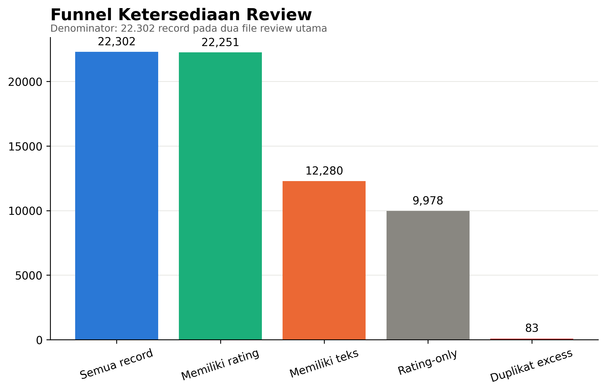

**Gambar 2.1. Funnel ketersediaan review.** Review berteks menjadi candidate pool NLP, sedangkan rating-only tetap digunakan untuk coverage dan rating context.

### 2.6.1 Distribusi Rating

Dari 22.243 rating integer valid, distribusinya adalah 15.595 bintang lima (70,11%), 3.635 bintang empat (16,34%), 1.396 bintang tiga (6,28%), 475 bintang dua (2,14%), dan 1.142 bintang satu (5,13%). Terdapat 8 rating desimal yang tidak dibulatkan dan 51 missing/unparseable ratings. Rating rata-rata valid adalah 4,4413.

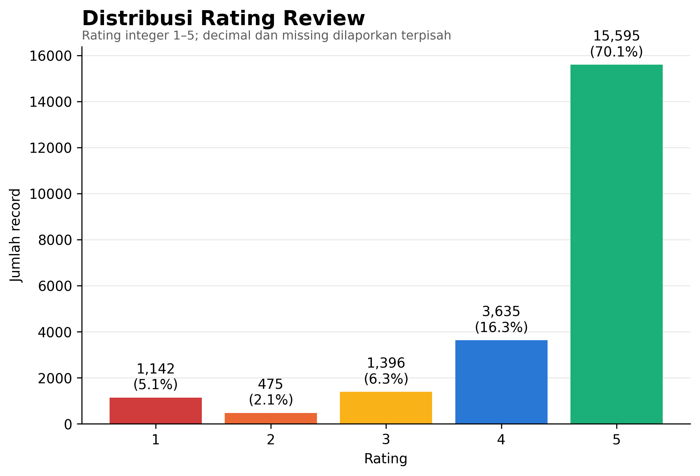

**Gambar 2.2. Distribusi rating integer review.** Dominasi bintang lima menunjukkan imbalance dan risiko rating-based polarity.

### 2.6.2 Panjang Review

Review berteks memiliki median 10 kata, kuartil pertama 4 kata, kuartil ketiga 23 kata, P95 55 kata, dan P99 120 kata. Sebanyak 2.530 review atau 20,60% memiliki maksimal tiga kata. Temuan ini mendukung max sequence length awal 192 token, tetapi keputusan final harus menggunakan truncation rate tokenizer model yang dipilih.

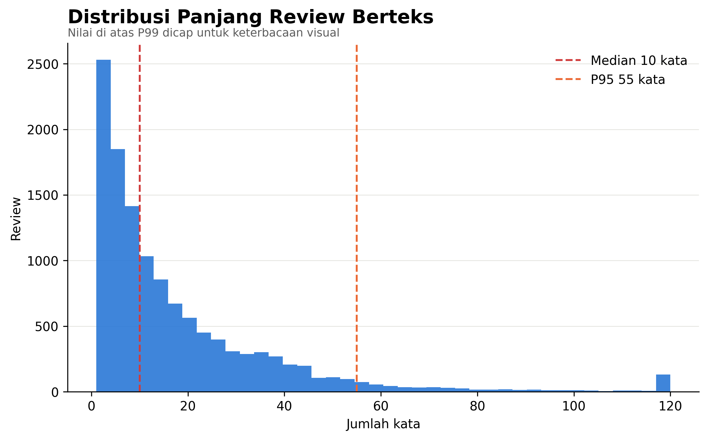

**Gambar 2.3. Distribusi panjang review berteks.** Visual dicap pada P99 untuk menjaga keterbacaan.

### 2.6.3 Coverage per Tempat

Sebelum entity resolution terdapat 343 nama tempat exact. Median coverage adalah 14 review berteks dan maksimum 685. Sebanyak 18 nama tidak memiliki review berteks, 82 memiliki 1–4, 91 memiliki 5–19, 71 memiliki 20–49, dan 81 memiliki minimal 50 review berteks.

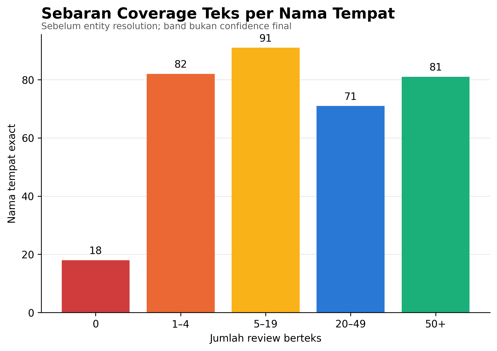

**Gambar 2.4. Band coverage teks per nama tempat exact.** Band belum merupakan confidence final karena entitas belum di-resolve.

### 2.6.4 Kandidat Aspek

Seed-keyword retrieval menemukan support awal terbesar pada pemandangan (3.677 review), pelayanan (1.477), harga/pungutan (1.017), kebersihan (1.001), akses/jalan (557), parkir (426), dan sanitasi (336). Sampah, keamanan, perawatan, dan jam operasional memiliki 70–134 candidate reviews, sehingga membutuhkan oversampling saat annotation. Hasil ini bukan gold label dan tidak mengukur polarity.

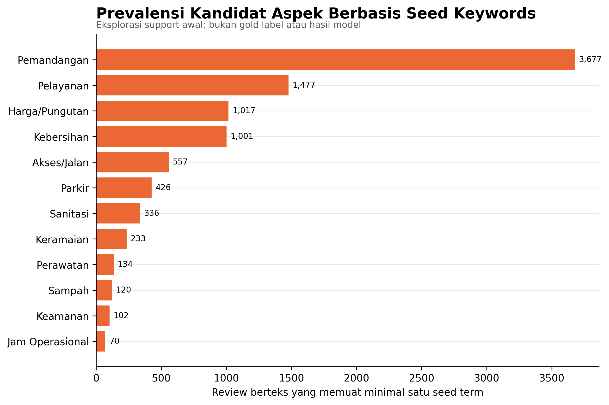

**Gambar 2.5. Prevalensi kandidat aspek berdasarkan seed keywords.** Digunakan untuk sampling annotation, bukan model evaluation.

### 2.6.5 Bahasa, Negasi, dan Kontras

Marker heuristic menemukan 6.794 review dengan marker Indonesia, 1.401 Inggris, 146 campuran, dan 3.939 tidak teridentifikasi. Sebanyak 2.102 review (17,12%) memuat marker negasi dan 1.295 (10,55%) marker kontras. Ini memperkuat kebutuhan contextual model dan error analysis pada mixed clauses. Kategori bahasa bukan hasil language-identification model.

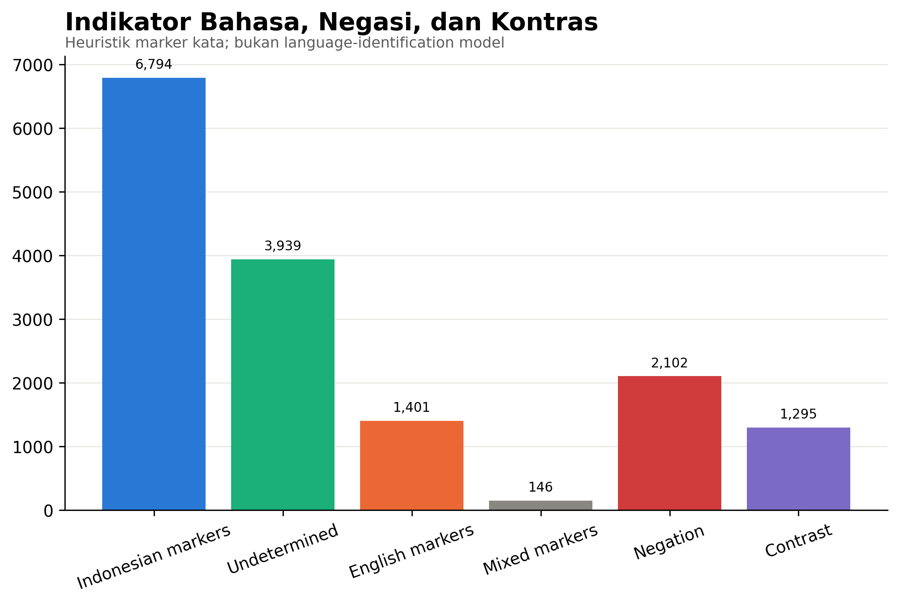

**Gambar 2.6. Indikator bahasa, negasi, dan kontras berbasis marker kata.**

### 2.6.6 N-gram dan Repeated Text

N-gram dominan mencakup `danau toba`, `luar biasa`, `air terjun`, `makanan enak`, `kamar mandi`, dan `tiket masuk`. Pola ini menunjukkan campuran pengalaman destinasi dan layanan serta membantu menemukan candidate vocabulary untuk annotation guideline. EDA menemukan 1.037 repeated-text excess rows dan 103 kelompok repeated text substantif. Repetition belum disebut spam karena komentar generik yang sama dapat ditulis pengguna berbeda.

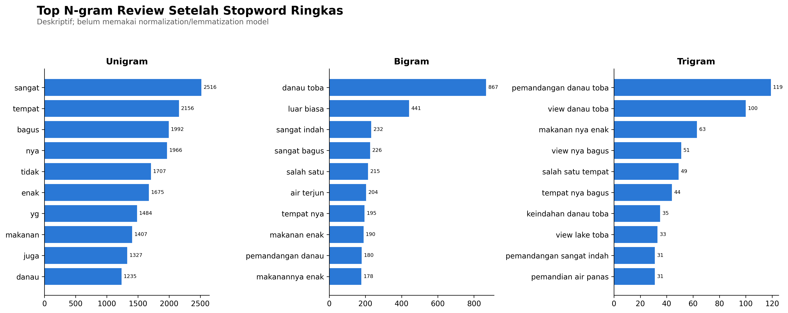

**Gambar 2.7. Top unigram, bigram, dan trigram setelah stopword ringkas.**

### 2.6.7 Freshness Field Availability

Scrape date tersedia pada 19.059 record dan hilang pada 3.243. Published-at tersedia pada 22.023 record dan hilang pada 279, tetapi nilainya berupa relative multilingual text. Parsing tanggal akan menghasilkan estimasi/interval beserta precision flag, bukan tanggal presisi palsu.

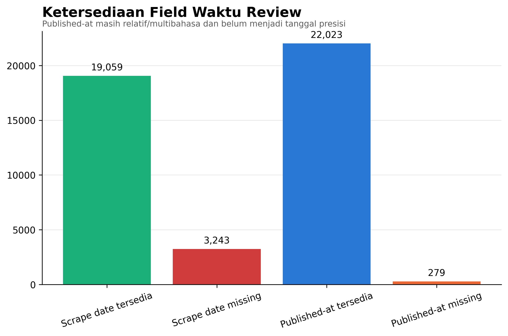

**Gambar 2.8. Ketersediaan scrape date dan published-at.**

### 2.6.8 Volume dan Candidate Complaint Rate

Seed complaint retrieval menemukan 916 review. Pada nama tempat dengan minimal lima review berteks, candidate complaint rate bervariasi dan tidak memiliki hubungan sederhana dengan volume atau mean rating. Karena retrieval masih berbasis keyword, visual ini digunakan untuk sampling dan bias analysis, bukan sebagai ranking hasil akhir.

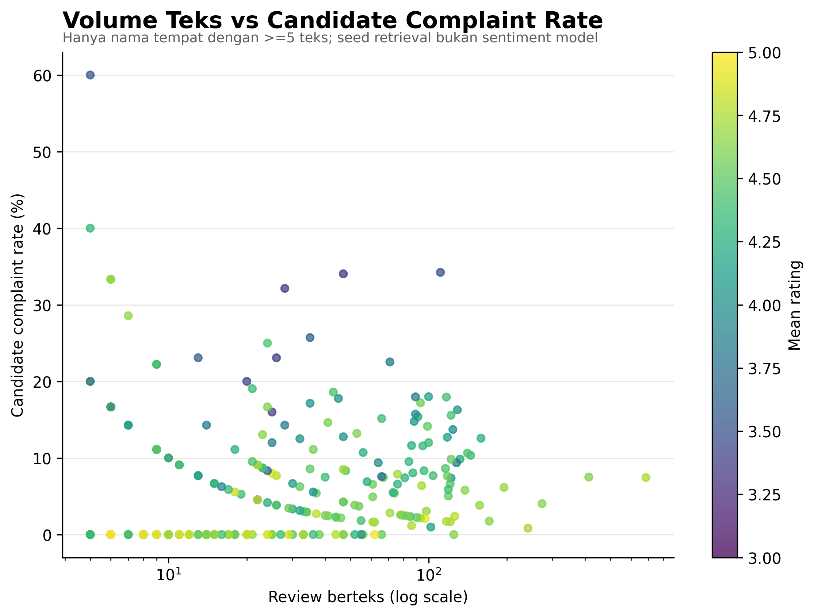

**Gambar 2.9. Volume review berteks vs candidate complaint rate.**

Temuan tersebut memiliki beberapa implikasi awal:

1. Sekitar 44,94% record tidak memiliki teks dan tidak dapat menjadi contoh training NLP, tetapi rating-only records masih dapat digunakan untuk konteks rating/coverage.
2. Dominasi bintang lima membuat accuracy dan rating-based sentiment berisiko menutupi kelas negatif.
3. Macro F1, per-label metrics, class weighting, threshold calibration, dan high-severity precision lebih relevan daripada accuracy tunggal.
4. Mixed-sentiment review tidak boleh diberi polaritas hanya berdasarkan rating keseluruhan.

Seluruh source data EDA tersedia pada `ml/artifacts/reports/` dan narasi lengkap pada `docs/eda-report.md`.

## 2.7 EDA Metadata dan Geospasial

Tiga metadata utama berisi 323 coordinate records: 139 wisata, 148 restoran, dan 36 hotel. Seluruh string koordinat berhasil diparse dan berada pada regional warning envelope latitude 1–4 dan longitude 97–101. Hanya terdapat 321 coordinate pairs unik; empat records terlibat pada shared-coordinate groups dan memerlukan audit nama/alamat. WGS84 masih merupakan asumsi terdokumentasi.

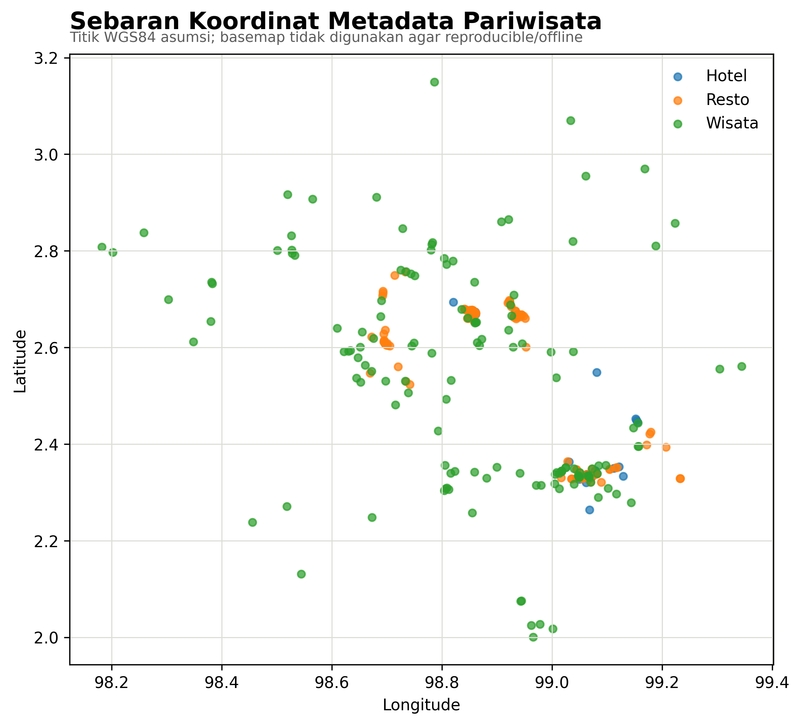

**Gambar 2.10. Sebaran coordinate records wisata, restoran, dan hotel.** Basemap tidak digunakan agar output reproducible dan luring.

Kelengkapan field berbeda tajam. Nama, alamat, dan coordinate tersedia 100% pada tiga metadata utama. Namun, fasilitas tersedia pada 0% metadata wisata, 4,05% metadata restoran, dan 83,33% metadata hotel. Hours tersedia 100% untuk wisata, 0,68% untuk restoran, dan tidak memiliki field yang sebanding pada metadata hotel. Absence diperlakukan sebagai unknown, bukan fasilitas/jam tidak tersedia.

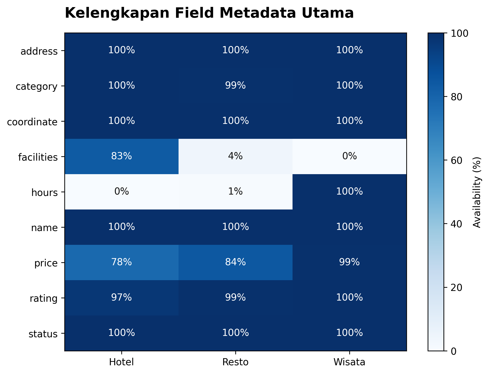

**Gambar 2.11. Kelengkapan field metadata utama.** Gap mendukung integrasi lintas sumber dan state `Insufficient Data`.

Schema fisik juga menunjukkan missingness tinggi pada `Info Seputar` (52,74%), `prompt` (42,86%), dan `resto-hotel-v2` (34,02%). Dua file pertama memiliki embedded/multirow headers, sehingga missingness tersebut tidak langsung dianggap data hilang sebelum semantic loader diterapkan.

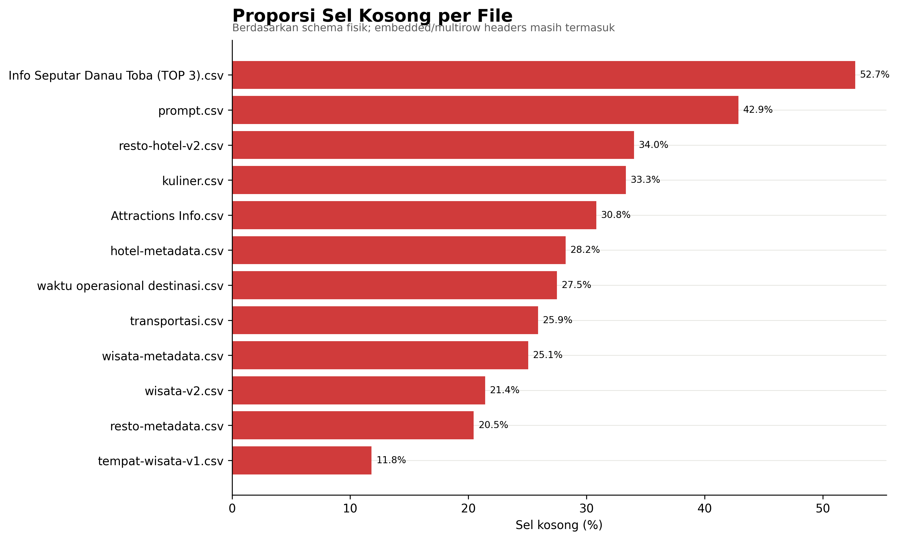

**Gambar 2.12. Proporsi sel kosong per file berdasarkan schema fisik.**

Proximity analysis berbasis Haversine menemukan bahwa 72 dari 139 wisata tidak memiliki metadata hotel/restoran dalam radius 5 km. Median jumlah layanan dalam radius adalah 0 dan median jarak ke metadata layanan terdekat adalah 5,374 km. Hasil ini menunjukkan gap coverage/proximity pada dataset, bukan bukti layanan nyata tidak tersedia.

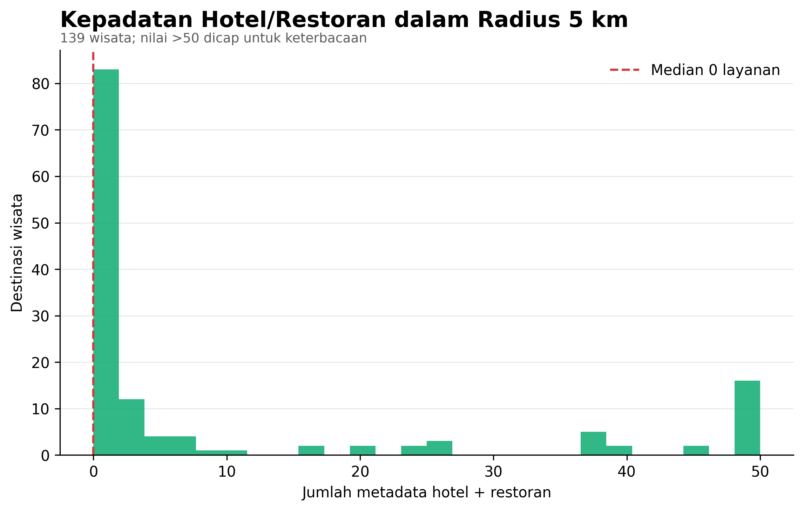

**Gambar 2.13. Kepadatan metadata hotel/restoran dalam radius 5 km dari wisata.**

## 2.8 Bias dan Risiko Data

| Risiko | Bukti awal | Dampak | Mitigasi yang dirancang |
| --- | --- | --- | --- |
| Popularity bias | Volume review tidak merata; distribusi per destinasi belum dihitung ulang | Tempat populer menghasilkan lebih banyak sinyal | Minimum support, Bayesian smoothing, confidence band |
| Rating imbalance | 70,11% rating integer valid adalah bintang lima | Kelas negatif dapat tertutup | Macro F1, class weights, stratified annotation |
| Missing review text | Hanya 55,06% record memiliki teks | Coverage training tidak merata | Pisahkan text/rating-only dan tampilkan sufficiency |
| Platform bias | Review berasal dari pengguna platform digital | Tidak mewakili semua wisatawan | Nyatakan limitation; validasi lapangan |
| Data staleness | 3.243 scrape date missing; published-at masih relatif | Alert mungkin tidak menggambarkan kondisi kini | Conservative date normalization, precision flag, freshness weight |
| Entity ambiguity | Tidak ada cross-file ID universal | Evidence dapat terhubung ke tempat salah | Conservative matching dan false-merge audit |
| Source snapshot mismatch | Inventory 14 CSV + `.DS_Store`; corpus baseline menyebut 15 file | Input pipeline lama belum pasti identik | Rekonsiliasi source manifest dan hashes |
| Service coverage gap | 72/139 wisata tanpa metadata hotel/restoran dalam radius 5 km | Facility-gap dapat berlebihan | Label sebagai metadata gap; validasi eksternal/lapangan |
| Reputational harm | False alert dapat dibaca sebagai vonis | Kerugian reputasi | Alert precision, evidence, neutral language, human verification |

## 2.9 Rumusan Masalah dan Hipotesis

Pertanyaan yang akan diuji adalah:

1. Seberapa baik model multilabel mendeteksi seluruh aspek yang muncul pada review pariwisata Indonesia dibanding keyword dan TF-IDF baseline?
2. Bagaimana mengagregasi sinyal review tanpa memberi skor ekstrem kepada destinasi dengan sampel kecil atau data tidak lengkap?
3. Seberapa selaras intervention priority yang transparan dengan penilaian ahli terhadap target verifikasi?
4. Seberapa sering evidence benar-benar mendukung alert, dan safeguard apa yang diperlukan untuk mencegah unsupported claim?

| ID | Hipotesis | Cara Uji | Metric |
| --- | --- | --- | --- |
| H1 | IndoBERT meningkatkan kinerja aspect detection dibanding Keyword dan TF-IDF | Locked destination-group test | Macro/Micro/per-label F1 |
| H2 | High-precision threshold dan evidence rule menekan false alert | Validation calibration + test/human review | Alert Precision, unsupported-alert rate |
| H3 | SIPATURE membantu menemukan isu prioritas lebih cepat daripada inspeksi review manual | Controlled user/system evaluation | Time saved, evidence correctness |

Hipotesis tersebut belum diuji dan tidak ditulis sebagai hasil.

## 2.10 Kesimpulan Analisis Permasalahan

Masalah yang dipilih bukan kekurangan rekomendasi wisata bagi pengunjung, melainkan kesenjangan antara feedback dan tindakan pengelolaan. Review intelligence dipilih karena memanfaatkan data panitia secara langsung, sedangkan intervention ranking memberi keluaran operasional yang lebih spesifik daripada sentiment dashboard. Fokus ini juga memungkinkan evaluasi lengkap dari data quality, model, evidence, ranking, sampai human verification.

---

# BAB III — DESAIN SOLUSI DAN INDIKATOR KEBERHASILAN

## 3.1 Konsep dan Value Proposition

**SIPATURE mengubah ribuan ulasan pariwisata Toba menjadi sinyal masalah spesifik, bukti verbatim, dan prioritas verifikasi yang transparan agar pengelola mengetahui apa yang perlu diperiksa lebih dahulu dan mengapa.**

Nilai SIPATURE bukan pada menghasilkan lebih banyak teks atau rekomendasi generik. Sistem dirancang untuk membangun satu rantai yang dapat diaudit:

```text
review -> issue -> confidence -> evidence -> destination signal
-> priority explanation -> field verification -> candidate intervention
```

## 3.2 Prinsip Desain

1. **Evidence before recommendation.** Setiap alert harus memiliki jumlah dukungan dan kutipan verbatim; model tidak membuat kutipan baru.
2. **Human verification before action.** Review diperlakukan sebagai laporan, bukan konfirmasi kondisi aktual.
3. **No issue berbeda dari insufficient data.** Ketiadaan prediksi tidak boleh disamakan dengan kondisi baik ketika data tidak cukup.
4. **Transparent score components.** Health dan priority harus menampilkan komponen, bobot, missing data, dan confidence.
5. **Batch-first dan offline-capable.** Dashboard memakai hasil batch agar stabil dan tidak memerlukan inference saat page load; real-time inference terbatas pada analyzer.
6. **Privacy by design.** Reviewer identity tidak disimpan pada output produk dan evidence ditampilkan secara anonim.
7. **Conservative claims.** Sistem menggunakan bahasa “dilaporkan” atau “sinyal awal” serta menghindari klaim kausal dan ilmiah yang tidak didukung data.

## 3.3 Arsitektur Konseptual

```text
Organizer CSV
-> deterministic inventory and cleaning
-> conservative entity resolution
-> human annotation workspace
-> Keyword / TF-IDF / IndoBERT training
-> threshold calibration and locked test evaluation
-> batch review inference
-> destination aggregation and evidence selection
-> health and intervention-priority engine
-> versioned export / API
-> SIPATURE web application
-> human verification workflow
```

Pipeline data/model berada pada package Python `sipature_ml`, sedangkan produk berada pada aplikasi Next.js terpisah. Kontrak ekspor didefinisikan melalui JSON Schema. Pemisahan ini mencegah model besar masuk ke browser dan memungkinkan dashboard tetap berjalan dengan precomputed data pada lingkungan luring.

## 3.4 Fitur Utama

### 3.4.1 Regional Overview

Overview menampilkan coverage data, jumlah destinasi yang dapat dinilai, distribusi isu, prioritas tertinggi, serta konteks kunjungan. Saat ini halaman sudah tersedia dalam prototipe, tetapi indikatornya masih menggunakan output baseline keyword + rating.

### 3.4.2 Intelligence Map

Peta memvisualisasikan lokasi destinasi, status sinyal, volume review, dan confidence. Filter saat ini mencakup kabupaten, jenis tempat, aspek, pencarian nama, dan kecukupan data. Leaflet digunakan untuk peta daring, sedangkan fallback SVG tersedia untuk demo luring. Layer taxonomy final akan diselaraskan dengan model baru.

### 3.4.3 Destination Evidence Page

Halaman destinasi memperlihatkan skor, aspek prioritas, jumlah mention/negative signal, trend baseline, kutipan evidence, confidence, facility gap, dan local simulator. Desain akhirnya akan menambahkan model version, generated timestamp, freshness, metadata conflict, dan status verifikasi.

### 3.4.4 Intervention Queue

Queue mengurutkan destinasi berdasarkan priority score dan menampilkan isu utama, support, evidence summary, confidence, serta tindakan verifikasi berikutnya. Status yang dirancang adalah `New`, `Verification Planned`, `Verified`, `Intervention Planned`, `Resolved`, dan `Rejected`.

### 3.4.5 Intervention Simulator

Simulator mengubah score berdasarkan asumsi penanganan aspek yang dipilih. Hasil wajib berlabel sebagai estimasi skenario, bukan prediksi kausal atau jaminan dampak dunia nyata.

### 3.4.6 Live Analyzer

Analyzer menerima satu review dan menampilkan aspect, polarity, severity, confidence, dan evidence span. Implementasi saat ini memakai baseline leksikon; model terlatih hanya akan menggantikannya setelah memenuhi schema dan evaluation gate.

## 3.5 User Flow

```text
Regional overview
-> filter peta/antrean
-> pilih destinasi
-> periksa issue, support, confidence, evidence, metadata
-> lihat alasan ranking
-> rencanakan verifikasi
-> catat hasil verified/rejected
-> pertimbangkan intervensi
```

Flow ini dirancang untuk menjaga manusia sebagai pengambil keputusan dan menjadikan output model dapat ditelusuri sampai ke evidence.

## 3.6 Taxonomy dan Output Model

Taxonomy `0.1.0-draft` mendefinisikan 14 aspek dalam empat kelompok:

| Kelompok | Aspek | Makna awal |
| --- | --- | --- |
| Environmental | cleanliness, waste, sanitation, crowding | Kebersihan, sampah, toilet/sanitasi, kepadatan yang dilaporkan |
| Infrastructure | access, parking, public_facilities | Akses, parkir, dan fasilitas publik |
| Visitor experience | scenery, comfort, safety, price_transparency | Pemandangan, kenyamanan, keselamatan, transparansi harga |
| Operations | staff_service, maintenance, opening_hours | Pelayanan, perawatan, dan jam operasi |

Task bersifat multilabel karena satu review dapat membahas beberapa aspek. Setiap aspek yang terdeteksi memiliki polaritas `positive`, `negative`, atau `neutral`. Severity `low`, `medium`, dan `high` hanya berlaku pada aspek negatif. Taxonomy ini masih draft dan dapat disederhanakan apabila support atau inter-annotator agreement tidak memadai.

## 3.7 Desain Health dan Priority Score

### 3.7.1 Aspect Health

```text
AspectHealth = 100 * (1 - SmoothedWeightedComplaintRate)
```

Complaint signal akan ditimbang dengan model confidence, severity, freshness, dan duplicate discount. Bayesian smoothing digunakan agar destinasi dengan sedikit review tidak memperoleh skor ekstrem.

### 3.7.2 Tourism Health

Rancangan awal menggunakan komponen environmental, sanitation, infrastructure, safety, operations, dan visitor experience. Bobot belum menjadi hasil final; bobot harus diuji melalui sensitivity analysis dan, bila memungkinkan, divalidasi bersama stakeholder. Komponen tanpa data tidak diberi nilai 100, tetapi dinyatakan `Insufficient Data`.

### 3.7.3 Intervention Priority

Config scoring draft menggunakan:

```text
0.25 severity + 0.20 complaint_frequency + 0.15 model_confidence
+ 0.15 persistence + 0.10 visitor_exposure + 0.10 facility_gap
+ 0.05 feasibility
```

Semua komponen dinormalisasi 0–1. Jika komponen hilang, bobot yang tersedia direncanakan untuk dinormalisasi ulang dan confidence diturunkan. Label keluaran adalah `Critical`, `High`, `Medium`, `Monitor`, dan `Insufficient Data`. Formula ini adalah decision rule transparan, bukan predictive model.

## 3.8 Indikator Keberhasilan

| Lapisan | Metric utama | Target awal | Hasil aktual |
| --- | --- | ---: | --- |
| Annotation | Aspect/Polarity/Severity agreement | 0,70 / 0,75 / 0,60 | Belum tersedia |
| Entity resolution | Pairwise F1 dan false-merge rate | >=0,90 / serendah mungkin | Belum tersedia |
| Aspect detection | Macro F1 | >=0,70 | Belum tersedia |
| Aspect detection | Micro F1 | >=0,82 | Belum tersedia |
| Early warning | High-severity Alert Precision | >=0,85 | Belum tersedia |
| Evidence | Unsupported evidence claims | <5% | Belum tersedia |
| Ranking | NDCG@10/rank agreement | Ditetapkan setelah expert cases | Belum tersedia |
| Product | Analysis time saved | Ditetapkan melalui user test | Belum tersedia |

Target adalah sasaran pengembangan, bukan hasil kompetisi. Hanya nilai locked-test atau human evaluation aktual yang akan dicantumkan sebagai hasil akhir.

## 3.9 Diferensiasi dan Kebaruan

| Pendekatan umum | SIPATURE |
| --- | --- |
| Sentiment dashboard | Aspect-specific issue, polarity, severity, dan data sufficiency |
| Review summary | Evidence verbatim dan provenance |
| Destination ranking opaque | Transparent intervention priority components |
| Environmental verdict | Reported issue yang memerlukan field verification |
| Generic recommendation | Deterministic, human-reviewed verification/action mapping |
| Fokus pengunjung saja | Decision support untuk pengelola dan perencana program |

## 3.10 Responsible AI by Design

Safeguard utama adalah anonimisasi evidence, larangan fabricated quote, high-precision alert threshold, minimum support, Bayesian smoothing, freshness indicator, data-confidence state, serta alur verifikasi dan penolakan alert. Popularity bias dan platform bias ditampilkan sebagai limitation. Produk tidak mengotomatisasi tindakan dan tidak menggunakan simulator untuk klaim kausal.

---

# BAB IV — PERENCANAAN IMPLEMENTASI

## 4.1 Strategi Pengembangan

Implementasi dilakukan bertahap agar setiap keluaran dapat diuji sebelum menjadi input tahap berikutnya:

```text
Inventory/EDA -> cleaning/entity resolution -> annotation
-> destination-group split -> Keyword/TF-IDF baselines
-> IndoBERT -> calibration/locked test
-> inference/aggregation/ranking -> product integration
-> system evaluation/submission
```

Strategi ini mencegah pengembangan dashboard mendahului validasi data dan model, serta memungkinkan baseline tetap digunakan secara jujur jika primary model belum layak.

## 4.2 Work Breakdown Structure dan Status

| Fase | Output utama | Status 28 Juli 2026 |
| --- | --- | --- |
| Scope dan repository | Charter, configs, contracts, locks, runbook | Selesai |
| Inventory | Hash/schema/row-count inventory | Selesai untuk 14 CSV saat ini |
| EDA/cleaning | EDA report, clean/interim data, quarantine | EDA selesai; cleaning belum dimulai |
| Entity resolution | Canonical destinations, links, metrics | Belum dimulai |
| Annotation | Guideline final, gold labels, agreement | Draft guideline; labels belum ada |
| Modelling | Keyword, TF-IDF, IndoBERT artifacts | Belum dimulai pada pipeline baru |
| Evaluation | Calibration, locked metrics, error analysis | Belum tersedia |
| Intelligence engine | Prediction, aggregation, priority export | Draft config; belum diimplementasikan |
| Product | Next.js prototype dan integration contract | Prototype baseline tersedia |

## 4.3 Repositori dan Reproducibility

Kode data/model menggunakan package Python `sipature_ml` dengan Python 3.10+, exact dependency lock untuk development dan profile terpisah untuk Colab/GPU. Seed global ditetapkan 42 untuk Python, NumPy, dan PyTorch. Config pipeline, taxonomy, split, training, dan scoring disimpan dalam YAML dan dicatat hash-nya pada environment snapshot.

CLI mendeklarasikan 15 stage dari inventory/EDA sampai app export. Inventory dan EDA sudah diimplementasikan; stage lanjutan fail-fast agar deklarasi command tidak dianggap sebagai hasil implementasi. Clean environment telah berhasil menjalankan lint, 16 unit tests, inventory, dan EDA terhadap dataset nyata.

Intermediate artifact wajib ditulis ke disk/Google Drive dan memiliki manifest berisi source hash, config version, pipeline/model version, timestamp, dan row counts. Raw data, generated artifact, model weight, dan secret tidak dimasukkan ke public Git. Catatan khusus: dataset sudah ter-track sebelum policy dibuat dan memerlukan keputusan lisensi terpisah sebelum repository dipublikasikan.

## 4.4 Teknologi dan Alasan Pemilihan

| Layer | Teknologi | Alasan |
| --- | --- | --- |
| Data | Python, Pandas, PyArrow/Parquet | Reproducible tabular processing dan efficient intermediate storage |
| Matching | RapidFuzz + geospatial distance | Conservative entity similarity yang dapat dijelaskan |
| Baseline | scikit-learn | Baseline kuat, cepat, dan mudah diaudit |
| Primary model | PyTorch, Transformers, IndoBERT | Contextual Indonesian NLP untuk mixed/multiaspect review |
| Experiment | Google Colab GPU | Akses GPU dan persistence melalui Drive |
| API | FastAPI (rencana) | Typed inference service dan offline deployment |
| Web | Next.js 15, React 19, Leaflet | Aplikasi interaktif, peta, dan server-side batch data |
| Deployment | Docker dan DGX B200 | Reproducible offline final deployment |

## 4.5 Integrasi dan Deployment

Dashboard akan membaca versioned precomputed export yang divalidasi terhadap `app-export.schema.json`. Real-time inference hanya digunakan pada analyzer/API. Export harus menyertakan schema version, model version, generated time, source manifest, destination confidence, priority, issues, dan evidence provenance.

Arsitektur deployment yang direncanakan adalah Next.js web, FastAPI inference, dan PostgreSQL/PostGIS atau SQLite untuk MVP. Model dan tokenizer disimpan lokal; container tidak boleh mengunduh model saat startup. Health check, CPU fallback, precomputed data, dan offline map fallback disiapkan untuk final round.

## 4.6 Rencana Pilot

Pilot direncanakan pada 5–10 destinasi yang berbeda jenis dan volume review. Expert menilai masalah tanpa melihat ranking model, kemudian hasil dibandingkan menggunakan rank agreement. Top alert diverifikasi di lapangan dan dicatat sebagai confirmed, rejected, atau uncertain. Feedback tersebut digunakan untuk memperbaiki taxonomy, thresholds, dan bobot ranking.

## 4.7 Risiko dan Mitigasi

| Risiko | Kemungkinan awal | Dampak | Mitigasi | Status residual |
| --- | --- | --- | --- | --- |
| Sparse labels | Tinggi | Model lemah pada aspek penting | Stratified sampling, support audit, class weights | Belum diukur |
| Popularity bias | Tinggi | Ranking didominasi tempat populer | Smoothing, minimum support, sufficiency state | Belum diuji |
| False alert | Sedang–tinggi | Reputational harm | Alert threshold, evidence, verification | Belum diuji |
| Entity false merge | Sedang | Evidence salah tempat | Conservative matching, manual review | Belum diuji |
| Data staleness | Belum diketahui | Alert usang | Date normalization dan freshness | Menunggu EDA |
| Deployment failure | Sedang | Demo tidak berjalan | Lock, Docker, offline artifacts/fallback | Local web build lulus |

## 4.8 Keberlanjutan

Keberlanjutan teknis bergantung pada feedback loop dari status verified/rejected, versioned retraining, monitoring drift dan alert precision, serta governance penggunaan data/evidence. Keberlanjutan operasional memerlukan pemilik proses pada pengelola atau pemerintah, jadwal review, definisi siapa yang boleh mengubah status, dan mekanisme audit. Model tidak memberi nilai apabila alert tidak masuk ke proses verifikasi nyata.

---

# BAB V — MODELLING

## 5.1 Definisi Tugas

Model dirancang sebagai tiga tugas terhubung:

1. Multilabel aspect detection untuk menemukan seluruh aspek pada review.
2. Aspect-conditioned polarity untuk menentukan positive, negative, atau neutral per aspek.
3. Negative severity untuk menentukan low, medium, atau high pada aspek negatif.

Pendekatan modular dipilih untuk MVP karena lebih mudah dievaluasi, di-debug, dan disederhanakan apabila support label tidak memadai.

## 5.2 Data Preparation yang Direncanakan

Cleaning akan mempertahankan raw text dan normalized text, melakukan Unicode NFKC/whitespace normalization, mempertahankan tanda baca/negasi/typo/mixed language, memvalidasi rating, memisahkan rating-only records, dan mencatat quarantine serta duplicate groups. Stemming dan stopword removal tidak digunakan untuk IndoBERT; perlakuannya akan diuji terpisah untuk TF-IDF.

Entity resolution menggunakan normalized name, address similarity, coordinate distance, dan category agreement. Config draft menetapkan auto-match name similarity 0,90, manual-review boundary 0,75, serta batas jarak 200 meter untuk aturan tertentu. Unresolved match dipilih dibanding false merge.

Annotation akan menggunakan stratified sampling dan human verification. Rules atau LLM hanya boleh memberi candidate label. Sebanyak 15–20% data direncanakan untuk double annotation dan seluruh disagreement pada subset tersebut akan di-adjudicate. Gold labels belum tersedia.

## 5.3 Leakage-Safe Split

Config split menetapkan rasio 70% train, 15% validation, dan 15% test berdasarkan `destination_id`. Duplicate group harus berada dalam split sama. Test dikunci sebelum tuning. Split aktual dan distribusi label belum tersedia karena canonical entities dan gold annotation belum dibangun.

## 5.4 Baseline dan Primary Model

Keyword baseline akan memakai aspect lexicon, negation window, contrast marker, intensity, dan severity rules. TF-IDF menggunakan word unigram/bigram dan character n-gram 3–5 dengan One-vs-Rest Logistic Regression serta class weighting. IndoBERT menggunakan encoder dengan sigmoid multilabel head; polarity dan severity menggunakan aspect-conditioned input.

Model ID IndoBERT belum dipilih. Pemilihan harus mencatat lisensi, tokenizer, ukuran, maximum length, dan sumber pretraining. Config hyperparameter saat ini hanya rancangan awal: max length 192, batch size 16, gradient accumulation 2, learning rate 2e-5, weight decay 0,01, empat epoch, warmup 0,10, patience 2, dan FP16. Nilai ini belum diuji.

## 5.5 Class Imbalance dan Threshold

Imbalance akan ditangani bertahap, dimulai dari `class_weight` untuk TF-IDF dan `pos_weight` pada BCE untuk IndoBERT. Oversampling, focal loss, atau augmentation hanya diuji satu per satu bila diperlukan. Detection threshold dan alert threshold dipilih per label menggunakan validation set. Karena false alert berisiko reputasional, alert threshold mengutamakan precision.

## 5.6 Inference, Evidence, dan Aggregation

Setiap prediction akan menyimpan review/destination ID, model version, aspect probability, polarity/probability, severity/probability, dan timestamp. Evidence dipilih dari teks asli, tidak duplikat, dianonimkan, dan tetap terhubung ke source provenance. Aggregation menghitung mention/negative/severe counts, confidence, persistence, freshness, dan data coverage sebelum menghasilkan destination signal.

## 5.7 Reproducibility Status

Reproducibility foundation sudah tersedia: exact local lock, pinned Colab profile, global seed, config hashes, file SHA-256, environment snapshot, Makefile, CLI, Drive bootstrap, checkpoint contract, tests, dan locked-test policy. Pada snapshot saat ini, Python 3.10.18 digunakan pada arm64 macOS; repository berstatus dirty karena pekerjaan belum dikomit. GPU packages belum dipasang pada local CPU profile, sesuai desain environment separation.

---

# BAB VI — EVALUASI MODEL

## 6.1 Protokol Evaluasi

Seluruh model akan dibandingkan pada destination-grouped split yang sama. Preprocessing, feature selection, hyperparameter, threshold, dan calibration ditentukan menggunakan train/validation saja. Test dibuka setelah config dan threshold dikunci. Hasil test tidak ditimpa; eksperimen baru harus memiliki versi baru.

Aspect detection dilaporkan dengan Macro F1 sebagai metric utama, disertai Micro F1, per-label precision/recall/F1, Hamming Loss, Exact Match, dan Alert Precision. Polarity dan severity menggunakan Macro F1 serta confusion matrix; severity juga memakai high-severity precision dan weighted kappa. Calibration diukur dengan ECE, Brier Score, dan reliability diagram.

Entity resolution dinilai dengan pairwise precision, recall, F1, dan false-merge rate. Ranking dinilai dengan NDCG@5/10, Spearman, dan Kendall bila expert ground truth tersedia. System-level evaluation mengukur evidence correctness, unsupported-alert rate, intervention relevance, dan time saved.

## 6.2 Status Hasil Evaluasi

| Evaluasi | Status 28 Juli 2026 | Alasan |
| --- | --- | --- |
| Annotation agreement | Belum tersedia | Gold annotation belum dibuat |
| Entity Resolution F1 | Belum tersedia | Matching belum diimplementasikan |
| Keyword model metrics | Belum tersedia | Baseline lama belum dievaluasi pada locked split baru |
| TF-IDF metrics | Belum tersedia | Model belum dilatih |
| IndoBERT metrics | Belum tersedia | Model belum dipilih/dilatih |
| Calibration | Belum tersedia | Validation predictions belum ada |
| Ranking agreement | Belum tersedia | Expert cases belum dinilai |
| Evidence correctness | Belum tersedia | Human evaluation belum dilakukan |

Skor baseline aplikasi tidak dimasukkan sebagai hasil evaluasi karena belum berasal dari gold labels dan locked test. Draft laporan akan diperbarui secara bertahap saat artifact aktual tersedia.

## 6.3 Quality Assurance yang Sudah Dilakukan

Fondasi pipeline telah melalui `ruff` lint dan 16 unit tests. Clean Python 3.10 environment berhasil di-install dari dependency lock serta menjalankan inventory dan EDA pada dataset nyata. Empat belas CSV dapat dibaca tanpa read error. Pengujian tersebut membuktikan reproducibility fondasi dan EDA, bukan performa model AI.

---

# BAB VII — HASIL DAN PEMBAHASAN

## 7.1 Hasil yang Sudah Tersedia

Hasil aktual saat ini mencakup scope lock, repository architecture, reproducibility foundation, inventory, EDA dengan 12 visual report-ready, dan prototipe aplikasi baseline. Pipeline baru belum menghasilkan clean canonical dataset, gold labels, predictions, atau priority queue final.

## 7.2 Prototipe Produk

Prototipe Next.js sudah menyediakan overview, peta, destination detail, intervention queue, simulator, analyzer, model/method page, APIs, dark mode, dan offline map fallback. TypeScript typecheck dan production build lulus. Data yang ditampilkan masih baseline keyword + rating dan harus diberi label demikian sampai trained-model export tersedia.

## 7.3 Studi Kasus Demo Sementara

Kawah Putih Dolok Tinggi Raja dipilih sebagai kasus utama karena baseline menghubungkan rating agregat 4,0 dengan laporan pungutan serta akses jalan. Bagus Bay Guest House menjadi backup dengan isu kebersihan/sanitasi. Puncak Paralayang Sibodiala menjadi failure case: baseline menghasilkan friksi nol meskipun review memuat mixed positive-negative statement mengenai jalan rusak dan berbahaya. Failure case ini menunjukkan alasan utama untuk tidak bergantung pada rating-assisted keyword logic.

Ketiga kasus tersebut belum menjadi hasil final. Kutipan harus diverifikasi ulang terhadap source row, dan prediksi harus dihasilkan ulang menggunakan model yang telah dievaluasi.

## 7.4 Keterbatasan Saat Ini

- Relative-date normalization, semantic duplicates, address consistency, dan source-specific complex schema cleaning belum diselesaikan.
- Canonical destination dan entity-resolution metrics belum tersedia.
- Taxonomy masih draft dan belum diuji melalui annotation agreement.
- Keyword, TF-IDF, dan IndoBERT belum dibandingkan pada locked split.
- Confidence baseline belum merupakan calibrated model probability.
- Priority weights belum divalidasi stakeholder atau sensitivity analysis.
- Evidence correctness, ranking agreement, dan time saved belum diukur.
- Persona dan workflow belum divalidasi melalui wawancara.
- Input manifest pipeline baseline lama belum direkonsiliasi penuh dengan snapshot EDA saat ini.

## 7.5 Implikasi Tahap Berikutnya

Tahap berikutnya adalah A4 cleaning dan entity resolution. EDA telah mereproduksi corpus utama, mengukur data quality awal, serta memberi dasar untuk source-specific loader, taxonomy candidate support, stratified annotation sampling, dan confidence/smoothing policy.

---

# BAB VIII — DEKLARASI PENGGUNAAN AI

## 8.1 Pernyataan Penggunaan AI Sementara

AI digunakan dalam perancangan solusi, penyusunan struktur teknis, pengembangan kode, dan drafting dokumentasi melalui asisten pemrograman generatif. Seluruh perubahan kode dan dokumen tetap diperiksa melalui pembacaan file, lint, unit test, build, serta keputusan pengguna. Deklarasi final akan mencantumkan nama tool, versi bila tersedia, ruang penggunaan, dan bentuk verifikasi manusia.

Model AI yang direncanakan dalam produk adalah IndoBERT untuk aspect detection, polarity, dan severity. Model tersebut belum dilatih atau dievaluasi dalam pipeline baru. Aplikasi saat ini memakai baseline keyword + rating dan tidak boleh disebut sebagai output IndoBERT.

## 8.2 AI dalam Solusi SIPATURE

| Komponen | Metode | Fungsi | Status |
| --- | --- | --- | --- |
| Aspect detection | Keyword + rating | Prototype UI signal | Baseline tersedia; belum tervalidasi |
| Aspect detection | TF-IDF Logistic Regression | Classical ML baseline | Direncanakan |
| Aspect detection | IndoBERT multilabel | Primary contextual classifier | Direncanakan |
| Polarity/severity | Aspect-conditioned classifier | Review-level issue characterization | Direncanakan |
| Priority ranking | Weighted deterministic formula | Decision-support ordering | Config draft; bukan AI prediction |

## 8.3 Batas Penggunaan AI

- Candidate labels dari rules/LLM tidak menjadi gold tanpa human verification.
- AI tidak membuat evidence baru atau mengubah kutipan menjadi bukti palsu.
- AI tidak mengambil keputusan inspeksi, pendanaan, atau intervensi secara otomatis.
- Review-derived signal tidak menjadi klaim ilmiah kondisi lingkungan.
- Simulator tidak diposisikan sebagai causal prediction.
- Model tidak digunakan untuk menilai individu atau komunitas.

## 8.4 Human Oversight, Privasi, dan Etika

Annotation akan menggunakan human verification dan adjudication. Error berisiko tinggi akan direview manual. Setiap alert akhir harus menampilkan evidence, support, confidence, freshness, dan hal yang harus diverifikasi. Workflow memungkinkan alert ditolak beserta alasannya.

Identitas reviewer tidak dimasukkan ke output produk, annotation export, atau evidence yang ditampilkan. Provenance internal dipertahankan untuk audit tanpa menampilkan profil pengguna. Popularity bias, platform bias, missing data, dan staleness didokumentasikan sebagai limitation.

## 8.5 Intended Use dan Misuse Risks

**Intended users:** pengelola destinasi, BPODT, pemerintah daerah, dan perencana program pariwisata.  
**Intended use:** memprioritaskan pembacaan evidence dan verifikasi lapangan.  
**Out-of-scope:** keputusan otomatis, public verdict, scientific monitoring, dan causal forecasting.  
**Misuse risks:** destination shaming, over-trust pada confidence, mengabaikan tempat minim data, atau menggunakan scenario score sebagai janji dampak.  
**Mitigations:** neutral language, data sufficiency, calibration, evidence, human verification, model card, dan rejection workflow.

## 8.6 Deklarasi Kejujuran Hasil

Seluruh hasil final akan berasal dari evaluasi aktual dengan protokol yang dijelaskan. Draft ini membedakan hasil aktual, output baseline, target, dan rancangan. Metric model yang belum tersedia tidak diisi dengan target. Kutipan evidence tidak boleh difabrikasi dan harus diverifikasi terhadap sumber.

---

# DAFTAR PUSTAKA SEMENTARA

1. Del AI Hackathon 2026, *Challenge Guidebook*, 2026.
2. Del AI Hackathon 2026, *Technical Meeting*, 13 Juli 2026.
3. `[PAPER INDOBERT SETELAH MODEL ID DIPILIH]`.
4. `[REFERENSI MULTILABEL CLASSIFICATION DAN CALIBRATION]`.
5. `[REFERENSI BAYESIAN/WILSON SMOOTHING DAN RANKING METRICS]`.

---

# LAMPIRAN STATUS DAN TRACEABILITY

## A. Artifact yang Menjadi Dasar Draft

| Klaim/Bagian | Artifact |
| --- | --- |
| Scope, user, demo cases | `SIPATURE-Project-Charter.md` |
| File count, rows, columns, hash | `ml/artifacts/reports/data_inventory.json` |
| Corpus baseline | `sipature-app/src/data/corpus.json` |
| EDA summary dan source tables | `ml/artifacts/reports/eda_*` |
| EDA figures dan narrative | `docs/figures/eda/`, `docs/eda-report.md` |
| Pipeline/seed/evaluation policy | `ml/configs/pipeline.yaml` |
| Taxonomy draft | `ml/configs/taxonomy.yaml` |
| Priority draft | `ml/configs/scoring.yaml` |
| Reproducibility environment | `ml/artifacts/reports/run-environment.json` |
| App status/routes | `sipature-app/README.md` |
| Responsible AI policy | `docs/responsible-ai.md` |
| Reproduction commands | `docs/reproducibility-runbook.md` |

## B. Bagian yang Menunggu Artifact

| Bagian laporan | Artifact yang diperlukan |
| --- | --- |
| EDA lanjutan | Semantic-cleaning-aware profile, relative dates, address validation |
| Data cleaning | Clean data, quarantine, cleaning manifest |
| Entity resolution | Entity links dan pairwise metrics |
| Annotation | Gold JSONL, agreement, audit report |
| Model | Keyword/TF-IDF/IndoBERT checkpoints/configs |
| Evaluasi | Locked-test metrics, curves, matrices, calibration |
| Ranking | Expert-reviewed destination cases dan NDCG/correlation |
| System impact | Evidence review dan time-saved study |

## C. Informasi Administrasi yang Belum Diisi

- Nama tim, ketua, dan anggota.
- Validasi makna/ejaan publik SIPATURE oleh penutur Batak Toba.
- Persetujuan anggota atas deklarasi penggunaan AI.
- Daftar lengkap tool AI dan third-party license.
