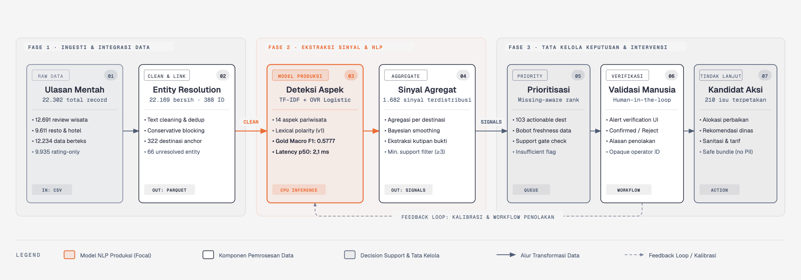
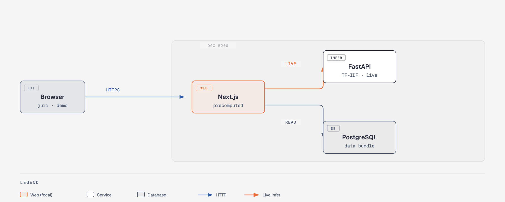
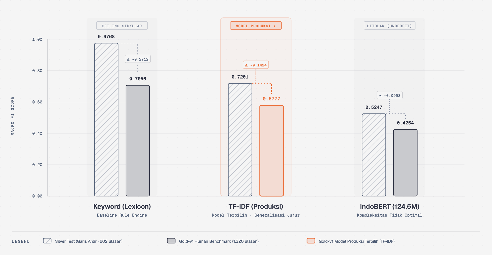
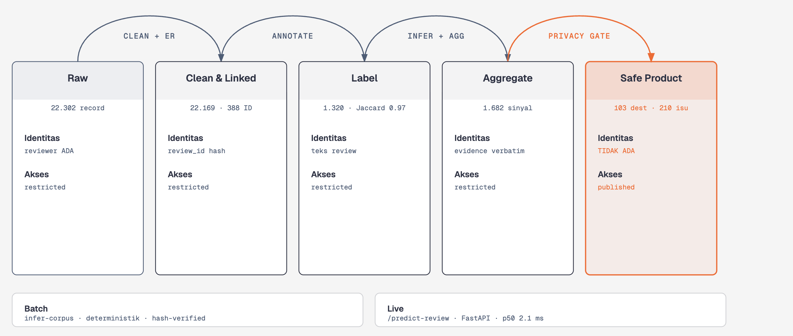
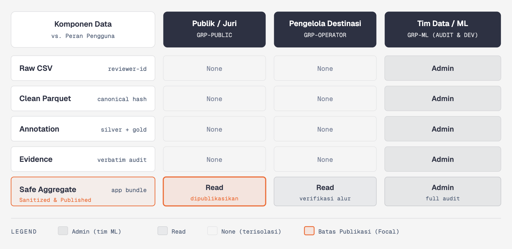

# SIPATURE

## Sistem Pemantauan Ulasan dan Prioritas Tindak Lanjut Pariwisata Toba

**Laporan Final Round — Del AI Hackathon 2026**

**Nama tim:** `[NAMA TIM]`

**Ketua:** `[ANGGOTA 1 - KETUA]`

**Anggota:** `[ANGGOTA 2]`, `[ANGGOTA 3]`

> Dokumen submission tidak mencantumkan identitas institusi pendidikan. Versi PDF maksimal 25 MB.

---

## Ringkasan Eksekutif

Ulasan wisata menyimpan informasi yang lebih rinci daripada *rating* rata-rata. Destinasi dengan *rating* tinggi tetap dapat menyembunyikan keluhan berulang tentang toilet, akses jalan, pungutan, parkir, atau pelayanan. Ketika volume ulasan mencapai ribuan, pengelola kesulitan membaca semuanya secara rutin dan menentukan isu mana yang perlu diverifikasi lebih dahulu.

SIPATURE adalah *dashboard* dan sistem pendukung keputusan yang mengubah ulasan menjadi **sinyal operasional per destinasi**. Sistem membaca ulasan, memilah isu ke 14 aspek, menentukan arah penilaian, mempertahankan kutipan bukti, dan menyusun prioritas verifikasi. SIPATURE tidak menyatakan bahwa keluhan pasti benar dan tidak menggantikan inspeksi lapangan.

*Pipeline* mengolah 22.302 *record* mentah menjadi 22.169 *record* bersih; 12.234 di antaranya berteks. Benchmark final memakai **human-gold** 1.320 *review* dari tiga anotator (agreement *Jaccard* aspek 0,9664). Terhadap *gold-v1*, deteksi aspek TF-IDF memperoleh *Macro F1* 0,5777 — di bawah *Keyword* (0,7056) tetapi di atas IndoBERT (0,4254). TF-IDF tetap dipilih sebagai model produksi karena merupakan model yang belajar dari data, interpretable, dan CPU-only; *gold* adalah *benchmark evaluasi*, bukan data *training*.

Produk final berjalan sebagai tiga layanan *Docker* (`web` + `inference` + `db`) yang di-deploy ke DGX B200 IT Del secara offline, dengan *latency* p50 2,1 ms per *review*, *alert verification workflow* (konfirmasi/tolak/tidak pasti + alasan), dan *fallback* peta SVG saat tanpa internet. Keluaran operasional mencakup 103 destinasi *actionable* dan 210 isu. Keterbatasan utama: model *severity* tidak tersedia (support kelas `high` < 20), dan *evidence* verbatim ditahan dari aplikasi publik sampai pemeriksaan privasi selesai.

Tabel ringkasan berikut merangkum indikator utama implementasi dan hasil evaluasi performa SIPATURE secara kuantitatif:

**Tabel 1. Ringkasan indikator utama implementasi dan evaluasi SIPATURE.**

| Indikator Utama | Hasil Aktual | Keterangan |
| --- | ---: | --- |
| *Review* bersih | 22.169 | dari 22.302 *raw records* |
| *Review* berteks | 12.234 | *input* utama pemrosesan NLP |
| *Gold annotation* | 1.320 | 3 anotator manusia, *Jaccard* aspek 0,9664 |
| *Aspect Macro F1* (gold-v1) | 0,5777 | TF-IDF (model produksi terpilih) |
| IndoBERT aspect (gold-v1) | 0,4254 | ditolak (*underfitting* pada data kecil) |
| *Canonical destination* | 388 | 322 *anchor metadata* + 66 *unresolved placeholder* |
| Destinasi *actionable* | 103 | menghasilkan 210 isu terverifikasi bukti |
| *Latency* `/predict-review` | p50 2,1 ms | inferensi CPU-only pada node DGX B200 |

**Interpretasi Tabel 1.** Indikator utama di atas mencerminkan efisiensi rantai konversi data: dari 22.302 ulasan mentah, sistem menghasilkan 103 destinasi dengan 210 isu yang didukung bukti konkret. Penggunaan model TF-IDF memastikan latensi inferensi sangat rendah (2,1 ms) sehingga mampu berjalan secara mandiri dan andal pada lingkungan komputasi luring DGX B200.

---

# 1. Latar Belakang dan Permasalahan

## 1.1 Konteks Pariwisata Danau Toba

Kawasan Danau Toba memiliki ekosistem pariwisata yang saling bergantung. Pengalaman wisatawan ditentukan bukan hanya oleh daya tarik destinasi, tetapi juga oleh kebersihan, akses jalan, parkir, toilet, keamanan, harga, pelayanan, akomodasi, kuliner, dan transportasi. Masalah pada satu unsur dapat memengaruhi kenyamanan dan citra kawasan secara keseluruhan.

Peningkatan kualitas membutuhkan informasi yang dapat ditindaklanjuti: bukan hanya tempat mana yang populer, tetapi masalah apa yang berulang, berapa banyak bukti yang tersedia, dan apa yang perlu diperiksa lebih dahulu — agar sumber daya terbatas diarahkan pada kebutuhan paling relevan.

## 1.2 Kondisi Data

Dataset panitia mencakup objek wisata, akomodasi, kuliner, transportasi, fasilitas, lokasi, harga, jam operasional, *rating*, dan ulasan. Cakupan ini memungkinkan analisis pariwisata sebagai satu ekosistem. Namun data masih mentah: informasi tersebar di sejumlah file dengan struktur berbeda, nama tempat tidak konsisten, sebagian *field* kosong, dan tidak semua *review* berteks. Data tidak dapat langsung dimasukkan ke model tanpa pembersihan, integrasi, dan penghubungan entitas.

## 1.3 Kesenjangan Keputusan (Decision Gap)

*Rating* rata-rata tidak menjelaskan penyebab pengalaman. Dua destinasi dengan *rating* sama dapat menghadapi masalah berbeda. Membaca ulasan satu per satu juga tidak efisien ketika jumlahnya ribuan; keluhan penting dapat tertutup oleh *review* positif atau tempat bervolume besar. Kebutuhan utamanya bukan sentimen umum, melainkan **aspek yang dibicarakan**, **potongan bukti**, **jumlah dan kecukupan data**, dan **prioritas verifikasi** — tanpa menyatakan keluhan sebagai fakta lapangan.

## 1.4 Rumusan Masalah

Berdasarkan kesenjangan antara ketersediaan data ulasan yang melimpah dan kebutuhan operasional pengelola di lapangan, perumusan masalah utama dalam pengembangan sistem ini diarahkan pada efektivitas ekstraksi sinyal dan prioritisasi tindak lanjut:

> Bagaimana membantu pengelola mengubah ribuan ulasan tersebar menjadi daftar isu spesifik, didukung sinyal yang dapat ditelusuri, dan dapat diprioritaskan untuk verifikasi?

## 1.5 Relevansi dengan Challenge

Pengembangan SIPATURE dirancang secara spesifik untuk menjawab tantangan tata kelola pariwisata berbasis kecerdasan buatan dengan mengedepankan empat pilar nilai utama: informatif, efisien, berkelanjutan, dan bernilai operasional. Matriks kontribusi sistem terhadap nilai-nilai tersebut dirinci pada tabel berikut:

**Tabel 2. Pemetaan nilai pilar kompetisi dan kontribusi solusi SIPATURE.**

| Nilai Pilar | Kontribusi Solusi SIPATURE |
| --- | --- |
| **Informatif** | Mengubah teks bebas menjadi 14 aspek terstruktur, kutipan bukti verbatim, dan skor prioritas yang dapat dijelaskan (*explainable*). |
| **Efisien** | Mengeliminasi proses audit ulasan manual dengan latensi p50 2,1 ms per ulasan dan konsumsi memori ringan. |
| **Berkelanjutan** | Memprioritaskan isu kebersihan, sanitasi toilet, dan akses jalan dengan mekanisme umpan balik verifikasi berkelanjutan. |
| **Bernilai** | Menjadi landasan pengambilan keputusan taktis bagi pengelola lokal dan alokasi anggaran strategis bagi BPODT. |

**Interpretasi Tabel 2.** Keempat pilar ini memastikan bahwa SIPATURE tidak hanya berfungsi sebagai proyek demonstrasi teknologi AI, melainkan sebuah instrumen operasional praktis yang memberi manfaat langsung bagi pengelolaan pariwisata Danau Toba.

---

# 2. Analisis Permasalahan

## 2.1 Pemangku Kepentingan

Keberhasilan intervensi pariwisata memerlukan pemahaman menyeluruh terhadap ekosistem pemangku kepentingan di Kawasan Danau Toba. Setiap pihak memiliki kebutuhan informasi yang berbeda serta menghadapi hambatan operasional tersendiri dalam memanfaatkan umpan balik wisatawan:

**Tabel 3. Pemetaan kebutuhan dan hambatan operasional para pemangku kepentingan.**

| Pemangku Kepentingan | Kebutuhan Utama | Hambatan Operasional Saat Ini |
| --- | --- | --- |
| **Pengelola Destinasi** | Menemukan keluhan fasilitas berulang dan menentukan titik inspeksi fisik. | Volume ulasan sangat besar, tidak terstruktur, dan tercampur pujian umum. |
| **BPODT / Pemerintah** | Memantau pola kelemahan lintas wilayah untuk alokasi anggaran fasilitas publik. | Data ulasan dan metadata tersebar di berbagai platform tanpa standardisasi. |
| **Wisatawan** | Memperoleh fasilitas wisata yang bersih, aman, transparan, dan terawat. | Umpan balik yang disampaikan jarang mendapat tindak lanjut nyata. |
| **Pelaku Usaha Lokal** | Mendapatkan rekomendasi perbaikan layanan spesifik (kuliner, penginapan). | Ketiadaan sinyal berbasis data agregat yang dapat dipercaya. |

**Interpretasi Tabel 3.** Kebutuhan para pemangku kepentingan menunjukkan bahwa tantangan terbesar bukan ketiadaan data, melainkan ketiadaan alat sintesis yang mampu menyaring kebisingan teks dan menyajikan prioritas tindakan yang konkret.

## 2.2 Profil Data

Dua file *review* utama (`wisata-v2.csv` 12.691 + `resto-hotel-v2.csv` 9.611) adalah sumber bahasa. Tiga file *metadata* utama menyediakan identitas dan lokasi. File lain berfungsi *enrichment* (jam, fasilitas, transportasi, kuliner). Pemisahan peran mencegah artikel/field pendukung diperlakukan sebagai *ground truth* keliru.

## 2.3 Temuan EDA

Eksplorasi data awal (*Exploratory Data Analysis*) dilakukan untuk memahami karakteristik teks, pola distribusi rating, dan kelengkapan metadata sebelum perancangan model. Temuan-temuan kunci dari analisis ini meliputi:

- **Skala:** 22.302 *raw* → 22.169 *clean* (12.234 textual, 9.935 rating-only).
- **Rating imbalance:** 15.595 dari 22.243 *rating* integer adalah bintang lima; model mayoritas bisa terlihat baik tanpa menemukan keluhan.
- **Volume vs complaint:** persentase tinggi pada sample kecil tidak stabil → *Bayesian smoothing* + *minimum support*.
- **Metadata:** nama/alamat/koordinat hampir lengkap; fasilitas & jam operasional tidak merata — *field* kosong diperlakukan sebagai "data belum cukup", bukan "tidak ada fasilitas".

## 2.4 Risiko dan Mitigasi

Penerapan kecerdasan buatan untuk mendukung keputusan publik membawa risiko bias algoritma, kesalahan penggabungan data, dan potensi dampak negatif terhadap reputasi destinasi. Oleh karena itu, SIPATURE menerapkan strategi mitigasi ketat di setiap lapisan proses:

**Tabel 4. Matriks identifikasi risiko sistem kecerdasan buatan dan strategi mitigasi.**

| Risiko Teridentifikasi | Dampak Potensial | Strategi Mitigasi Terintegrasi |
| --- | --- | --- |
| **Popularity Bias** | Destinasi populer mendominasi antrean isu. | Penerapan *Bayesian smoothing*, *minimum support gate*, dan normalisasi *log exposure*. |
| **False Alert & Reputasi** | Kerugian nama baik destinasi akibat alarm palsu. | Bahasa pelaporan netral (*reported signal*), verifikasi manusia, dan *rejected-alert workflow*. |
| **Sparse Label / Rare Aspect** | Aspek langka tidak terdeteksi oleh model. | *Stratified sampling*, optimasi *Macro F1*, dan penyesuaian bobot kelas (*class weighting*). |
| **Entity False Merge** | Data dua tempat berbeda tercampur keliru. | *Conservative resolution*, penolakan *low-confidence merge*, dan *unresolved placeholder*. |
| **Data Usang (Staleness)** | Keputusan diambil dari keluhan lama yang teratasi. | Pembobotan kebaruan data (*freshness decay*) dan label status `Insufficient Data`. |

**Interpretasi Tabel 4.** Strategi mitigasi ini dirancang agar sistem bertindak sebagai asisten pemantauan yang hati-hati (*conservative assistant*), meminimalkan risiko keputusan salah (*false positives*) yang dapat merugikan pengelola lokal.

---

# 3. Pendekatan AI dan Modelling

## 3.1 Rantai Solusi

Arsitektur solusi SIPATURE dibangun sebagai rantai pemrosesan end-to-end yang mengubah ulasan mentah multi-sumber menjadi rekomendasi tindak lanjut yang dapat diverifikasi oleh pengelola:

**Gambar 1. Rantai solusi SIPATURE — dari ulasan menjadi tindak lanjut terverifikasi.**

**Interpretasi Gambar 1.** Tujuh tahap: ulasan mentah dibersihkan dan dihubungkan ke destinasi (*entity resolution*), diproses model deteksi aspek (TF-IDF + lexical polarity, ditandai *focal*), diagregasi menjadi sinyal dan bukti verbatim per destinasi, diprioritaskan secara *missing-aware*, diverifikasi manusia (`confirmed`/`rejected`/`uncertain`), lalu menjadi kandidat tindak lanjut. *Severity* tidak tersedia (support kelas `high` < 20) sehingga tidak diimputasi.

## 3.2 Taxonomy

Taksonomi aspek dirancang untuk menangkap spektrum permasalahan pariwisata secara terstruktur. Sebanyak 14 aspek dikelompokkan ke dalam empat pilar operasional:
1. **Lingkungan:** `cleanliness` (kebersihan umum), `trash` (pengelolaan sampah), `sanitation` (kondisi toilet/sanitasi), dan `crowd` (kepadatan pengunjung).
2. **Infrastruktur:** `access` (akses jalan/kemudahan tempuh), `parking` (ketersediaan & tarif parkir), serta `public_facility` (sarana ibadah, gazebo, penerangan).
3. **Pengalaman:** `scenery` (daya tarik alam/keindahan visual), `comfort` (kenyamanan beraktivitas), `safety` (keamanan lingkungan), dan `price_transparency` (kewajaran harga, tarif tidak resmi/pungli).
4. **Operasional:** `service` (keramahan & sikap staf), `maintenance` (perawatan sarana), dan `opening_hours` (kesesuaian jam operasional).

## 3.3 Annotation dan Kesepakatan Anotator (Inter-Annotator Agreement)

Untuk melatih dan menguji model deteksi aspek secara andal, SIPATURE menerapkan strategi anotasi berjenjang:
- **Silver labels** (AI-assisted weak supervision, 3 *rule passes*) digunakan untuk melatih model pada skala besar — *bukan* sebagai tolok ukur kebenaran manusia.
- **Gold-v1 benchmark** (anotasi independen oleh 3 manusia pada 1.320 ulasan) khusus digunakan sebagai tolok ukur evaluasi akhir.

Kualitas dan konsistensi pelabelan pada dataset *gold-v1* diuji secara kuantitatif melalui metrik kesepakatan antar-anotator (*inter-annotator agreement*) sebelum proses pembekuan data:

**Tabel 5. Hasil inter-annotator agreement pada dataset benchmark gold-v1 (1.320 ulasan).**

| Komponen Anotasi | Metrik Evaluasi | Ambang Batas Gate | Hasil Aktual | Status Kepatuhan |
| --- | --- | :---: | :---: | :---: |
| **Deteksi Aspek** (Multilabel) | *Mean Pairwise Jaccard* | $\ge 0,7000$ | **0,9664** | Lulus Gate ($\checkmark$) |
| **Polaritas Sentimen** | *Raw Agreement Ratio* | $\ge 0,7500$ | **0,9804** | Lulus Gate ($\checkmark$) |
| **Tingkat Keparahan** (*Severity*) | *Cohen's Kappa ($\kappa$)* | $\ge 0,7000$ | **1,0000** | Lulus Gate ($\checkmark$) |
| **Adjudikasi Ketidaksepakatan** | *Total Disagreements* | Semua diselesaikan | **117 kasus** (97 auto + 20 manual) | Selesai Dialokasikan |

**Interpretasi Tabel 5.** Seluruh metrik kesepakatan melampaui ambang batas kualitas yang ditetapkan (*quality gates*). Skor *Jaccard* aspek sebesar 0,9664 dan kesepakatan polaritas 0,9804 membuktikan bahwa pedoman anotasi dipahami secara seragam oleh para penilai, sehingga dataset *gold-v1* merupakan instrumen uji independen yang sangat valid.

## 3.4 Model yang Dibandingkan

Eksperimen pemodelan mengevaluasi tiga pendekatan berbeda untuk menemukan keseimbangan optimal antara akurasi generalisasi, interpretabilitas, dan efisiensi komputasi:

**Tabel 6. Komparasi karakteristik arsitektur tiga kandidat model ekstraksi aspek.**

| Kandidat Model | Pendekatan & Representasi | Kebutuhan Komputasi | Peran dalam Sistem |
| --- | --- | --- | --- |
| **Keyword** | *Lexicon matching* + aturan konteks | CPU minimal (aturan leksikal) | Batas atas (*ceiling*) referensi; sirkular di silver |
| **TF-IDF (Produksi)** | *Word + Character n-grams* $\rightarrow$ OVR Logistic Regression | CPU ringan (p50 2,1 ms) | **Model Produksi Terpilih** (belajar dari data) |
| **IndoBERT** | *Fine-tuning* `indobenchmark/indobert-base-p1` (124,5M param) | GPU / VRAM besar | Model kandidat kontekstual (**Ditolak**) |

**Interpretasi Tabel 6.** TF-IDF dipilih sebagai model produksi karena menawarkan kombinasi keunggulan: belajar dari pola data nyata, deterministik, mudah dijelaskan (*interpretable* bobot fiturnya), dan memiliki konsumsi sumber daya yang sangat efisien untuk implementasi mandiri di DGX B200.

## 3.5 Split Leakage-Safe

1.320 *record* dibagi **per destinasi** (bukan acak per *review*): 922 train / 196 validation / 202 locked test, 0 *leakage* destinasi/duplikat/teks berulang, seluruh 14 aspek muncul di validation/test.

## 3.6 Polarity & Severity

Penentuan arah sentimen (*polarity*) dan tingkat keparahan (*severity*) dirancang dengan prinsip kehati-hatian matematis untuk mencegah kesimpulan yang tidak didukung data:

- **Polarity** produksi: `lexical-polarity-v1` (deterministik, tanpa probabilitas). Kandidat IndoBERT *polarity* ditolak (gold-v1 0,5077 ≈ *chance*).
- **Severity:** `unavailable_no_supported_model` (support kelas `high` 19 < *gate* 20).

---

# 4. Proses Pengembangan Solusi

## 4.1 Tahapan Pengembangan

Pengembangan solusi SIPATURE dilaksanakan secara sistematis melalui lima fase terukur, mulai dari pengolahan data mentah hingga penyediaan sistem terintegrasi:

**Tabel 7. Lima fase siklus pengembangan sistem SIPATURE dan artefak keluarannya.**

| Fase Pengembangan | Ruang Lingkup Aktivitas | Output / Artefak Terverifikasi | Status |
| --- | --- | --- | :---: |
| **01. Data Engineering** | Inventarisasi, EDA, *cleaning*, dan resolusi entitas | `canonical_reviews.parquet` (22.169 records) | Selesai ($\checkmark$) |
| **02. Annotation** | Pembuatan label *silver* dan anotasi *human gold-v1* | `gold.jsonl` (SHA `7b5b6057`) | Selesai ($\checkmark$) |
| **03. Model Development** | Eksperimen *Keyword*, TF-IDF, dan IndoBERT | `tfidf-aspect-silver-v1` (SHA `a10bddb1`) | Selesai ($\checkmark$) |
| **04. Analytics Engine** | *Inference*, agregasi sinyal, dan skoring prioritas | `a9-tfidf-lexical-v1.0.4` | Selesai ($\checkmark$) |
| **05. Product Delivery** | API FastAPI, UI Next.js 15, dan *dockerization* | Tiga kontainer Docker mandiri di DGX B200 | Selesai ($\checkmark$) |

**Interpretasi Tabel 7.** Setiap fase menghasilkan artefak yang dikunci dengan *hash* kriptografis SHA-256 untuk menjamin keterlacakan penuh (*end-to-end traceability*) dan reprodusibilitas hasil eksperimen.

## 4.2 Reproducibility

*Seed* 42, konfigurasi YAML per *stage*, *manifest* + SHA-256 di setiap *stage*, dependensi terkunci (`requirements-dev.lock.txt`), dan *locked-test policy* (test dievaluasi sekali, metrik tidak boleh ditimpa).

## 4.3 Tumpukan Teknologi

Tumpukan teknologi (*tech stack*) dipilih untuk memastikan kinerja inferensi yang cepat, konsumsi memori rendah, dan kemampuan operasional luring (*offline*):

**Tabel 8. Rincian tumpukan teknologi (tech stack) implementasi multi-layer SIPATURE.**

| Lapisan Sistem | Teknologi / Pustaka | Peran dan Rasional Pemilihan |
| --- | --- | --- |
| **Data Processing** | Python 3.11, Pandas, PyArrow (Parquet) | Ekstraksi cepat, penyimpanan biner efisien, manipulasi tabular. |
| **Machine Learning** | scikit-learn (TF-IDF + Logistic Regression) | Inferensi deterministik, CPU-only, ringan, dan andal tanpa GPU. |
| **Inference API** | FastAPI, Uvicorn, Pydantic | Pelayanan prediksi berlatensi rendah dengan validasi skema ketat. |
| **Frontend Web** | Next.js 15 (React), Leaflet, CSS Murni | Antarmuka responsif dengan *fallback* visual SVG interaktif. |
| **Database & Cache** | PostgreSQL 16 | Penyimpanan relasional sinyal agregat dan *state* verifikasi alur. |
| **Deployment Host** | Docker Compose, NVIDIA DGX B200 | Orkestrasi kontainer mandiri (*air-gapped*) tanpa dependensi internet. |

**Interpretasi Tabel 8.** Pemilihan teknologi ini menjamin portabilitas tinggi: aplikasi dapat dijalankan secara instan pada lingkungan server DGX B200 tanpa memerlukan unduhan paket eksternal saat inisialisasi kontainer.

---

# 5. Implementasi Produk dan Deployment

## 5.1 Arsitektur

Sistem SIPATURE diimplementasikan dengan arsitektur multi-layanan mandiri (*self-contained*) yang siap dijalankan pada lingkungan komputasi terisolasi:

**Gambar 2. Deployment tiga layanan di host DGX B200.**

**Interpretasi Gambar 2.** Komunikasi antar-layanan berlangsung efisien di dalam *bridge network* host DGX B200: peramban memanggil *web gateway* Next.js melalui protokol HTTPS, *web* membaca basis data PostgreSQL (`READ`), dan meneruskan permintaan analisis teks ulasan langsung ke engine FastAPI (`LIVE`). Seluruh model dan data terintegrasi ke dalam image Docker sehingga sistem beroperasi 100% luring.

## 5.2 Fitur

Aplikasi antarmuka SIPATURE menyediakan 7 modul fungsional utama yang saling terhubung untuk mendukung alur kerja pemantauan dan pengambilan keputusan:

1. **Overview** — Ringkasan metrik kesehatan pariwisata, *coverage* data, rekapitulasi isu, dan daftar prioritas tertinggi.
2. **Map** — Peta interaktif dengan filter kabupaten, kategori destinasi (*kind*), aspek permasalahan, dan tingkat *confidence*, dilengkapi *fallback* SVG luring.
3. **Detail** — Pemeriksaan mendalam per destinasi mencakup *evidence* ulasan, *metadata*, skor *confidence*, indikator *health*, dan komponen data yang belum lengkap (*missing*).
4. **Queue** — Antrean verifikasi operasional dengan *ranking* prioritas, tingkat dukungan bukti (*support*), dan rekomendasi tindakan.
5. **Simulator** — Alat simulasi dampak intervensi berbasis asumsi eksplisit dengan peringatan permanen sifat non-kausal (*non-causal warning*).
6. **Analyzer** — Pengujian teks ulasan interaktif secara *live* menggunakan model TF-IDF produksi.
7. **Verification workflow** — Alur validasi sinyal lapangan bagi pengelola (opsi konfirmasi, tolak, atau tidak pasti beserta alasan penolakan).

## 5.3 Deployment DGX B200

Docker Compose tiga layanan; model & data di-*bundle* ke image (tanpa *download* saat startup). Offline penuh: map tile eksternal turun ke SVG luring; analyzer turun ke *baseline* bila inference mati. *Health check*, *cold start*, dan *restart* terverifikasi.

## 5.4 Pengujian Performa

Pengujian performa menunjukkan bahwa sistem beroperasi dengan latensi sangat rendah dan efisiensi memori yang tinggi pada satu node DGX B200:

**Tabel 9. Hasil uji performa latensi inferensi dan konsumsi memori pada host DGX B200.**

| Komponen / Operasi | Metrik Waktu / Kapasitas | Keterangan Operasional |
| --- | :---: | --- |
| **Endpoint `/predict-review`** | p50 2,1 ms · p95 3,1 ms | Inferensi live NLP ulasan tunggal |
| **Endpoint `/api/analyze`** | p50 6,5 ms · p95 9,8 ms | Gateway agregasi inferensi + pengayaan metadata |
| **Waktu Pemuatan Halaman (*Page Load*)** | 0,05 – 0,14 detik | Respons render UI Next.js 15 |
| **Memori Kontainer `web`** | 95 MiB | Antarmuka pengguna dan gateway |
| **Memori Kontainer `inference`** | 133 MiB | Model scikit-learn + FastAPI |
| **Memori Kontainer `db`** | 23 MiB | Basis data PostgreSQL 16 |
| **Total Konsumsi Memori Sistem** | **251 MiB** | Jauh di bawah batas alokasi host |

**Interpretasi Tabel 9.** Hasil pengujian membuktikan bahwa SIPATURE memiliki jejak komputasi yang sangat efisien (total memori hanya 251 MiB) dengan latensi sub-10 ms, menjadikannya sistem yang sangat tangguh untuk penggunaan operasional waktu nyata (*real-time*).

---

# 6. Evaluasi dan Hasil

## 6.1 Benchmark Gold-v1 (human)

Evaluasi model dilakukan secara independen terhadap dataset uji terkunci *gold-v1* (1.320 ulasan beranotasi manusia) untuk mengukur performa nyata di luar data pelatihan:

**Gambar 3. Perbandingan Macro F1 deteksi aspek pada silver (locked) vs gold-v1 (human).**

**Tabel 10. Perbandingan Macro F1 deteksi aspek dan polaritas pada silver (locked) vs gold-v1 (human).**

| Model yang Diuji | Silver Test (Locked · 202 ulasan) | Gold-v1 Benchmark (Human · 1.320 ulasan) | Status Keputusan Model |
| --- | :---: | :---: | --- |
| **Keyword (Lexicon)** | 0,9768 (sirkular) | 0,7056 | Batas atas (*rule ceiling*) |
| **TF-IDF + Ridge** | 0,7201 | **0,5777** | **Model Produksi Terpilih** |
| **IndoBERT (Aspek)** | 0,5247 | 0,4254 | Ditolak (*underfit* data kecil) |
| **IndoBERT (Polaritas)** | 0,7459 | 0,5077 (≈ *chance*) | Ditolak (akurasi tidak memadai) |

**Interpretasi Tabel 10 & Gambar 3.** Skor *Keyword* pada silver (0,9768) terbukti bersifat sirkular karena aturan pembentukan silver identik dengan leksikon model; skornya turun drastis ke 0,7056 pada evaluasi manusia. TF-IDF mengalami penurunan wajar dari 0,7201 ke 0,5777 yang mencerminkan generalisasi jujur terhadap penilaian manusia. IndoBERT memperoleh skor terendah (0,4254 untuk aspek dan 0,5077 untuk polaritas) akibat keterbatasan ukuran data pelatihan.

## 6.2 Keputusan Model — mengapa TF-IDF (dilatih silver) dipilih

**Mengapa model produksi dilatih pada *silver labels*, bukan *gold*?** Karena *gold* adalah *benchmark evaluasi*, bukan data *training*. Ketiga alasan berikut menjawab pertanyaan juri yang paling sering muncul:

1. **Circularity / leakage.** 1.320 *review* *gold* adalah persis *split* yang dipakai evaluasi. Melatih di *gold* lalu menguji di *gold* berarti model menghafal jawaban — persis seperti *Keyword* 0,9768 di *silver* yang kami ungkap sebagai *ceiling*, bukan prestasi. Nilai F1 yang dihasilkan tidak akan bermakna.
2. **Generalisasi.** *Gold* hanya 1.320 *review*, sedangkan produksi harus memprediksi 12.234 *review* berteks. *Silver* menyediakan data *training* yang sama besarnya dan sudah dipakai sejak awal untuk melatih.
3. **Independensi *benchmark*.** *Gold* dibuat justru agar independen dari model; memakainya untuk melatih akan menghancurkan fungsinya sebagai pengukur yang jujur.

**Lalu mengapa bukan *Keyword* (0,7056 > TF-IDF 0,5777 di gold)?** *Keyword* adalah *rule engine* leksikal yang *sama* dengan pembuat *silver labels* — bukan model yang belajar dari data. Ia tinggi di *silver* (0,9768) justru karena sirkular, dan tetap tinggi di *gold* karena lexikon *taxonomy*-nya kebetulan cocok dengan penilaian manusia. Memilih *Keyword* berarti memilih *rules* yang sudah kami tulis sendiri, bukan model yang menggeneralisasi. Kami melaporkan keduanya secara terpisah dan tidak menyembunyikan gap ini.

**Dan mengapa bukan IndoBERT?** IndoBERT (124,5M param, fine-tune 4 *epoch*) memperoleh aspek 0,4254 dan *polarity* 0,5077 (≈ *chance*) di *gold-v1* — keduanya di bawah TF-IDF. Pada data kecil (922 *train*) dengan label lemah dan distribusi aspek timpang, kompleksitas tidak otomatis memberi hasil lebih baik; IndoBERT juga lebih mahal (GPU) dan kurang interpretable.

**Kesimpulan:** TF-IDF + *One-vs-Rest Logistic Regression* dipilih sebagai detektor aspek karena (a) model yang benar-benar belajar dari data, (b) *interpretable* dan deterministik, (c) CPU-only dengan *latency* p50 2,1 ms, (d) dapat dimuat ulang secara offline, dan (e) hasil *gold-v1*-nya (0,5777) adalah angka jujur terhadap penilaian manusia. *Upgrade* yang benar di masa depan adalah menambah anotasi manusia (held-out set baru) lalu melatih ulang — bukan memakai *gold* yang sama sebagai *training*.

## 6.3 Evaluasi Resolusi Entitas (Entity Resolution)

Resolusi entitas diterapkan secara konservatif untuk menggabungkan variasi penamaan destinasi dari berbagai sumber data tanpa menimbulkan penggabungan keliru (*false merge*):

**Tabel 11. Metrik evaluasi resolusi entitas destinasi wisata.**

| Metrik Kualitas Resolusi | Nilai Capaian | Implikasi Terhadap Integritas Sistem |
| --- | :---: | --- |
| **Reviewed-pair Precision** | **0,9714 (97,14%)** | Memastikan bahwa pasangan entitas yang digabung benar-benar destinasi yang sama. |
| **Reviewed-pair Recall** | **0,4304 (43,04%)** | Penggabungan dilakukan secara hati-hati (*strict matching*), menghindari tebakan spekulatif. |
| **False-Merge Rate** | **0,0286 (2,86%)** | Angka kesalahan sangat rendah, mencegah tercampurnya reputasi dua lokasi berbeda. |
| **Komposisi Canonical IDs** | **388 ID** | Terdiri dari 322 *anchor metadata* dan 66 *unresolved placeholder*. |

**Interpretasi Tabel 11.** Presisi tinggi (97,14%) dan *false-merge rate* yang sangat rendah (2,86%) membuktikan bahwa entitas destinasi dihubungkan secara akurat. Entitas yang belum terselesaikan (*unresolved*) diisolasi ke dalam 66 *placeholder* dan dikeluarkan dari antrean prioritas untuk mencegah kesalahan intervensi.

## 6.4 Error Analysis

Analisis kualitatif terhadap kesalahan prediksi dilakukan untuk mengidentifikasi batasan linguistik model dan menyediakan konteks bagi alur verifikasi manusia:

- **Negasi:** "pungli tidak ada" dapat ter-flag *negative* (limitation *lexical polarity*).
- **Klausa kontras:** "tempat bagus, tapi jalan jelek" → akses kadang `neutral`.
- **Rare aspect:** `opening_hours` *support* kecil → F1 tidak stabil.
- **False-positive case (didokumentasikan):** Danau Sidihoni `scenery` — empat *review* "negatif" ternyata pujian; di-*reject* lewat workflow.

---

# 7. Dampak dan Potensi Pengembangan

## 7.1 Manfaat per Stakeholder

Implementasi SIPATURE mentransformasi tumpukan ulasan pasif menjadi alat pengambil keputusan yang terukur bagi seluruh pemangku kepentingan:

**Tabel 12. Matriks dampak operasional dan indikator keberhasilan per pemangku kepentingan.**

| Pemangku Kepentingan | Manfaat Langsung Implementasi | Indikator Keberhasilan Operasional |
| --- | --- | --- |
| **Pengelola Destinasi** | Menemukan isu berulang secara cepat dan memulai verifikasi dari bukti terkuat. | Penurunan waktu tanggap verifikasi (*time-to-verification*). |
| **BPODT / Pemerintah** | Memetakan pola kelemahan fasilitas lintas destinasi untuk alokasi anggaran tepat sasaran. | Peningkatan persentase *coverage* isu dan ketepatan prioritas intervensi. |
| **Wisatawan & Masyarakat** | Menikmati fasilitas wisata yang lebih bersih, aman, nyaman, dan terawat. | Peningkatan rasio keluhan yang berhasil ditindaklanjuti secara nyata. |

**Interpretasi Tabel 12.** Dampak yang dihasilkan dapat diukur secara kuantitatif melalui efisiensi waktu kerja pengelola dan ketepatan penyaluran fasilitas perbaikan oleh instansi pemerintah terkait.

## 7.2 Rencana Pilot

5–10 destinasi beragam; *blind review* pengelola sebelum melihat *ranking* model; verifikasi lapangan *top alerts* (catat `confirmed`/`rejected`/`uncertain`); KPI: *verification rate*, *time-to-verification*, *intervention adoption*, *time saved*. Tidak menjanjikan *revenue*/*visitor growth* pada prototipe.

## 7.3 Keberlanjutan

*Feedback* dari *verified/rejected alert* dipakai memperbaiki *taxonomy*, *threshold*, dan bobot; *retraining* periodik; *governance* akses *evidence*; *cost* rendah (CPU-only, model ringan).

## 7.4 Skalabilitas

Arsitektur *batch-first* + SQL; TF-IDF inferensi linear; *entity resolution* berbasis *blocking*; PostgreSQL + indeks; dapat diparalelkan per *batch* untuk wilayah lebih luas.

---

# 8. Responsible AI dan Etika

Penerapan kecerdasan buatan pada domain pelayanan publik menuntut kepatuhan ketat terhadap prinsip transparansi, privasi individu, akuntabilitas, dan pengawasan manusia. SIPATURE memegang teguh komitmen etika berikut:

- **Privasi:** identitas reviewer, review ID, source file/row tidak masuk bundle aplikasi; `verified_by` opaque.
- **Evidence:** verbatim + provenance internal; teks ditahan dari aplikasi publik (`withheld_pending_privacy_review`).
- **Bahasa:** reported issue / early-warning signal, bukan vonis "kotor/berbahaya/tidak layak".
- **Low-support:** Insufficient Data, tidak diranking; unresolved identity tidak diberi prioritas.
- **Human oversight:** setiap alert = kandidat verifikasi; rejected-alert workflow tersedia.
- **Simulator:** non-kausal, asumsi eksplisit.

## 8.1 Kebijakan Data Terbatas (Restricted Data Policy)

Perlindungan privasi data diterapkan melalui pemisahan ketat antara lingkungan pengolahan data internal dan distribusi aplikasi publik:

**Gambar 4. Lima lapisan data — dari mentah (restricted) ke agregat aman (published).**

**Interpretasi Gambar 4.** Data mengalir dari kiri ke kanan melalui empat transformasi, dengan **PRIVACY GATE** (ditandai aksen) sebagai batas kritis: hanya agregat aman yang menyeberang ke sisi publik. Identitas reviewer berangsur hilang — dari `reviewer-id`/`name` di lapisan *raw*, menjadi `review_id` hash, teks *review*, *evidence* verbatim, hingga **tidak ada sama sekali** di *bundle* produk. Dua jalur konsumsi (*batch* dan *live*) memakai data yang sama secara deterministik dan hash-verified.

Data SIPATURE dibagi lima lapisan dengan tingkat akses berbeda. Lapisan mentah hingga *evidence* hanya dapat diakses tim ML (`restricted`); hanya **agregat aman** yang dipublikasikan ke aplikasi tanpa identitas reviewer:

**Tabel 13. Matriks klasifikasi lima lapisan data dan batasan hak akses privasi.**

| Lapisan Data | Cakupan dan Volume Konten | Keberadaan Identitas Reviewer | Kebijakan Hak Akses |
| --- | --- | :---: | :---: |
| **01. Raw CSV** | 22.302 *records* mentah (`wisata-v2`, `resto-hotel-v2`) | ADA (`reviewer-id`, nama akun) | *Restricted* (Tim ML saja) |
| **02. Clean Parquet** | 22.169 *canonical records* (hasil deduplikasi & ER) | Disamarkan ke `review_id` SHA-256 | *Restricted* (Tim ML saja) |
| **03. Annotation Base** | 1.320 ulasan beranotasi *gold* dan *silver* | Hanya teks ulasan (tanpa profil) | *Restricted* (Tim ML saja) |
| **04. Aggregate Store** | 1.682 sinyal aspek terdeteksi + *evidence verbatim* | Kutipan teks untuk audit internal | *Restricted* (Tim ML saja) |
| **05. Safe Product** | *App bundle* publik (103 destinasi, 210 isu) | **TIDAK ADA SAMA SEKALI** | **Published** (Publik & Pengelola) |

**Interpretasi Tabel 13.** Klasifikasi ini membuktikan kepatuhan *privacy-by-design*: data mentah yang memuat identitas personal disimpan terisolasi di sisi server/audit, sementara data yang disajikan ke publik telah disanitasi penuh sehingga tidak ada kebocoran data pribadi.

**Gambar 5. Matriks akses tiga peran × lima komponen data.**

**Interpretasi Gambar 5.** Empat komponen terbatas (`raw`, `clean`, *annotation*, *evidence*) hanya memiliki hak akses `Admin` bagi tim ML — publik dan pengelola berstatus `None`. Hanya **safe aggregate** yang dapat dibaca (`Read`) oleh publik (sel yang ditandai aksen = batas publikasi). Matriks ini membuktikan bahwa aplikasi publik tidak pernah menerima data identitas reviewer.

---

# 9. Deklarasi Penggunaan AI

## 9.1 AI dalam Solusi

Penggunaan model AI di dalam arsitektur operasional SIPATURE dibatasi pada tugas ekstraksi sinyal berbasis bukti dan diklasifikasikan berdasarkan status kesiapan produksinya:

**Tabel 14. Klasifikasi peran model AI dalam modul operasional SIPATURE.**

| Komponen Fungsional | Model / Metode Algoritma | Status Kesiapan Produksi |
| --- | --- | --- |
| **Deteksi Aspek (14 Aspek)** | TF-IDF + *One-vs-Rest Logistic Regression* | **Model Produksi Terpilih** (dilatih pada *silver*) |
| **Klasifikasi Polaritas Sentimen** | *Lexical Fallback* (`lexical-polarity-v1`) | **Deterministik Berversi** (tanpa probabilitas semu) |
| **Estimasi Tingkat Keparahan (*Severity*)** | Tidak diimputasi model spekulatif | `unavailable_no_supported_model` (dukungan data < 20) |

**Interpretasi Tabel 14.** Sistem menghindari model berlebihan (*over-engineering*) dengan menolak kandidat IndoBERT (aspect 0,4254 / polarity 0,5077) demi mempertahankan kecepatan, efisiensi memori, dan interpretabilitas pada server mandiri.

## 9.2 AI dalam Proses Pengembangan

AI generatif digunakan untuk membantu perancangan solusi, pengembangan kode, *debugging*, audit aturan, dan penyusunan dokumentasi. *AI-assisted weak supervision* menghasilkan *silver labels* (bukan gold). Seluruh *output* AI diperiksa manusia (*lint*, *unit test*, *schema validation*, *hash verification*, pembacaan hasil).

## 9.3 Batas Penggunaan AI

Untuk menjaga keandalan dan etika sistem pendukung keputusan, kami menetapkan batas tegas yang tidak boleh dilanggar oleh komponen kecerdasan buatan:

- AI tidak menjadi *ground truth* tanpa verifikasi manusia.
- AI tidak membuat *evidence* baru (kutipan verbatim dari sumber).
- AI tidak menentukan tindakan lapangan otomatis.
- Simulator bukan *causal prediction*.

## 9.4 Deklarasi Kejujuran Hasil

Komitmen terhadap integritas ilmiah dan keterbukaan hasil evaluasi dideklarasikan secara tertulis sebagai berikut:

> Seluruh metrik berasal dari evaluasi aktual pada data dan protokol yang dijelaskan. Target, asumsi simulator, dan hasil aktual dibedakan secara eksplisit. Kutipan *evidence* berasal dari dataset dan tidak difabrikasi.

---

## Referensi dan Traceability

Daftar dokumen rujukan dan panduan teknis yang menjadi acuan penyusunan solusi SIPATURE:

1. Del AI Hackathon 2026, *Technical Meeting Final Round*, 19 Agustus 2026.
2. *Scope lock* final: `docs/c1-final-scope-lock.md`.
3. *Model selection & evaluation*: `docs/model-selection-and-evaluation.md`.
4. *Model card*: `docs/model-card.md`.
5. *Performance & reliability*: `docs/c6-performance-reliability.md`.
6. *Evidence & demo audit*: `docs/c7-evidence-demo-audit.md`.
7. *Deployment runbook*: `docs/dgx-deployment-runbook.md`.
8. *Responsible AI*: `docs/responsible-ai.md`.
9. *Restricted data policy*: `docs/restricted-data-policy.md`.
10. *Reproducibility*: `docs/reproducibility-runbook.md`.

Seluruh klaim kuantitatif dan kualitatif dalam laporan ini dapat ditelusuri ke artefak teknis dan repositori data yang bersangkutan melalui matriks keterlacakan berikut:

**Tabel 15. Matriks keterlacakan klaim laporan terhadap artefak teknis dan repositori data.**

| Klaim Teknis dalam Laporan | Lokasi Artefak / Kode Sumber | Keterangan Verifikasi Kriptografis |
| --- | --- | --- |
| **Gold-v1 Benchmark (1.320 ulasan)** | `ml/data/annotations/gold/gold.jsonl` | Terkunci dengan SHA-256: `7b5b6057` |
| **Inter-Annotator Agreement** | `ml/data/annotations/gold/agreement.json` | *Jaccard* aspek 0,9664, *polarity* 0,9804 |
| **Metrik Evaluasi Gold-v1** | `ml/artifacts/metrics/*-gold-v1-test-metrics.json` | Keyword (0,7056), TF-IDF (0,5777), IndoBERT (0,4254) |
| **Artefak Model Produksi** | `ml/artifacts/models/tfidf-aspect-silver-v1/` | Model pipeline scikit-learn (SHA `a10bddb1`) |
| **Pipeline Inferensi & Agregasi** | `ml/artifacts/a9/20260813-1713_a9-tfidf-lexical-v1-*` | Ekstraksi 1.682 sinyal dan 210 isu terverifikasi |
| **Data Proyeksi Web App** | `sipature-app/src/data/generated/*.json` | Berkas `places.json`, `interventions.json`, `corpus.json` |
| **Laporan Uji Performa DGX** | `docs/c6-performance-reliability.md` | Latensi p50 2,1 ms dan konsumsi memori 251 MiB |

**Interpretasi Tabel 15.** Matriks keterlacakan ini memberikan jaminan auditabilitas bahwa seluruh angka, klaim performa, dan keluaran yang disajikan dalam laporan final dapat diverifikasi dan direproduksi secara independen.

> *Raw data*, teks *evidence*, *review-level predictions*, *annotation*, *split records*, model *artifact*, dan *error cases* bersifat *restricted* dan tidak dipublikasikan tanpa pemeriksaan lisensi, privasi, dan hak akses.
