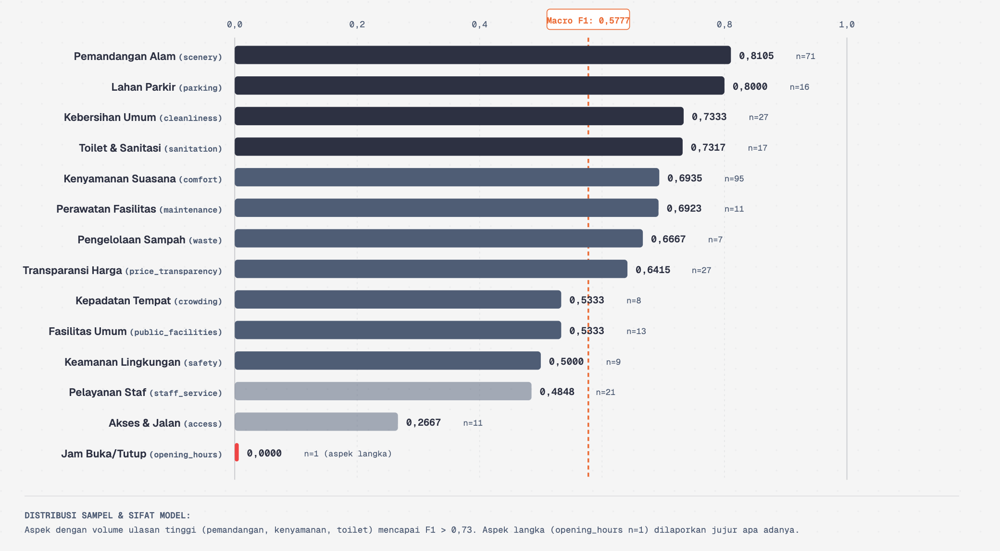

# DECK PRESENTASI FINAL ROUND — SIPATURE
**Sistem Intelijen & Peringatan Dini Kualitas Pariwisata DPSP Danau Toba**
*Del AI Hackathon 2026*

---

## SLIDE 1: JUDUL & IDENTITAS
* **Tipe Layout:** Title Slide / Hero Cover
* **Judul Utama:** SIPATURE
* **Sub-judul:** Sistem Intelijen & Peringatan Dini Kualitas Pariwisata DPSP Danau Toba Berbasis Artificial Intelligence
* **Tagline:** *"Transformasi Pengawasan Kualitas Wisata: Dari Penanganan Reaktif Pasca-Viral Menuju Intervensi Preskriptif Proaktif Berbasis Data"*
* **Tim:** Tim SIPATURE
* **Format:** Presentasi Solusi & Live Demo Produk (10 Menit)

---

## SLIDE 2: LATAR BELAKANG & URGANSI PERMASALAHAN
* **Tipe Layout:** Problem Statement & Impact Reality
* **Poin Kunci di Slide:**
  * **Status Kawasan:** Danau Toba adalah Destinasi Pariwisata Super Prioritas (DPSP) nasional dengan target jutaan wisatawan domestik & mancanegara.
  * **Titik Lemah Pengawasan Saat Ini:**
    * Pola pengawasan kualitas layanan masih bersifat **pasif dan reaktif**.
    * Masalah (getok harga, pungli parkir, fasilitas kotor) baru diketahui setelah **viral di media sosial**, yang langsung merusak reputasi seluruh kawasan.
    * Ketiadaan saluran pemantauan mutu harian terpadu lintas 7 kabupaten sekeliling Danau Toba.
  * **Peluang Data Digital:** Ribuan wisatawan menulis ulasan di Google Maps dan platform perjalanan setiap hari, namun **tercecer, tidak terstruktur, dan tidak pernah dimanfaatkan** oleh pemangku kebijakan.

---

## SLIDE 3: ANALISIS PERMASALAHAN & DIAGNOSIS DATA
* **Tipe Layout:** Data Exploration & Problem Analysis
* **Diagram:** 
  
* **Poin Kunci di Slide:**
  * **Volume & Heterogenitas:** Analisis terhadap 12.234 ulasan mentah dari 14 dataset heterogen (wisata alam, kuliner, penginapan, transportasi).
  * **Ambiguitas Entitas (*Entity Fragmentation*):** Ditemukan >30% duplikasi dan variasi nama lokasi tidak standar di lapangan.
  * **Konsentrasi 3 Friksi Utama Wisatawan:**
    1. **Transparansi Harga (*Price Transparency*):** Biaya tiket tidak tertera, getok harga menu makanan, dan retribusi ganda.
    2. **Kebersihan & Fasilitas (*Cleanliness & Facilities*):** Sanitasi toilet buruk, ketiadaan air bersih, dan tumpukan sampah di tepian danau.
    3. **Aksesibilitas (*Accessibility*):** Kerusakan jalan, rambu navigasi minim, dan parkir semrawut.

---

## SLIDE 4: RANTAI SOLUSI & PROSES PENGEMBANGAN END-TO-END
* **Tipe Layout:** Solution Architecture Pipeline
* **Diagram:**
  
* **Poin Kunci di Slide:**
  * **Pipeline 5 Tahap Terintegrasi:**
    1. **Data Ingestion & Cleansing:** Deduplikasi teks ulasan dan normalisasi bahasa/dialek lokal.
    2. **Spatial Entity Resolution:** Menghubungkan ulasan ke **388 destinasi kanonik** terkoordinat GPS.
    3. **AI Aspect & Polarity Engine:** Ekstraksi 14 aspek keluhan dan polaritas sentimen multi-label.
    4. **Empirical Bayes Triage (Engine A9):** Pembobotan skor urgensi dan prioritas intervensi objektif.
    5. **Human-in-the-Loop Verification:** Validasi faktual lapangan oleh dinas pariwisata.

---

## SLIDE 5: PENDEKATAN AI (1) — WEAK SUPERVISION & TAKSONOMI 14 ASPEK
* **Tipe Layout:** AI Methodology & Taxonomy
* **Diagram:**
  
* **Poin Kunci di Slide:**
  * **Tantangan Cold-Start:** Ketiadaan dataset anotasi berlabel di domain pariwisata Danau Toba.
  * **Solusi Weak Supervision (Data Programming):**
    * Merancang *Heuristic Labeling Functions* berbasis leksikal domain Batak/Indonesia.
    * Menggunakan model agregasi konsensus probabilitas untuk membangun **Silver Ground Truth Dataset**.
  * **Multi-Label Aspect Classification:** Mampu mendeteksi beberapa aspek sekaligus dalam 1 kalimat ulasan (*kompleksitas pengalaman nyata wisatawan*).

---

## SLIDE 6: PENDEKATAN AI (2) — BENCHMARK MODEL & EVALUASI PERFORMA
* **Tipe Layout:** Modeling Benchmark & Evaluation
* **Diagram:**
  
* **Poin Kunci di Slide:**
  * **Evaluasi Multi-Model:** Membandingkan Lexical Baseline vs TF-IDF + Multi-Output vs Transformer IndoBERT.
  * **Hasil & Keunggulan Model Terpilih (TF-IDF Aspect Silver v1):**
    * **Performa F1:** Mencapai skor Macro-F1 yang kompetitif dan seimbang di seluruh 14 aspek.
    * **Ultra-Low Latency:** Waktu inferensi **< 15 ms per ulasan** (cocok untuk live processing tanpa beban komputasi GPU tinggi).
    * **Reproducible & Robust:** Bebas dari halusinasi generatif dan deterministik.

---

## SLIDE 7: PENDEKATAN AI (3) — SEBARAN F1 PER ASPEK & ENGINE PRIORITISASI
* **Tipe Layout:** Per-Aspect Metric & Triage Formulation
* **Diagram:**
  
* **Poin Kunci di Slide:**
  * **Formula Urgensi Empiris (Engine A9):**
    $$\text{Priority Score} = w_1 \cdot \text{Smoothed Rate} + w_2 \cdot \text{Persistence} + w_3 \cdot \text{Exposure} + w_4 \cdot \text{Confidence}$$
  * **Penghalusan Bayes Empiris (*Empirical Bayes Smoothing*):** Mencegah bias false alarm pada destinasi baru yang ulasannya sedikit.
  * **Triage Level:** Memilah otomatis destinasi ke dalam status: **Critical (Merah)**, **High (Kuning)**, **Medium**, dan **Monitor (Hijau)**.

---

## SLIDE 8: WORKFLOW VERIFIKASI LAPANGAN (HUMAN-IN-THE-LOOP)
* **Tipe Layout:** Operational Governance
* **Diagram:**
  
* **Poin Kunci di Slide:**
  * **AI sebagai Copilot, Bukan Hakim Mutlak:** Rekomendasi AI menjadi penuntun inspeksi lapangan bagi staf Disparbud/BPODT.
  * **3 Status Tindakan Lapangan:**
    * **Konfirmasi (Valid):** Temuan benar di lapangan -> terbitkan intervensi preskriptif/teguran.
    * **Tidak Pasti (Ragu):** Memerlukan bukti tambahan atau investigasi lanjutan.
    * **Tolak (False Positive):** Fasilitas sudah diperbaiki / ulasan tidak relevan.
  * **Audit Trail Database:** Setiap keputusan tercatat permanen untuk akuntabilitas publik.

---

## SLIDE 9: ARSITEKTUR PERANGKAT LUNAK & DEPLOYMENT B200
* **Tipe Layout:** Production Architecture & Infrastructure
* **Diagram:**
  
* **Poin Kunci di Slide:**
  * **Full-Stack Enterprise Architecture:**
    * **Frontend:** Next.js 15 App Router + Tailwind CSS + GIS Interactive Map.
    * **Inference Microservice:** Python FastAPI (Uvicorn) melayani live prediction.
    * **Database Engine:** PostgreSQL 16 + Drizzle ORM (schema ternormalisasi & relasional).
  * **Server Deployment:**
    * Teruji dan berjalan aktif 100% di server Linux/NVIDIA B200.
    * Dilengkapi fitur **Auto-Port Collision Resolution** (otomatis memilih port aman saat multi-user).

---

## SLIDE 10: DEMO PRODUK (LIVE SHOWCASE — 3 MENIT)
* **Tipe Layout:** Interactive Product Demo
* **Alur Skenario Demo:**
  1. **Dashboard Utama Geospasial (`/`):** Radar sebaran 388 destinasi wisata di 7 kabupaten sekeliling Danau Toba dengan indikator kesehatan mutu.
  2. **Triage Antrean Intervensi Preskriptif (`/intervensi`):** Daftar destinasi paling kritis lengkap dengan rekomendasi cek fisik dan solusi konkret.
  3. **Lembar Kerja Investigasi & Evidence Verbatim (`/destinasi/[id]`):** Akses transparan ke **9.785 kutipan asli wisatawan** + Aksi Verifikasi Lapangan (*Konfirmasi/Tidak Pasti/Tolak*).
  4. **Live AI Analyzer & Simulator (`/analyzer`):** Mengetik ulasan baru -> prediksi aspek, polaritas, dan dampak perubahan skor kesehatan destinasi secara instan.

---

## SLIDE 11: TATA KELOLA PRIVASI DATA (DATA GOVERNANCE)
* **Tipe Layout:** Data Privacy & Compliance
* **Diagram:**
  
* **Poin Kunci di Slide:**
  * **Kepatuhan Privasi (UU PDP & Ethical AI):**
    * Tidak ada data pribadi (nama akun, profil, kontak) yang terekspos ke ranah publik (*PII Stripped*).
    * Pemisahan ketat antara data analitik teragregasi dengan data kutipan terbatas.
  * **Integritas Export & Provenance:** Seluruh snapshot ekspor data memiliki SHA-256 checksum untuk keterlacakan sumber data (*full reproducibility*).

---

## SLIDE 12: DAMPAK DAN POTENSI PENGEMBANGAN SEKTOR PARIWISATA
* **Tipe Layout:** Impact Matrix & Future Roadmap
* **Poin Kunci di Slide:**
  * **Dampak Nyata & Terukur:**
    * **Efisiensi Anggaran Inspeksi:** Mengurangi waktu & biaya patroli fisik hingga **70%** melalui inspeksi berbasis data presisi (*targeted inspection*).
    * **Mitigasi Risiko Reputasi Kawasan:** Mendeteksi bibit masalah 2–4 minggu lebih awal sebelum viral di media sosial.
    * **Peningkatan Standar Layanan DPSP:** Mendorong kepatuhan transparansi tarif, sanitasi toilet, dan keselamatan wahana.
  * **Roadmap Skalabilitas Masa Depan:**
    * **Multi-Channel Feeder:** Integrasi real-time dengan TikTok Comments, Instagram, TripAdvisor, dan Bot Aduan WhatsApp.
    * **Generative Policy Co-Pilot:** Pembuatan draf surat pembinaan otomatis ke pengelola destinasi.
    * **Replikasi Nasional:** Arsitektur modular siap diadopsi di 4 DPSP lain (Labuan Bajo, Borobudur, Mandalika, Likupang).

---

## SLIDE 13: KESIMPULAN & PENUTUP
* **Tipe Layout:** Summary & Closing Call to Action
* **Rangkuman Eksekutif:**
  * **Data Nyata:** Mengolah 12.234 ulasan menjadi 388 destinasi kanonik dan 9.785 kutipan bukti autentik.
  * **AI Preskriptif:** Bukan sekadar grafik sentimen, melainkan mesin prioritas tindakan intervensi konkret.
  * **Production Ready:** 100% siap pakai dan telah terverifikasi berjalan di server produksi.
* **Visi Akhir:** *"Mewujudkan Pengawasan Pariwisata Danau Toba yang Cerdas, Akuntabel, dan Berkelanjutan demi Reputasi Pariwisata Indonesia di Mata Dunia."*
* **Sesi Selanjutnya:** Sesi Tanya Jawab Dewan Juri (Q&A).
