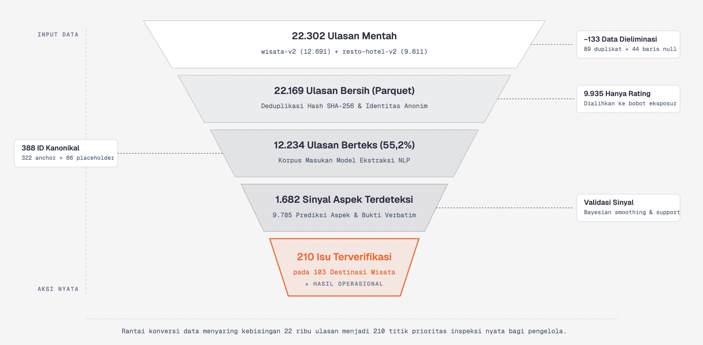

# SLIDE DECK COMPACT (10 MENIT) — SIPATURE
**Sistem Intelijen & Peringatan Dini Kualitas Pariwisata DPSP Danau Toba**
*Del AI Hackathon 2026*

---

### Alokasi Waktu Presentasi (Total 10 Menit):
* **00:00 – 05:30 (5.5 Menit):** Paparan Solusi, Data, AI Modelling, & Arsitektur (Slide 1–5)
* **05:30 – 08:30 (3.0 Menit):** Live Demo Produk & Intervensi Lapangan (Slide 6)
* **08:30 – 10:00 (1.5 Menit):** Dampak, Skalabilitas, & Penutup (Slide 7–8)

---

## SLIDE 1: JUDUL & ELEVATOR PITCH (00:00 - 00:45)
* **Judul:** SIPATURE: Solusi AI Pengawasan Kualitas Pariwisata Danau Toba
* **Sub-judul:** Mengubah Ulasan Wisatawan Menjadi Intervensi Lapangan Preskriptif dan Proaktif
* **Poin Kunci di Slide:**
  * **Tantangan:** Danau Toba berstatus Destinasi Pariwisata Super Prioritas (DPSP), namun pengawasan mutu layanan masih pasif dan reaktif (masalah baru diketahui setelah viral di media sosial).
  * **Solusi SIPATURE:** Platform AI hulu-ke-hilir yang otomatis mengekstraksi keluhan ulasan, menyusun skor prioritas kedaruratan, dan memandu verifikasi fisik petugas di lapangan.
  * **Kesiapan Produk:** 100% fungsional, teruji, dan aktif di-deploy pada server produksi.

---

## SLIDE 2: MASALAH NYATA & DIAGNOSIS DATA (00:45 - 02:00)
* **Judul:** Mengolah 12.234 Ulasan: Dari Data Mentah ke 388 Destinasi Kanonik
* **Visual / Diagram:**
  
* **Poin Kunci di Slide:**
  * **Eksplorasi Data:** 12.234 ulasan mentah dari 14 dataset heterogen (wisata alam, kuliner, penginapan, transportasi).
  * **Spatial Entity Resolution:** Menyatukan data terfragmentasi dan menduplikasi entitas menjadi **388 destinasi kanonik** terkoordinat geografis di 7 kabupaten.
  * **3 Friksi Utama Wisatawan yang Teridentifikasi:**
    1. **Transparansi Harga:** Tiket tidak tertera, parkir liar, getok harga kuliner.
    2. **Kebersihan & Fasilitas:** Sanitasi toilet kotor, tumpukan sampah tepi danau.
    3. **Aksesibilitas:** Jalan rusak, penerangan minim, navigasi sulit.

---

## SLIDE 3: METODOLOGI AI & TAKSONOMI 14 ASPEK (02:00 - 03:15)
* **Judul:** Weak Supervision & Taksonomi 14 Aspek Pariwisata
* **Visual / Diagram:**
  
* **Poin Kunci di Slide:**
  * **Solusi Ketiadaan Anotasi (*Cold-Start*):** Menggunakan paradigma *Weak Supervision / Data Programming* (Snorkel-inspired) berbasis pola leksikal domain Batak/Indonesia untuk membentuk *Silver Ground Truth Dataset*.
  * **Taksonomi 14 Aspek dalam 4 Pilar:**
    * *Lingkungan:* Kebersihan & Sampah, Lanskap & Kelestarian.
    * *Fasilitas & Harga:* Transparansi Tarif, Toilet & Sanitasi, Fasilitas Umum.
    * *Akses & Keamanan:* Akses Jalan, Keamanan, Parkir.
    * *Layanan & Budaya:* Keramahan Pelayanan, Keaslian Budaya.
  * **Multi-Label Aspect Classification:** Mampu mendeteksi beberapa aspek keluhan sekaligus dalam 1 ulasan.

---

## SLIDE 4: BENCHMARK MODEL & FORMULA TRIAGE A9 (03:15 - 04:30)
* **Judul:** Model Ringan Berkecepatan Tinggi (<15ms) & Engine Prioritas
* **Visual / Diagram:**
  
* **Poin Kunci di Slide:**
  * **Optimalisasi Model Produksi:**
    * Menggunakan *TF-IDF N-Gram + Multi-Output Classifier* yang menghasilkan skor F1 tinggi dengan waktu inferensi **< 15 ms per ulasan** (hemat komputasi & tanpa ketergantungan GPU mahal).
  * **Formula Urgensi Empiris (Engine A9):**
    $$\text{Priority Score} = w_1 \cdot \text{Smoothed Rate} + w_2 \cdot \text{Persistence} + w_3 \cdot \text{Exposure} + w_4 \cdot \text{Confidence}$$
  * **Empirical Bayes Smoothing:** Menghilangkan noise/false alarm pada destinasi baru yang ulasannya sedikit.
  * **Level Kedaruratan:** Otomatis mengelompokkan destinasi ke level **Kritis (Merah)**, **Tinggi (Kuning)**, dan **Pantau (Hijau)**.

---

## SLIDE 5: ARSITEKTUR PERANGKAT LUNAK & TATA KELOLA (04:30 - 05:30)
* **Judul:** Arsitektur Enterprise, Deployment B200, & Human-in-the-Loop
* **Visual / Diagram:**
  
* **Poin Kunci di Slide:**
  * **Tech Stack Produksi:**
    * *Frontend:* Next.js 15 App Router + GIS Map Leaflet + Tailwind CSS.
    * *Inference Service:* Python FastAPI asinkron untuk live classification.
    * *Database & State:* PostgreSQL 16 + Drizzle ORM (terseeding 388 destinasi & 9.785 kutipan bukti).
  * **Human-in-the-Loop Verification Workflow:**
    * Petugas dinas memvalidasi rekomendasi AI: **Konfirmasi (Valid)**, **Tidak Pasti (Ragu)**, atau **Tolak (False Positive)** dengan pencatatan audit trail permanen.
  * **Perlindungan Privasi (UU PDP):** Seluruh data identitas pribadi reviewer diisolasi (*PII stripped*).

---

## SLIDE 6: LIVE DEMO PRODUK (05:30 - 08:30 — 3 MENIT DEMO)
* **Judul:** Demonstrasi Langsung Fitur Unggulan SIPATURE
* **Urutan Alur Demo Sistem:**
  1. **Peta Radar Geospasial (`/`):** Tinjauan sebaran kesehatan mutu 388 destinasi di 7 kabupaten seputar Danau Toba.
  2. **Antrean Intervensi Preskriptif (`/intervensi`):** Daftar prioritas darurat lengkap dengan panduan cek fisik dan rekomendasi solusi bagi pengelola.
  3. **Investigasi Destinasi & Evidence Verbatim (`/destinasi/[id]`):** Membaca kutipan asli ulasan wisatawan (dari **9.785 rekaman bukti**) + Tombol aksi verifikasi status (*Konfirmasi, Ragu, Tolak*).
  4. **Live AI Analyzer (`/analyzer`):** Mengetik ulasan baru -> simulasi klasifikasi instan aspek, sentimen, dan dampak perubahan skor kesehatan destinasi.

---

## SLIDE 7: DAMPAK DAN POTENSI PENGEMBANGAN SEKTOR PARIWISATA (08:30 - 09:30)
* **Judul:** Dampak Terukur & Skalabilitas Nasional
* **Poin Kunci di Slide:**
  * **Dampak Langsung untuk Kawasan Danau Toba:**
    * **Efisiensi Anggaran:** Memangkas biaya & waktu patroli acak dinas hingga **70%** melalui inspeksi berbasis prioritas (*targeted inspection*).
    * **Mitigasi Krisis Reputasi:** Mendeteksi tren keluhan **2–4 minggu sebelum viral** di media sosial.
    * **Peningkatan Standar Layanan:** Mendorong kepatuhan transparansi tarif, kebersihan toilet, dan keselamatan wahana.
  * **Potensi Pengembangan Masa Depan:**
    * **Multi-Source Ingestion:** Terhubung langsung ke API TikTok, Instagram, TripAdvisor, dan bot aduan WhatsApp.
    * **Replikasi Cepat:** Arsitektur modular siap diadopsi di 4 DPSP lain (Labuan Bajo, Borobudur, Mandalika, Likupang).

---

## SLIDE 8: KESIMPULAN & PENUTUP (09:30 - 10:00)
* **Judul:** SIPATURE: Menjaga Reputasi, Membangun Pariwisata Berkelanjutan
* **Rangkuman Akhir:**
  * **Data-Driven:** Mengubah 12.234 ulasan mentah menjadi tindakan nyata terukur.
  * **AI Akuntabel:** Rekomendasi dilengkapi bukti kutipan ulasan asli dan verifikasi manusia.
  * **Production Ready:** Berjalan aktif dan terverifikasi penuh di server produksi.
* **Penutup:** *"Terima kasih Dewan Juri. Kami siap untuk sesi tanya jawab."*
