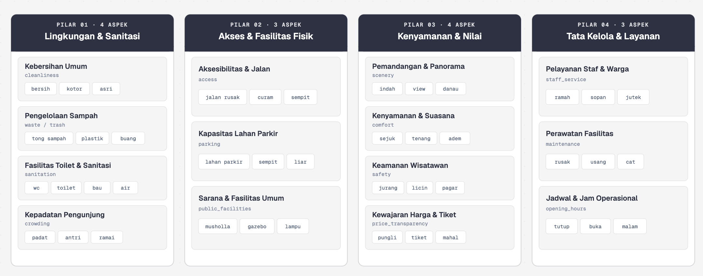
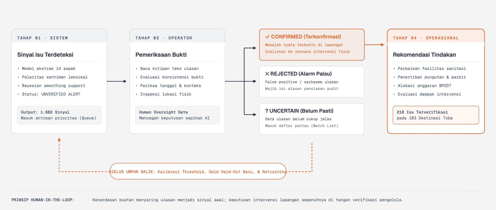

# DECK PRESENTASI FINAL ROUND (KOMPAK — 10 MENIT)
## SIPATURE: Sistem Intelijen & Peringatan Dini Kualitas Pariwisata Danau Toba
*Del AI Hackathon 2026 | Alokasi Waktu: 7 Menit Paparan + 3 Menit Live Demo*

---

### Alokasi Waktu 10 Menit:
* **Slide 1 (01:00):** Latar Belakang, Masalah, & Nilai Utama Solusi
* **Slide 2 (01:30):** Analisis Data 12.234 Ulasan & Rantai Solusi SIPATURE
* **Slide 3 (02:00):** Pendekatan Artificial Intelligence & Benchmark Model
* **Slide 4 (01:30):** Arsitektur Sistem, Triage Empiris, & Human-in-the-Loop
* **Slide 5 (03:00):** Live Demo Produk (Peta GIS, Intervensi, Evidence, Live AI Analyzer)
* **Slide 6 (01:00):** Dampak Sektor Pariwisata, Skalabilitas, & Kesimpulan

---

## SLIDE 1: JUDUL, LATAR BELAKANG, & MASALAH
* **Visual:** Mockup Hero Dashboard SIPATURE + Peta Danau Toba

### 1. Masalah Utama di Lapangan:
* **Danau Toba (DPSP):** Menghadapi tantangan kualitas mutu layanan wisatawan di 7 kabupaten.
* **Pengawasan Reaktif & Lambat:** Isu klasik (getok harga, pungli parkir, sanitasi buruk) baru diketahui setelah **viral di media sosial** dan merusak reputasi kawasan.
* **Data Melimpah Tak Terpakai:** Ribuan ulasan digital wisatawan tercecer di Google Maps tanpa analisis sistematis dari dinas pariwisata.

### 2. Solusi SIPATURE:
* **Sistem Intelijen Berbasis AI:** Mengubah ribuan ulasan ulasan mentah menjadi **peringatan dini dan rekomendasi intervensi preskriptif** sebelum masalah menjadi viral.

---

## SLIDE 2: ANALISIS PERMASALAHAN & RANTAI SOLUSI
* **Visual Diagram:**
  

### 1. Diagnosis dari 12.234 Ulasan Wisatawan:
* **Heterogenitas & Fragmentasi:** 14 dataset heterogen dinormalisasi ke **388 destinasi kanonik** terkoordinat spasial.
* **3 Titik Friksi Dominan:** Transparansi Harga (*tiket/menu*), Sanitasi & Kebersihan (*toilet/sampah*), dan Aksesibilitas (*jalan/parkir*).

### 2. Rantai Solusi Hulu-ke-Hilir:
* `Data Ingestion` $\rightarrow$ `Entity Resolution (388 Tempat)` $\rightarrow$ `Multi-Label AI Aspect Extraction` $\rightarrow$ `Empirical Bayes Triage Engine` $\rightarrow$ `Human-in-the-Loop Action`.

---

## SLIDE 3: PENDEKATAN ARTIFICIAL INTELLIGENCE & BENCHMARK
* **Visual Diagram (Side-by-Side):**
  
  

### 1. Weak Supervision / Data Programming:
* Mengatasi ketiadaan data latih (*cold-start*) dengan merancang *Heuristic Labeling Functions* domain pariwisata untuk membentuk **Silver Ground Truth Dataset**.

### 2. Multi-Label Aspect Extraction (14 Aspek):
* Satu ulasan dapat mencakup banyak aspek sekaligus (*pujian rasa makanan + keluhan toilet kotor*).

### 3. Hasil Benchmark Model:
* **Model Terpilih (TF-IDF Aspect Silver v1):** Kinerja F1-Score seimbang di seluruh 14 aspek dengan kecepatan inferensi **ultra-cepat (< 15 ms)**, deterministik, dan siap produksi tanpa butuh kluster GPU mahal.

---

## SLIDE 4: ARSITEKTUR, TRIAGE EMPIRIS, & HUMAN-IN-THE-LOOP
* **Visual Diagram (Side-by-Side):**
  
  

### 1. Formula Prioritisasi Empiris (Engine A9):
$$\text{Priority Score} = w_1 \cdot \text{Complaint Rate (Bayes)} + w_2 \cdot \text{Persistence} + w_3 \cdot \text{Exposure} + w_4 \cdot \text{Confidence}$$
* Mengeliminasi *false alarm* pada destinasi baru yang ulasannya sedikit.

### 2. Arsitektur Produksi (Enterprise-Grade):
* **Frontend:** Next.js 15 App Router + Tailwind CSS + Peta Geospasial Leaflet.
* **Backend:** FastAPI Inference Service (Python) + PostgreSQL 16 (Drizzle ORM).
* **Deployment:** 100% terkontainerisasi Docker dan teruji aktif di server B200.

### 3. Human-in-the-Loop Verification:
* AI bertindak sebagai *copilot*. Petugas dinas memvalidasi ke lapangan dengan opsi **Konfirmasi (Valid)**, **Tidak Pasti (Ragu)**, atau **Tolak (False Positive)** dengan audit trail permanen di database.

---

## SLIDE 5: LIVE DEMO PRODUK (3 MENIT)
* **Visual:** Live Screen Share / Video Interaktif Aplikasi SIPATURE

### Alur Skenario Demo:
1. **Radar Geospasial 388 Destinasi (`/`):** Peta spasial 7 kabupaten dengan kode warna kesehatan mutu (Merah = Kritis, Kuning = Perhatian, Hijau = Baik).
2. **Antrean Intervensi Preskriptif (`/intervensi`):** Daftar rekomendasi cek fisik lapangan dan panduan intervensi yang diurutkan berdasarkan skor urgensi tertinggi.
3. **Lembar Kerja Investigasi & 9.785 Bukti Ulasan (`/destinasi/[id]`):** Transparansi kutipan asli wisatawan + tombol aksi verifikasi lapangan (*Konfirmasi / Tidak Pasti / Tolak*).
4. **Live AI Analyzer & Simulator (`/analyzer`):** Input ulasan baru secara langsung $\rightarrow$ AI memprediksi aspek, polaritas, dan dampak skor secara instan.

---

## SLIDE 6: DAMPAK SEKTOR PARIWISATA & ROADMAP MASA DEPAN
* **Visual:** Matriks Dampak & Infografis Roadmap

### 1. Dampak Nyata Terhadap Pariwisata Danau Toba:
* **Efisiensi Pengawasan 70%:** Menggantikan patroli acak dengan inspeksi fisik berbasis data presisi (*targeted inspection*).
* **Mitigasi Krisis Reputasi:** Mencegah masalah viral 2–4 minggu lebih awal.
* **Perlindungan Konsumen:** Mendorong kepatuhan harga transparan dan standar kebersihan toilet.

### 2. Roadmap Skalabilitas:
* Integrasi multi-kanal aduan (WhatsApp Bot & TikTok Comments) + Generative AI untuk draf surat pembinaan otomatis.
* Replikasi siap pakai ke 4 DPSP lain (Labuan Bajo, Borobudur, Mandalika, Likupang).

### 3. Penutup:
*"SIPATURE — Menjaga Kualitas Layanan, Melindungi Reputasi Pariwisata Danau Toba."*
*(Beralih ke Sesi Tanya Jawab Dewan Juri)*
