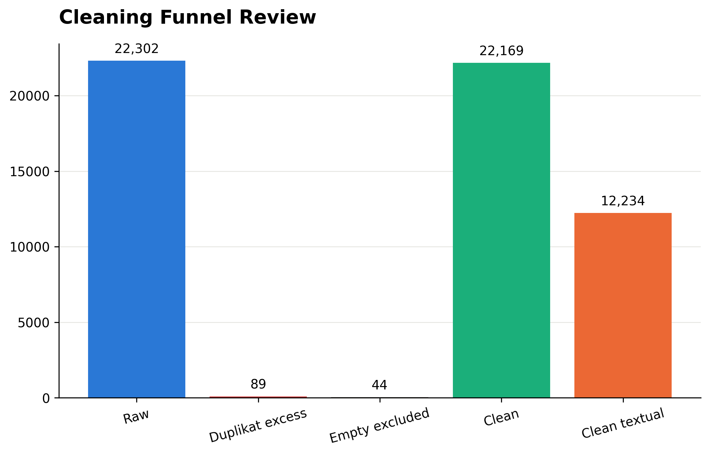
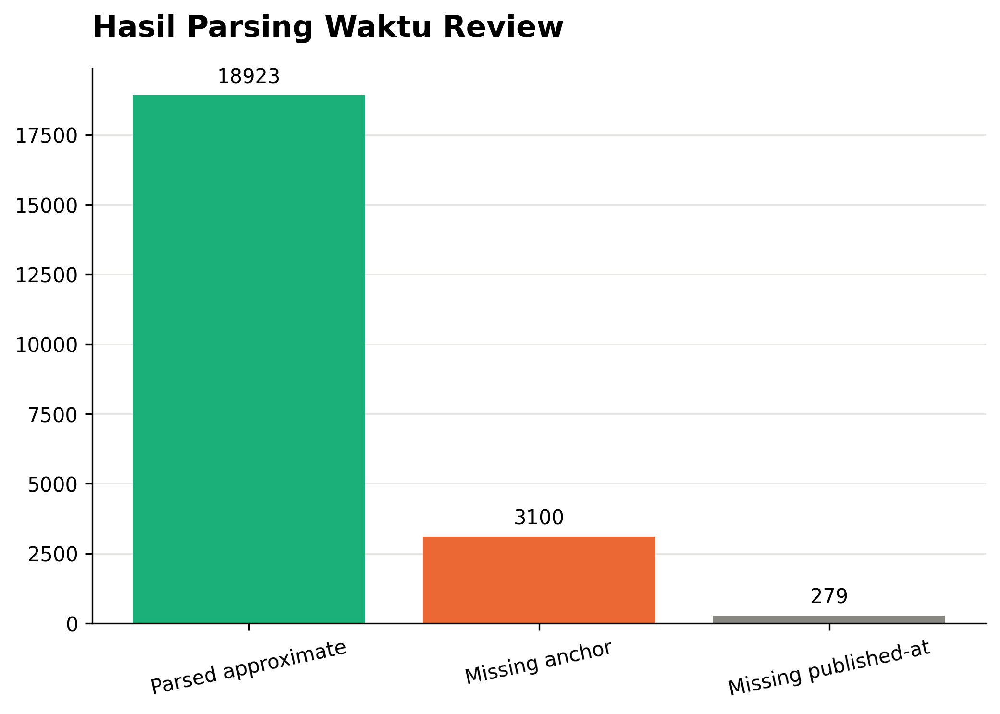
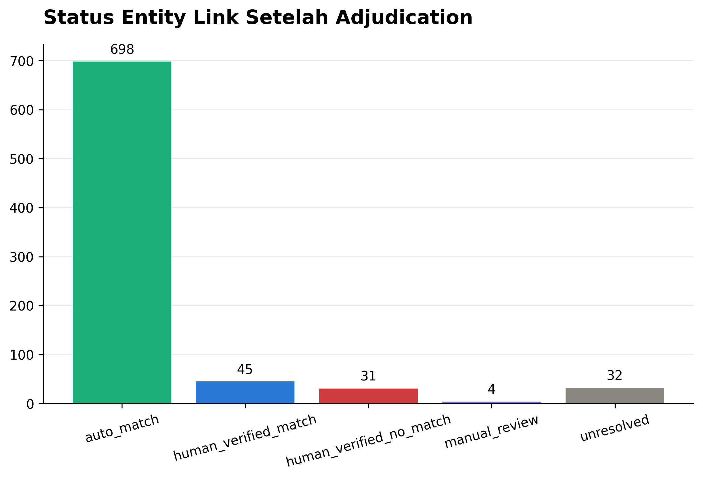
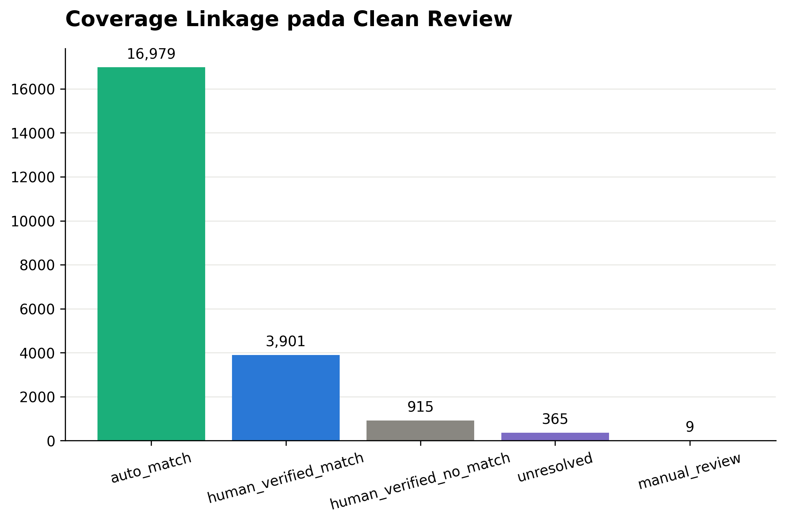
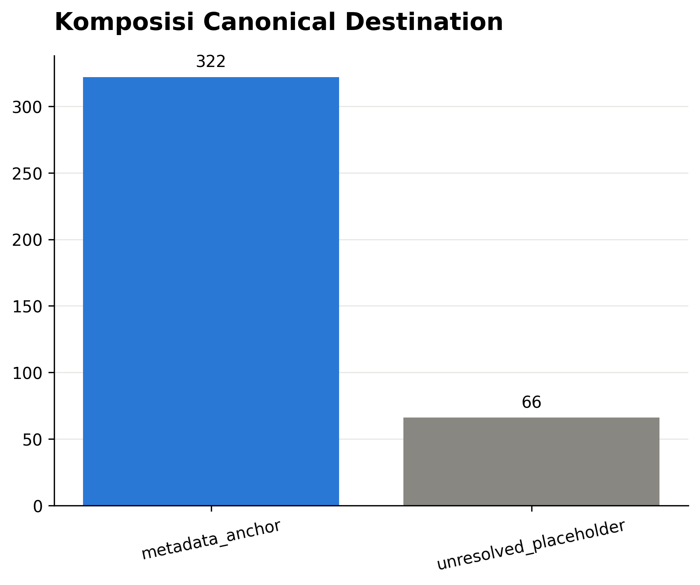
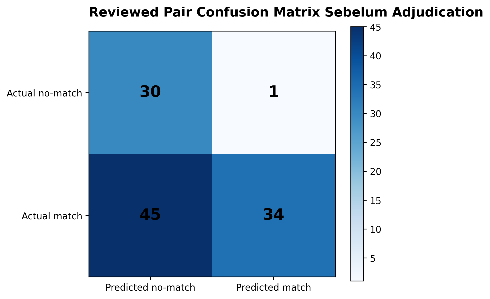

# SIPATURE Cleaning and Entity Resolution Report

**Pipeline version:** 0.1.0  
**Run date:** 28 Juli 2026  
**Input snapshot:** 14 CSV dengan SHA-256 pada `cleaning_summary.json`

## Ringkasan

Cleaning memproses 22.302 review-like records menjadi 22.169 clean records. Sebanyak 89 technical duplicate excess rows dan 44 empty records dikeluarkan dari modelling pool dengan provenance tetap tersedia. Clean pool terdiri dari 12.234 review berteks dan 9.935 rating-only records. Processed output tidak menyimpan nama atau ID reviewer.

Entity resolution membangun 322 metadata-anchor destinations dari 323 metadata records; dua record Bukit Tara Bunga digabung setelah audit nama, alamat, dan jarak sekitar 3,37 meter. Sebanyak 145 supporting place records dan 343 normalized review-place names diproses melalui kind blocking, exact normalized name, address similarity, dan candidate review. Seluruh 22.169 clean reviews memperoleh `destination_id`; unsafe aliases menerima unresolved placeholder sendiri, bukan dipaksa bergabung.

Human review mencakup seluruh 78 ambiguous candidates, seluruh 6 fuzzy auto-matches, dan sampel deterministik 30 exact review-name matches: 114 reviewed pairs, terdiri dari 110 certain dan 4 uncertain. Sebelum adjudication, precision pada reviewed pairs adalah 0,9714, recall 0,4304, F1 0,5965, dan false-merge rate among predicted matches 2,86%. Recall rendah mencerminkan threshold konservatif. Satu fuzzy false merge dan satu exact-name collision berisiko telah dikoreksi. Post-adjudication metrics 1,0 hanya berlaku pada reviewed pairs dan tidak diklaim sebagai generalization performance.

## Cleaning



**Gambar 1. Cleaning funnel review.** Hasil akhir tidak sama dengan `raw - duplicate - empty` bila kategori overlap; implementasi memilih usable records setelah seluruh aturan diterapkan.

### Kebijakan

- Decode `utf-8-sig` dan normalisasi Unicode NFKC.
- Normalisasi whitespace/control characters tanpa menghapus punctuation, negasi, typo, atau mixed language.
- Parse rating hanya bila seluruh field cocok pola 0–5; rating desimal dipertahankan dan diberi warning.
- Relative dates di-anchor ke scrape date dan disimpan sebagai estimasi beserta precision.
- Exact duplicates menggunakan transient normalized reviewer name hanya untuk fingerprint; identitas tersebut tidak disimpan pada clean output.
- Empty records dan technical duplicate excess dikeluarkan dari pool tetapi tetap ada pada quarantine/duplicate artifact.
- Text pool dan rating-only pool disimpan terpisah.

### Output Counts

| Output | Count |
| --- | ---: |
| Raw review records | 22.302 |
| Technical duplicate excess | 89 |
| Empty rating + text | 44 |
| Clean records | 22.169 |
| Clean textual records | 12.234 |
| Clean rating-only records | 9.935 |
| Quarantine flags | 103 |

Jumlah duplicate excess menjadi 89, lebih tinggi enam dari physical exact-row EDA (83), karena NFKC/whitespace-normalized records dapat menjadi identik walaupun byte representation berbeda.



**Gambar 2. Hasil parsing waktu review.** Sebanyak 18.923 record memperoleh tanggal estimasi, 3.100 tidak memiliki scrape anchor, dan 279 tidak memiliki published-at. Hasil parsing bersifat approximate, bukan exact date.

## Entity Resolution

### Blocking and Evidence

1. Block berdasarkan source kind: wisata hanya dibandingkan wisata; service dibandingkan restoran/hotel.
2. Exact normalized name menjadi auto-match bila hanya ada satu anchor compatible.
3. Supporting records dapat auto-match fuzzy bila name similarity >=0,90, address similarity >=0,65, dan margin >=0,08.
4. Candidate name similarity >=0,75 masuk manual review.
5. Review place names tanpa address tidak di-auto-match fuzzy.
6. No safe candidate dan reviewed no-match mendapat canonical placeholder terpisah.



**Gambar 3. Status 810 entity links setelah adjudication.** Terdapat 698 auto-match, 45 human-verified match, 31 human-verified no-match, 4 manual-review/uncertain, dan 32 unresolved.



**Gambar 4. Coverage linkage pada 22.169 clean reviews.** Sebanyak 16.979 reviews terhubung auto-match, 3.901 melalui human-verified alias, 915 melalui human-verified no-match placeholders, 365 unresolved placeholders, dan 9 manual-review placeholders.



**Gambar 5. Komposisi 388 canonical IDs teknis.** Sebanyak 322 adalah metadata anchors dan 66 unresolved placeholders. Placeholder menjaga seluruh review memiliki group ID valid tanpa memaksa merge; placeholder bukan destinasi baru yang telah terverifikasi.

## Evaluation



**Gambar 6. Confusion matrix 110 certain reviewed pairs sebelum adjudication.** Empat uncertain pairs dikeluarkan dari denominator metric.

| Metric | Pre-adjudication reviewed pairs | Post-adjudication reviewed pairs |
| --- | ---: | ---: |
| Precision | 0,9714 | 1,0000 |
| Recall | 0,4304 | 1,0000 |
| F1 | 0,5965 | 1,0000 |
| False-merge rate | 0,0286 | 0,0000 |

Post-adjudication metrics hanya menunjukkan konsistensi penerapan human-reviewed decisions pada 110 certain pairs. Metrik tersebut tidak mengukur performa pada pasangan baru. Pre-adjudication metrics lebih tepat untuk memahami trade-off matcher: precision tinggi tetapi recall rendah.

### Critical Cases Corrected

- `SAPADIA VILLA BALIGE III` tidak digabung dengan `II` meskipun name/address similarity tinggi.
- `Bukit Simargulang Ombun` memiliki exact name pada lokasi berbeda; review name tanpa location evidence dipindahkan ke manual-review placeholder.
- Generic restaurant names dan different waterfall names tidak dipaksa merge.
- Corrupted ampersand (`26`) dan URL-encoded quotation aliases yang diverifikasi dapat dihubungkan melalui override.

## Artifacts

```text
ml/data/interim/clean_reviews.parquet
ml/data/interim/text_training_pool.parquet
ml/data/interim/rating_only_pool.parquet
ml/data/interim/quarantine_rows.parquet
ml/data/interim/duplicate_groups.parquet
ml/data/interim/clean_place_sources.parquet
ml/data/processed/canonical_destinations.parquet
ml/data/processed/entity_links.parquet
ml/data/processed/canonical_reviews.parquet
ml/configs/entity-review-v1.csv
ml/artifacts/reports/cleaning_summary.json
ml/artifacts/reports/entity_resolution_summary.json
ml/artifacts/reports/entity_resolution_metrics.json
```

## Limitations

- Human review bukan dua annotator independen dan belum memiliki agreement metric.
- Exact-name auto-match sample hanya 30 dari 265 eligible review-name links.
- Address fields dapat salah secara administratif.
- Placeholder dapat mewakili alias dari anchor yang belum diverifikasi.
- Relative dates remain approximate.
- Supporting complex files `Attractions Info` dan `Info Seputar TOP 3` belum di-unpivot ke canonical place fields pada A4 MVP.

## Reproduction

```bash
cd ml
make clean-data DATASET_DIR=../Datasets
make resolve-entities
sipature-ml quality-figures --figure-dir ../docs/figures/eda
```
