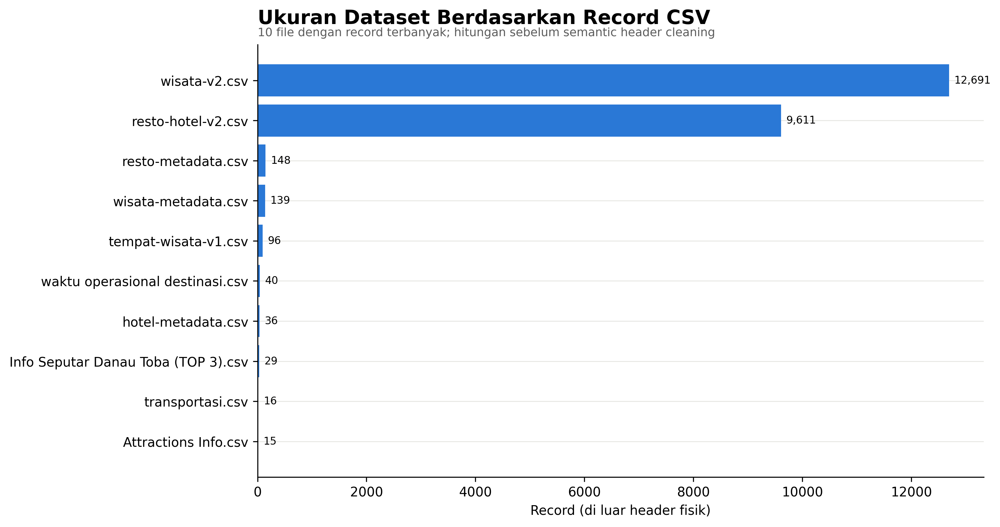
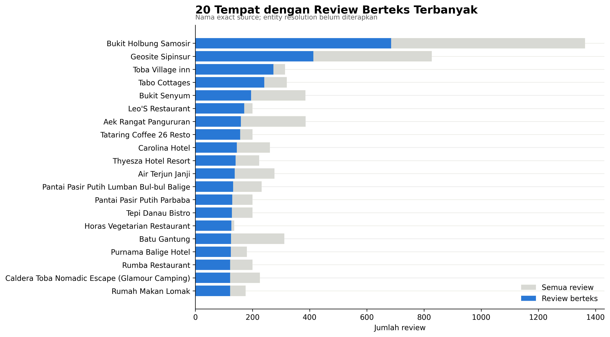
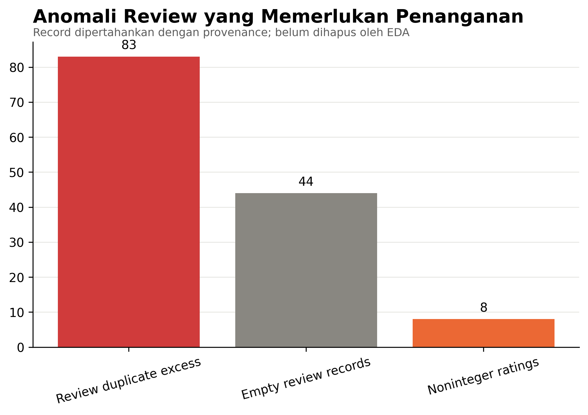

# SIPATURE Exploratory Data Analysis Report

**EDA version:** 0.1.0  
**Run date:** 28 Juli 2026  
**Input:** 14 CSV pada `Datasets/`  
**Command:** `make eda DATASET_DIR=../Datasets`

## Executive Findings

1. Dua file review utama berisi 22.302 record; 12.280 (55,06%) memiliki teks, 9.978 merupakan rating-only bersih, 7 text-only, dan 44 tidak memiliki rating maupun teks.
2. Terdapat 83 exact duplicate excess rows yang harus ditandai sebelum training/agregasi, bukan dihapus tanpa provenance.
3. Dari 22.243 rating integer valid, 15.595 (70,11%) adalah bintang lima. Rating imbalance mendukung penggunaan Macro F1, class weighting, dan text-based aspect analysis.
4. Panjang review berteks memiliki median 10 kata, P95 55 kata, dan P99 sekitar 120 kata. Sebanyak 2.530 review (20,60%) memiliki maksimal tiga kata.
5. Sebelum entity resolution terdapat 343 nama tempat exact. Median coverage adalah 14 review berteks; 100 nama tempat memiliki maksimal empat review berteks atau tidak memiliki teks sama sekali.
6. Seed-keyword exploration menemukan support awal untuk taxonomy, tetapi aspek langka seperti keamanan, sampah, maintenance, dan jam operasional memerlukan oversampling saat annotation.
7. Metadata wisata, restoran, dan hotel memuat 323 coordinate records; seluruh coordinate string dapat diparse dan berada dalam regional warning envelope. Hanya 321 titik unik, sehingga terdapat coordinate sharing yang harus diaudit.
8. Kelengkapan metadata tidak seimbang: fasilitas wisata 0% pada `wisata-metadata`, fasilitas restoran 4,05%, opening hours restoran 0,68%, sedangkan koordinat tersedia 100% pada tiga metadata utama.
9. Beberapa file memiliki struktur spreadsheet tidak konvensional: embedded/multirow headers, kolom kosong, section rows, dan displaced status. Source-specific loaders wajib digunakan.

## 1. Dataset Scale



**Gambar 1. Ukuran dataset berdasarkan record CSV.** Dua file review mendominasi volume. Hitungan merupakan schema fisik sebelum semantic header cleaning; `Attractions Info`, `Info Seputar`, dan `prompt` memerlukan koreksi semantic row count.

Source data: `ml/artifacts/reports/eda_file_profile.csv`.

## 2. Review Availability


**Gambar 2. Funnel ketersediaan review.** Sebanyak 12.280 record memiliki teks dan dapat dipertimbangkan untuk NLP. Rating-only tetap berguna untuk coverage/rating context, tetapi tidak masuk text-model training. Duplikat excess dilaporkan terpisah.

| Review kind | Count | Share of all records |
| --- | ---: | ---: |
| Text + rating | 12.273 | 55,03% |
| Text only | 7 | 0,03% |
| Rating only | 9.978 | 44,74% |
| Empty rating + text | 44 | 0,20% |

## 3. Rating Imbalance


**Gambar 3. Distribusi rating integer.** Bintang lima mencakup 70,11% dari 22.243 rating integer valid. Dataset juga memiliki 8 rating desimal dan 51 missing/unparseable ratings. Rating tidak boleh menjadi ground truth polaritas teks, khususnya pada mixed-sentiment review.

## 4. Review Length


**Gambar 4. Distribusi panjang review berteks.** Median 10 kata, P95 55 kata, dan P99 120 kata. Nilai ini mendukung max sequence length awal 192 token, tetapi truncation rate harus dihitung dengan tokenizer IndoBERT yang benar sebelum training.

## 5. Coverage per Place



**Gambar 5. Tempat dengan review berteks terbanyak.** Bukit Holbung Samosir memiliki 685 review berteks dan Geosite Sipinsur 413. Angka masih menggunakan exact source name sebelum entity resolution.


**Gambar 6. Band coverage teks.** Dari 343 nama tempat exact, 18 tidak memiliki review berteks, 82 memiliki 1–4, 91 memiliki 5–19, 71 memiliki 20–49, dan 81 memiliki minimal 50. Coverage imbalance memerlukan sufficiency state dan smoothing.

Source data: `ml/artifacts/reports/eda_place_coverage.csv`.

## 6. Candidate Aspect Support


**Gambar 7. Prevalensi kandidat aspek berdasarkan seed keywords.** Pemandangan memiliki support terbesar (3.677), disusul pelayanan (1.477), harga/pungutan (1.017), dan kebersihan (1.001). Keamanan (102), sampah (120), perawatan (134), dan jam operasional (70) relatif langka. Hasil ini hanya candidate retrieval untuk sampling annotation, bukan gold label, sentiment, atau model output.

Source data: `ml/artifacts/reports/eda_candidate_aspects.csv`.

## 7. Language, Negation, and Contrast Indicators


**Gambar 8. Indikator bahasa, negasi, dan kontras.** Marker heuristic menemukan 6.794 review dengan marker Indonesia, 1.401 Inggris, 146 campuran, dan 3.939 tidak teridentifikasi. Sebanyak 2.102 review (17,12%) mengandung marker negasi dan 1.295 (10,55%) marker kontras. Ini mendukung contextual model dan clause-aware error analysis. Kategori bahasa bukan hasil language-identification model.

## 8. Missingness and Irregular Schemas


**Gambar 9. Proporsi sel kosong berdasarkan schema fisik.** `Info Seputar` memiliki 52,74% sel kosong dan struktur multirow header. `prompt` memiliki leading blank rows/embedded header. Missingness fisik tidak langsung sama dengan data quality setelah semantic parsing, tetapi membuktikan satu generic CSV loader tidak cukup.

## 9. Metadata Completeness


**Gambar 10. Kelengkapan field metadata utama.** Koordinat, nama, dan alamat tersedia 100% pada metadata wisata, restoran, dan hotel. Gap terbesar terdapat pada fasilitas dan hours. Absence pada file metadata berarti unknown, bukan fasilitas tidak tersedia.

Source data: `ml/artifacts/reports/eda_metadata_completeness.csv`.

## 10. Coordinate Distribution


**Gambar 11. Sebaran 323 coordinate records.** Seluruh coordinate string pada tiga metadata utama berhasil diparse dan berada pada envelope regional latitude 1–4 dan longitude 97–101. Hanya 321 coordinate pairs unik; empat records terlibat pada shared-coordinate groups dan memerlukan entity/address audit. WGS84 masih merupakan asumsi terdokumentasi.

Source data: `ml/artifacts/reports/eda_coordinates.csv`.

## 11. Review Quality Anomalies



**Gambar 12. Anomali review yang memerlukan penanganan.** EDA menemukan 83 exact duplicate excess rows, 44 empty review records, dan 8 noninteger ratings. Record dipertahankan dengan provenance pada tahap ini; cleaning akan menentukan quarantine/deduplication policy.

## 12. N-gram dan Generic/Repeated Text


**Gambar 13. Top unigram, bigram, dan trigram.** Kata/frasal dominan menggambarkan pemandangan, Danau Toba, makanan, dan evaluasi umum. N-gram seperti `kamar mandi` dan `tiket masuk` juga mendukung taxonomy aspek. EDA menemukan 1.037 repeated-text excess rows dan 103 repeated substantive-text groups. Repetition tidak otomatis berarti spam; komentar generik dari pengguna berbeda dapat identik dan harus dibedakan dari exact source-row duplicates.

Source data: `ml/artifacts/reports/eda_ngrams.csv`.

## 13. Freshness Field Availability


**Gambar 14. Ketersediaan field waktu review.** Scrape date tersedia pada 19.059 record dan hilang pada 3.243. Published-at tersedia pada 22.023 dan hilang pada 279, tetapi nilainya berupa teks relatif multibahasa seperti `a year ago` atau `2 tahun lalu`. Tanggal publikasi harus diparse sebagai estimasi/interval dengan scrape date sebagai anchor, bukan tanggal presisi.

## 14. Volume, Rating, dan Candidate Complaint Rate


**Gambar 15. Volume review berteks vs candidate complaint rate.** Scatter menunjukkan heterogenitas antar-tempat dan tidak membentuk hubungan sederhana antara rating rata-rata, volume, dan candidate complaint rate. Seed complaint retrieval menemukan 916 review, tetapi belum merupakan sentiment classifier. Visual mendukung penggunaan aspect-level evidence dan smoothing dibanding ranking berdasarkan raw complaint count.

## 15. Nearby Service Density


**Gambar 16. Jumlah metadata hotel/restoran dalam radius 5 km dari wisata.** Dari 139 wisata, 72 tidak memiliki hotel/restoran yang tercatat dalam radius tersebut. Median jumlah layanan adalah 0 dan median jarak ke layanan terdekat 5,374 km. Ini adalah gap pada dataset metadata/proximity context, bukan bukti bahwa layanan nyata tidak tersedia. Address/entity validation dan data eksternal legal diperlukan sebelum facility-gap claim.

Source data: `ml/artifacts/reports/eda_service_density.csv`.

## 16. Data Engineering Decisions

- Gunakan source-specific loaders untuk file dengan embedded/multirow headers.
- Simpan raw fields, source row, source hash, dan parse warnings.
- Pisahkan text/rating-only/empty review records.
- Jangan membulatkan rating desimal tanpa audit sumber.
- Tandai exact duplicates dan repeated short text secara berbeda.
- Gunakan destination entity resolution sebelum split dan aggregation.
- Gunakan conservative relative-date parsing dengan uncertainty.
- Treat absent facility/status/hour as unknown unless explicitly recorded.
- Redact reviewer names dan contact patterns dari public evidence.
- Gunakan stratified annotation sampling untuk rare operational/environmental aspects.

## 17. Limitations

- Language categories are marker heuristics.
- Aspect prevalence is keyword retrieval, not annotation/model output.
- Semantic cleaning for complex spreadsheet exports is not yet applied.
- Exact place names are not canonical entities.
- Coordinate/address consistency requires manual or external validation.
- Sentiment, severity, and intervention priority are outside EDA and remain unevaluated.

## 18. Reproduction

```bash
cd ml
make setup
make inventory DATASET_DIR=../Datasets
make eda DATASET_DIR=../Datasets
```

Machine-readable output: `ml/artifacts/reports/eda_summary.json`. Figure source files and data hashes are recorded alongside the report.

SHA-256 dan ukuran seluruh PNG report-ready dicatat pada `figures/eda/manifest.json`.
