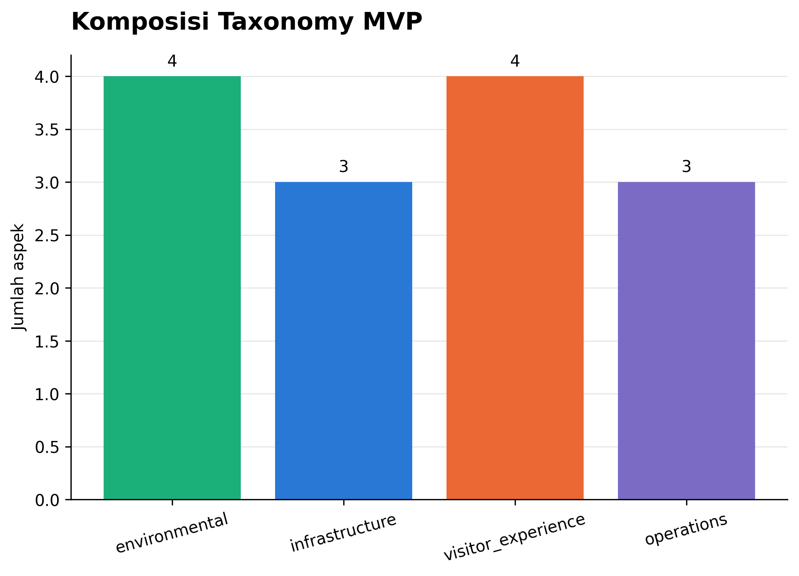
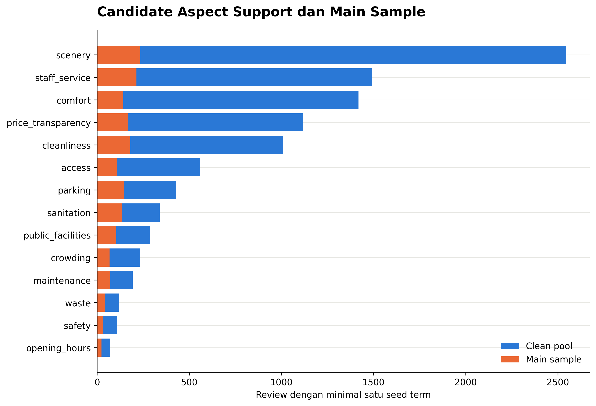
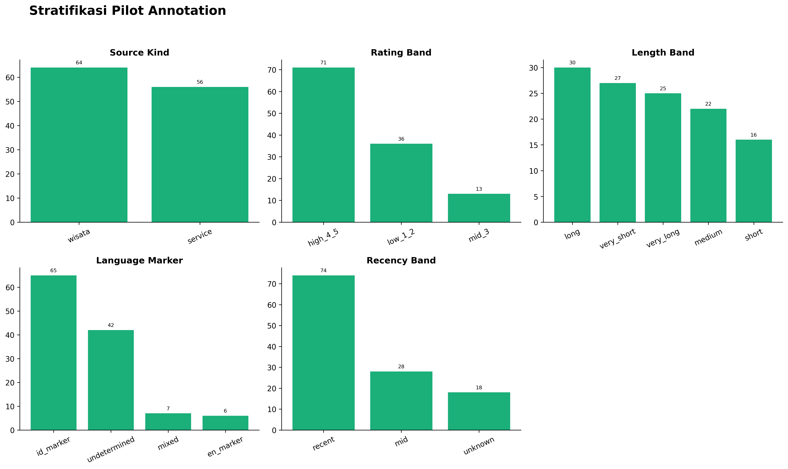
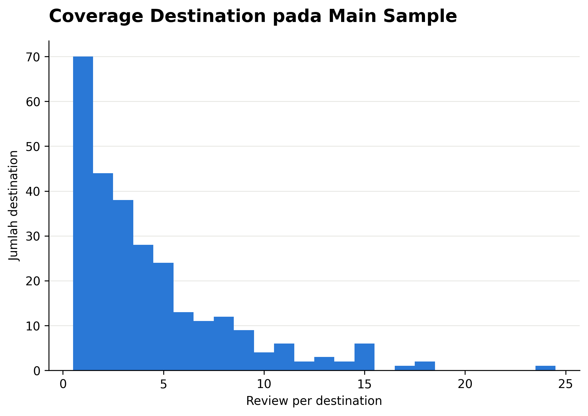
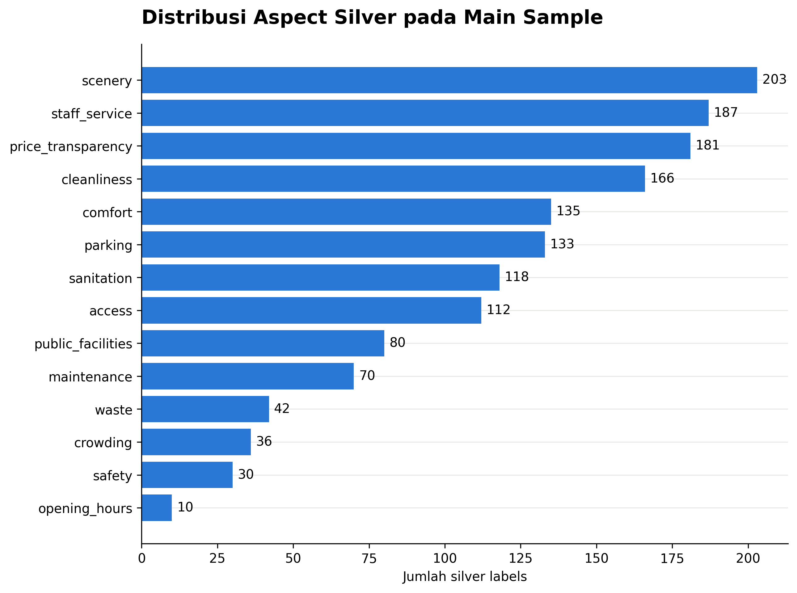
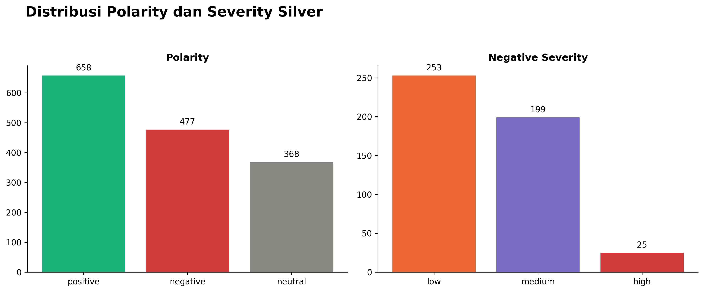
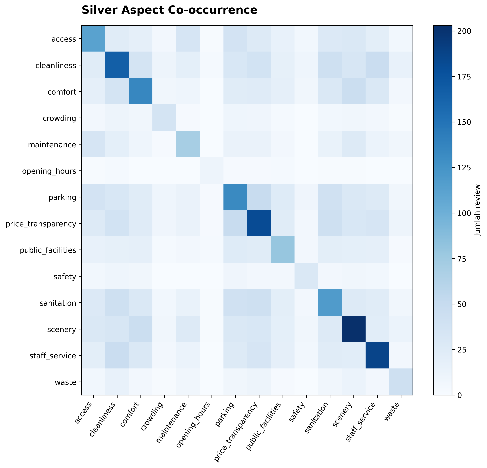
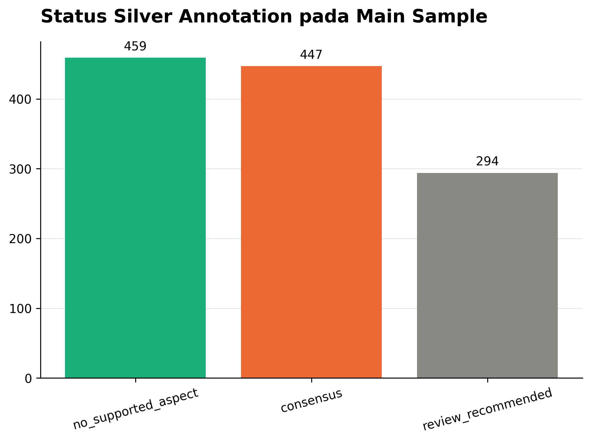
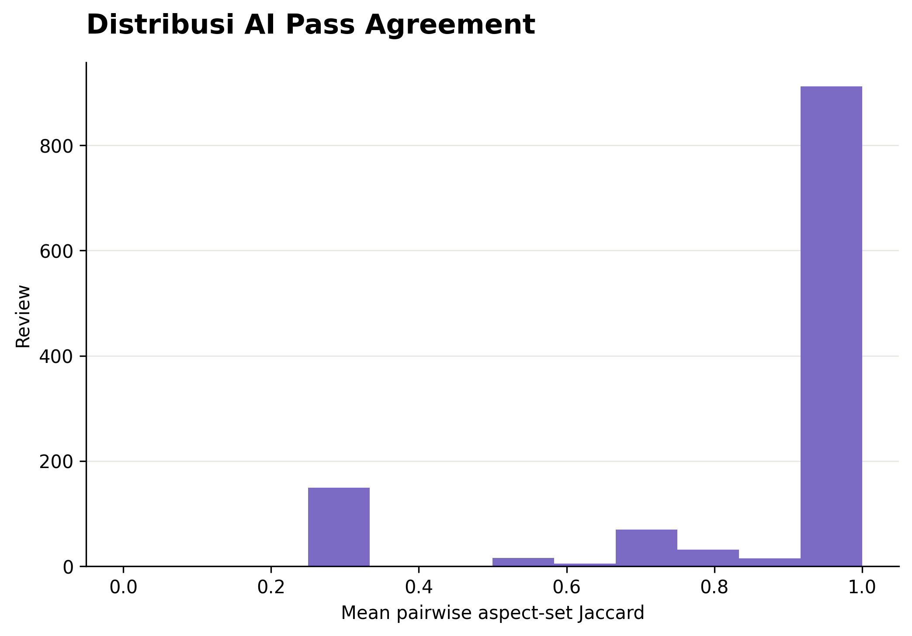

# SIPATURE Taxonomy and Silver Annotation Report

**Taxonomy version:** `1.0.0-rc1`  
**Silver version:** `silver-1.0.0`  
**Status:** AI-assisted silver completed; not human gold  
**Sampling seed:** 42

## Ringkasan Status

A5 menghasilkan 1.320 AI-assisted weak-supervision records: pilot 120 dan main sample 1.200. Tiga deterministic rule passes (`strict`, `balanced`, dan `recall`) memberi aspect, polarity, severity negatif, dan evidence verbatim. Consensus label memerlukan minimal dua dari tiga votes. Seluruh 1.320 records lulus silver schema validation.

Artifact ini adalah **silver labels**, bukan human annotation atau gold dataset. Mean pass agreement 0,8827 mengukur konsistensi rule passes, bukan inter-annotator agreement. Confidence adalah vote agreement dan bukan calibrated probability.

| Status seluruh 1.320 records | Count |
| --- | ---: |
| consensus | 489 |
| review_recommended | 334 |
| no_supported_aspect | 497 |

Silver SHA-256: `8838930b046def5303c89efb4f018d9a5d8a77cc2b142fa25d4c445f4d9d2610`.

## Taxonomy



**Gambar 1. Komposisi taxonomy MVP.** Empat belas aspek dikelompokkan menjadi environmental (4), infrastructure (3), visitor experience (4), dan operations (3).

Polarity terdiri dari `positive`, `negative`, dan `neutral`. Severity `low`, `medium`, dan `high` hanya berlaku untuk polarity negatif. Rating tidak digunakan untuk menentukan polarity atau severity.

## Sampling



**Gambar 2. Candidate support pada clean pool dan main sample.** Seed retrieval digunakan untuk stratifikasi dan oversampling, bukan ground truth.

Pilot mencakup 120 reviews dari 83 destination IDs. Main sample mencakup 1.200 reviews dari 276 destination IDs dan tidak overlap dengan pilot. Sampling mengurangi dominasi destinasi populer dan meningkatkan peluang low ratings, long/mixed-language reviews, candidate complaints, serta rare aspects.



**Gambar 3. Stratifikasi pilot.** Distribusi mencakup source kind, rating, text length, language marker, dan recency.



**Gambar 4. Coverage destination pada main sample.**

## Silver Label Results

Actual main-sample support terbesar adalah scenery 203, staff service 187, price transparency 181, dan cleanliness 166. Support terendah adalah opening hours 10, safety 30, crowding 36, dan waste 42. Support ini merupakan output weak supervision dan tidak boleh diperlakukan sebagai prevalensi populasi.



**Gambar 5. Distribusi silver aspects pada main sample.** Satu review dapat memiliki lebih dari satu aspect.

Main sample menghasilkan 658 positive, 477 negative, dan 368 neutral labels. Negative labels terdiri dari severity low 253, medium 199, dan high 25.



**Gambar 6. Distribusi polarity dan negative severity pada main sample.**



**Gambar 7. Actual silver aspect co-occurrence pada main sample.** Diagonal menunjukkan support tiap aspect; sel lain menunjukkan review dengan dua aspect yang sama-sama didukung.

## Consistency and Uncertainty

Pada main sample, terdapat 447 consensus, 294 review-recommended, dan 459 no-supported-aspect records. Angka seluruh pipeline berbeda karena menambahkan 120 pilot records.



**Gambar 8. Status silver pada main sample.** `review_recommended` dipertahankan sebagai uncertainty queue.



**Gambar 9. Distribusi AI pass agreement.** Nilai adalah mean pairwise aspect-set Jaccard antara tiga rule passes, bukan human agreement.

## Quality Audit

Audit mencakup seluruh high-severity labels dan pemeriksaan boundary/error patterns. Perbaikan yang dibuat mencakup:

- Negasi pungli, termasuk `aman dari`, `tidak ada`, dan slang `gadak`.
- Pertanyaan/rumor pungli menjadi neutral, bukan otomatis negative.
- `jalan rusak` diprioritaskan sebagai access dan tidak otomatis maintenance.
- Toilet diprioritaskan sebagai sanitation, tidak otomatis cleanliness/public facilities.
- `penuh semut` tidak lagi memicu crowding.
- Kata `buka` generik tidak lagi otomatis opening hours.
- Severity `tidak ada air` dibuat aspect-aware agar `tidak ada air panas` tidak otomatis high.

Setiap koreksi memiliki regression test. Remaining queue tidak diadjudikasi manusia dan tidak dipromosikan menjadi consensus.

## Artifacts and Reproduction

```text
ml/configs/taxonomy.yaml
ml/contracts/silver-annotation.schema.json
ml/data/annotations/silver-v1.0.0.jsonl
ml/data/annotations/silver-v1.0.0.manifest.json
ml/data/annotations/silver-disagreement-queue.jsonl
ml/artifacts/reports/silver_annotation_summary.json
```

```bash
cd ml
make annotation-sample
make silver-annotate
sipature-ml silver-validate data/annotations/silver-v1.0.0.jsonl
sipature-ml silver-figures --figure-dir ../docs/figures/eda
```

Review text, pass outputs, silver JSONL, and disagreement queue are restricted and Git-ignored. Aggregate reports and figures contain no reviewer identity.

## Limitations

- Weak-supervision rules may miss implicit, sarcastic, misspelled, or domain-specific statements.
- Vote agreement measures consistency among related rules and can remain high when rules share the same bias.
- No human agreement, gold quality, calibration, or model generalization claim is available.
- Silver support is affected by stratified oversampling and cannot estimate population prevalence directly.
